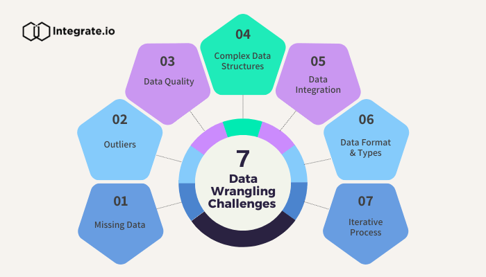

# (03/06/2024 and 04/06/2024)

> What is Shell ?
---
To write a script in any OS a language is needed, which we call shell in Linux OR When we give any input into the system and after interpreting the same input into a shell, we give the output in the machine language, which is called shell, and shell is a intface between user and kernal, that shell is called Bash.
shell and kernel are reposable in the backend of whatever Linux is running.

> **Types Of Shell ?**

  Bourn Shell (sh) /bin/sh Bourn again shell (bash) /bin/bash Kourn shell (ksh) /bin/ksh C shell (Csh) /bin/csh
  echo $SHELL (With the help this command we can check shell in current Linux machine machine) and shell is located in /bin/sh location.
  when we are ceating shell scripting, so sript is devide in 2 parts, 1 :- sebang and header 2:- commented line 3 :- program body #!/bin/bash OR #!/bin/sh and This is indicate to not commented) /bin/sh and /bin/bash ( This is indicate to shell location) you can fire this command in linux , echo $ECHO*

> **What is shell scripting ?**

  Shell scripting is a set of command, with the help of shell scripting we can automante any task shell scripting, when we are input - any command from the keyboad   or mounse After interpreting the input, it converts our input into 0 and 1 and gives us output.
  When we are creating shell scripting so fist going to the anyh editor, for example (vim,nano,vi) these are 3 editors for linux OS.

> **3 Parameter are available in shell scripting.**

- 1:- shebang OR header section
- 2:- comment section
- 3:- Program body secotion

> **This is a basic shell scripting,** 

- vim coredge.sh (#This is coredege file for creating shell scripting, after enter we are gose to the editor)
- #!/bin/bash (#!, we can say not commaneted and /bin/bash, It means, this is location shell location and The interpreter takes our input and converts it into the - form of 0 and 1 and gives us output.)
  
- #!/bin/bash
 mkdir coredge
 touch coredge.io
 apt install apache2
 systemctl restart apache2
 echo "Hello Everyone"
 (This is normal basic shell scripting)
  And if we are run shell scripting file. and We should always know that when we create a shell scripting file, the file must have excution permissions to - - run it. we can run with help of .coredge OR sh .coredge
 these are tools are available in the market for automate the task
 Shell/Bash Scripting and Ansible for automate task

> **What is Kernel ? **

• Kernel is an heart of Linux OS.
• The Linux kernel is the main component of a Linux operating system (OS) and 
is the core interface between a computer's hardware and its processes. 
• It is an interface between Application and computer hardware as well as shell.
• It manages resource of Linux OS. Resources means facilities available in Linux. 
• Kernel decides who will use this resource, for how long and when.
• It runs your programs (or set up to execute binary files).
• The kernel acts as an intermediary between the computer hardware and various 
programs/application/shel

> **What is Data Wrangling ?**

Data Wrangling it is kind to transforming or orgnaize you raw data into the same another formate, and wrangling data easy to undersatnd, according to the data wranging we can take a decision on data wranging, RAW data it's a critical data we can't ready and not understable data.

> **You can understand from this images of Wrangling**

> **Data Wrangling gives us some features**

- Easy to understable
- transform/orgnize
- data accessing
- Analisys and process
- Improved Communication and Decision-Making

> **About Alterys Tools ( This is data analytics and visualization tool)**

Alteryx processes values based on the data type. Alteryx supports string, numeric, date-time, and boolean data types, as well as, spatial objects and Alteryx is used to automate data processes more quickly and efficiently
- CEO of Alterys :-  Mark Anderson
- Date founded:- 1997
- Founder: Dean Stoecker.  

 > **What is Command-line Environment ?**

With the command line interface we can run any command and services, in server and systems all operation system are provide commaand line interface (CLI) Window,Mac,Linux, and CLI it's a faster interection interface.

These are CLI available inm the market for OS,
Window OS = CMD and and power shell
Linux OS = Linux itself CLI cammnd line 
Mac OS = Mac-CLI
We can oprate OS from the CLI method (Window,Mac,Linux).

#! (Interpretor calling system)
/bin/bash :- location of shell

> Types of Quotes 

- 1:- Single Quotes :- ' ' (Print As it is)
- 2:- Double Quates :- " " (We can print message and values as well)
- 3:- Back Quotes :-   ` (ti is use to print output of any commad ony)\

date :- +%A
date :- +%H:%M

date --help

# Keep Learning........

