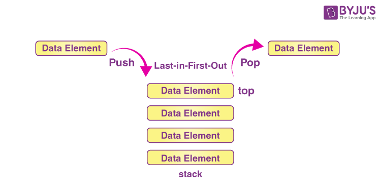
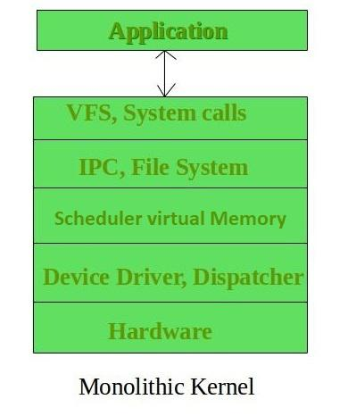

# This is About VIM text editor in linux

> **What is VIM Editor ?**

  VIM Editor it's test editor file, we can edit and modify any existing file and we can create new file accoring to the need.
  For Example :- If we want to create a new file, vim coredge, vim core, we can take any name

> **Types of Editor in Linux OS,**

> **This is a basics command of VIM Editor**

- VIM,VI,NANO
  In VIM Editor, we can use these commands for save,quit,set number etc,
- Esc+wq! = Enter (file save and quit from the file)
- Esc+q!
- I ( press i for eiditing in file)
- / (we can search any work in file)
- :set number ( With this coommand can set numnber of test lines), and these are same command we can use it.
- 7j : move 7 lines down.
- w : move a word forward
- ctrl + f : move down a page
- ctrl + b : move up a page
- gg : move to the top of the document
- dw : delete a word
- 4dd : delete 4 lines
- cc : change a line ( change is delete and go in insert mode ). 

> **What is Stack ?**

Stack is a linear data structure. The elements are inserted or removed from the same end. Queue is also a linear data structure. The elements are inserted or removed from two different ends, that is called (FIFO,First in first out And LIFO, Last in first out). In one stack we can uplaod and remove data from the stack.

 Push :- We can upload the data in stack
 pop :- We can remove the data from stack 

 

 > **Private Cloud**

Private cloud is not availale to each persion and private cloud are desined only instities or only orgnizations, private closud provide to security and costly, best example of open stack for private cloud, private cloud mostly use IAAS Service (Insfrasture As A Service). and more then costmized.

Private Cloud :- OpenStack 

> **About of openstack ?**

Written in:- Python
Initial release:- 21 October 2010, 14 years ago
Type of OpneStack :- Cloud
Developer: Rackspace Technology

> **Monolithic Kernal ?**

All OS related component stuffed as a single module of a kernal, all services are runing in a single kernal, If any service failed or crashes in Karnal then it becomes difficult to find the field service, these kernal are diffecult to debug.

Monolithic Kernal :- Linux,Unix,Dos

> **What is SSID :-**

SSID (Service set identifier), When we install Wi-Fi at home, and after installing Wi-Fi, we receive a name which is called SSID when we login to the wifi by entering the password.

# **Keep Learning.....** 

