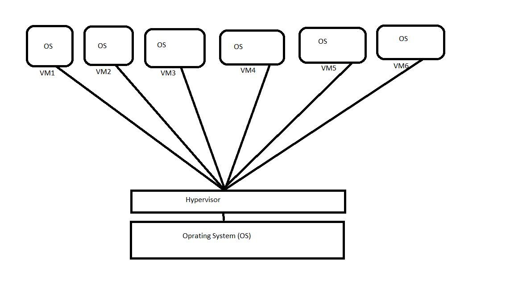
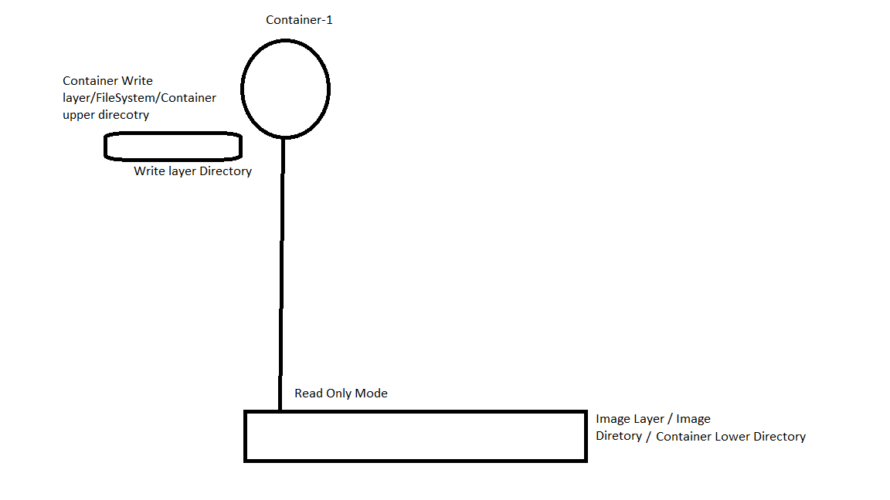

# About Docker?

- Programming language: Go
- Initial release: March 20, 2013; 11 years ago
- Developer: Docker, Inc.
- Operating system: Linux, Windows, macOS
  
# What is Docker? 

Docker is a set of platform as a service products that use OS-level virtualization to deliver software in packages called containers. The service has both free and premium tiers docker is an open platform for developing, shipping, and running applications, Docker enables you to separate your applications from your infrastructure so you can deliver software quickly And Docker provides the ability to package and run an application in a loosely isolated environment called a container The isolation and security lets you run many containers simultaneously on a given host. Containers are lightweight and contain everything needed to run the application.

> **What is provisoning**

It’s a method to providing VMs with some application installation.

> **Provisioning Method**

- 1) VM/Instance Based: This is example of hardware virtualization.
- 2) Container Based: This is example of OS base virtualization.
  
  Docker: Docker is a community and It is Open source container technology

> **Virtualization**

1. H/w Based Virtualization (Hypervisor)
2. OS Virtulization 

Virtualization is a technology by which we can run multiple machines on a 
hardware simultaneously. 

> You can understand from this image,

> **OS Virtualization**

1. Docker Host/Engine: A machine/OS that will run multiple container machines

**Two release available in market**

Docker ce: Community Edition
Docker ee: Enterprise Edition (One month subscription is free with your ID)

> **What is docker client**

Client machine from where we can provision containers. This is just like your client workstation and 
generally its not recommended to take docker client.

> **What is docker images**

Its light weight image for particular application. To spin the container you should have at least 
available. It has minimal configuration to deploy any container.

**Two types of images available in market**

1. Community based :- There have some communities available in market and they are providing free of cost images.
   
For example: docker hub
Free available: CE
Red hat also provide their docker images.
but need subscription: registry.access.redhat.com

2. **Custom Image:-**

We can configure our offline Docker registry and we can import some ready to use images.

> **Docker Registry**

From where we can pull the container images

> **Docker Container**

It’s a micro machine running over the docker host  And its have own process/storage/IP/NIC.

Note: We can deploy multiple container using same docker image.

> **How to Install Docker community addition**

> **: Create one centos machine in AWS Cloud**

-  yum install -y yum-utils
- yum-config-manager --add-repo https://download.docker.com/linux/centos/docker-ce.repo
- ls -lrt /etc/yum.repos.d/
- yum install docker-ce -y [docker-ce will install docker client/command also ]
- docker version 
- systemctl start docker [to show docker server version]
- systemctl enable docker
- docker version
  
> **Docker Image command**

- docker images
- docker ps
- docker search mysql
- docker pull mysql:latest
- docker pull mysql:5.6
- docker images
- docker pull nginx:latest
- ls -ld /var/lib/docker
- docker pull centos:7
- docker images
- docker history b5b4d78bc90c [to check the history of docker image]
  
> **Create first container by using centos image**

- hostnamectl set-hostname docker-host
- bash
- docker run -it --name=test centos:7
- /]# touch abc
- /]# exit
- docker ps [you will not see any container listed here]
- docker ps -a [to list all containers]
  
> **Basics command about the Images/containers**

1. systemctl is-acitve docker (docker runing or not)
2. docker info (all deatils is show of docker)
3. ls /var/lin/docker (all folder are available for docker)
4. docker images (show all images)
5. docker pull images (httpd) (pull images from docker resitory)
6. docker search (we can search image, in docker machine)
7. docker system df (how many space consume from docker machine)
8. docker rmi httpd:2.2 (remove images, untaga)
9. docker tag 356125da0595 httpd:latest (Tag images from docker)
10. docker pull ubuntu (You can pull raw images)

> **Two Types of images are available in docker**

1. Service image (mysql,nginx,httpd,apaceh, etc)

2. Raw images (minor footprint, Packed same services, In a raw images same normal command are avalable, like:- ls, mkdir,touch etc.), Raw images when we want to create costom images then we need raw images, with help of raw images we can create images, we can't create any images with raw image.

> **How to create container images in docker**

1. docker ps (how many container runiung)
2. docker images
3. docker run -d(deamon) --name=con1 nginx (Create container con1 from nginx images)
4.  ls /var/lib/docker/containers/ (Container data is available in this diretory)
5.  docker exec -it con1 bash (we can log in container)
6.  exit
7.  docker rm container-name (delete container name)
8.  docker rm -f image id (delete image)
   
- docker run  -d   (Daemon Container)
- docker run -it   (Raw Image deploy container)

- docker exec 
              1. Login
              2. any command you can run inside the container from docker host

- docker attach con1  
(also provide login in container but only  raw containers.
attach existing  bash process. i dont start  new  bash process .)

9. docker stop CON1 (stop and kill process container)
10. docker ps -a (show all container)
11. docker start CON1 (start container)
12. ps -ef (how many process is runing in system)
13. dockr inspect CON1 (all information about the container)
14. docker stats CON1 (information about memory and network)
15. docker top CON1 (how many process is runing in container)
16. docker logs CON1 (log how about container)
17. docker pull ubuntu (pull raw image)
18. docker run -d --name=demo ubuntu bash (log and create container)

> **How to insatll database in docker, mysql,nariadb**

19. docker pull mysql
20. docker logs containername (you can find logs)
21. docker images inspect ubuntu CON1 | grep -i upper ( you can find upper diretory)
22. docker images inspect ubuntu CON1 | grep -i Lower ( we can find lower diretory)

# Note :-

1. docker run -d --name=rawcon (if we are using this commnd, after run this command your process by defautl killed itself just because RAW container does not have its own processing)

2. docker run -d it --name=rawcon (if we are runing this command then conatienr is runing and login because we can fire command with -d option -d mean that direct login contaienr and create container deamon mode)

# Docker File System,

> **Images/Container file system**

1.  /var/lib/docker/overlay2  =>  This is path of container writing layer, all details are available in this diretory Overlayfs allows one, usually read-write, directory tree to be overlaid onto another, read-only directory tree. All modifications go to the upper, writable laye. we can access file with run the command with help of /var/lib/docker/overlay2/28ec896513d30aa0239577151b227f7111867d9df041ed1a1e15077008e1ad73/diff/.

Note :- If you images is delete then also we can access your images from backend, /var/lib/docker/overlay2/28ec896513d30aa0239577151b227f7111867d9df041ed1a1e15077008e1ad73/diff/

> **This is a image of Docker file system**

> **Image Build**
when we need costom image creation from existing images, then we need to costom image

- 1. Step :- Raw Image
- 2. Step :- Deploy container using Raw images
- 3. Step :- Installtion the application related software
- 4 Step :- To commit container images
  
> **Now we are createing RAW image**

- 1:- docker pull ubuntu
- 2:- docker run -it --name=demo ubuntu

Note :- After login in Raw Image then we are install same software (packages) 

- 3:- docker commit demo(Container name ) apach2 (New image)
- 4:- docker images 
  
# Docker Volume.

According to the need we can create disk amd make the directory and mount from disk for data writing and reading, we can create volume in docker machine, and this is backend file for volume, => /var/lib/docker/volume.

> Note :- If you are deleting container due to same rasion but your data is not lose, you can create again new container from same images and again we can mount same volume.

> 2 Type volume we can add 

- 1. Hostpath volume
- 2. Docker Native Volume
  
> How to create voulme and attache from diretory in docker. (This techique is not use in dockerm mchine)

- 1. lsblk
- 2. mkfs -t /xfs /dev/sdb
- 3. mkdir /Nitin
- 4. mount /dev/sdb /Nitin
- 5. docker pull mysql 
- 6. docker run -d --name=DB -v /Nitin:/var/lib/mysql -e MYSQL_ROOT_PASSWORD=redhat@123 mysql (Attached volume from this command with particular diretory)
  
> - 2.  Docker Native Volume

> **How to create native volume in docker(this is most uses tecqunic  in  docker )**

- 1. docker volume ls (show all volumes in docker)
- 2. docker volume create nitin (we can create new volumne)
- 3. docker run -d -v vol1:/usr/share/nginx/html --name=demo nginx
  
# Docker Networking?.

Docker netwokring we can manage network, and we can allow and blog any particilar IP, and traffice can mamage in docker, we can create costom bridge netork for saprate assign IP for conatainer

- 1. Each container should have the uniqu IP Address (Ture)
- 2. Two container should have the communicate form each container (True)
- 3. container shold go to out side the docker network (True)
  
> Note :- 

- 1:- Container network by default work bridge network concept
- 2:- Bridge network it's a sosftwatre define network which work to L2 switch container 
- 3:- During the installtion bridge plugin alredy has installed
- 4:- Docker system alredy has created one bridge after installtion with 172.17.0.0/16 subnet renge
  
> When we are install docker, that time 3 network is created,

- 1. Bridge Network
- 2. Host network
- 3. None network
  

- > **Bridge Network**
- > **These are same command of docker network**

- 1. docker network ls
- 2. docker network inspect bridge 
- 4. rount -n (show network realted insformation)
  
**Creating Bridge Network**

- docker network create --subnet 192.16810.24/24(you can take any IP) --driver bridge(type bridge netwoek) frontnd(Bridge network name)
- docker network ls
- docker pull ubuntu
- docker run -it --name=DB1 --network backend(netowrk name) ubuntu
- docker network connect frontend app (we are connecting network from frontend bridge netwoek)
-  docker network disconnect frontend app (disconnet network from container)
-  docker network rm frontend (delete bridge)
  
> **Container Expose(We are access container outside the network)**

When we are require that, we want to reach container outside the network, that time we are creating container expose.

> External users want to reach your container,

- Port Forwarding,
-  1:- Static Port Forwarding (We are define port forwording for reach container from outside the network) 
  
-  2:- Dynaminc Port forwarding (Docker, itself kept port from container and according to conatiner port contianer reach)
  
- 1. docker pull nginx
- 2. netstat -tunlp | grep -w 8080 (This port number is free or not)
- 3. docker run -d --name-web1 -p 8080:80 nginx (this container reach outside the docker host) **Daynamic Port forwordinf**
- 4. docker run -d --name-web1 -P nginx **Dynamic Port forwording**
  

> **Host Network And None Network**

**Host Network**

The container they directly attache docker machine OR docker system IP, 
They are not part of bridge network we can access such contianer from external world using docker IP's and no need configure port forwarding but there is concern if we deploy one nginx container which work on 80 port that meant we can't nginx container using host network on 80 port.

**How we can create Host network**

1. docker pull nginx
2. docker run -d --name=web1 --network host nginx (Create container waith host network)
3. docker network ls

AND None Network,

none network in docker means when you don't want any network interface for your container. If you want to completely disable the networking on a container

**How we can create None network**

None network not any itself IP, and we can use only testing purpose we can not use for deployment.

1. docker pull nginx
2. docker run -d --name=web1 --network none nginx (create none network)
3. docker network ls 

# What is Docker File And Why we need Docker file.

Docker file is a file, we have put all estraction for create container automaticly , with the help of docker file we can create container automatic.

Note :- When we create a Docker file, it is mandatory to name the Dockerfile.
Example :- vim > dockerfile (this is docker file name)

**2 Types are available creating container,**

1. Automatic 
2. Manual
  
> How to create docker file,

** we will follow this Steps**

- 1:- BaseImage (Raw images/service image)
- 2:- create container
- 3:- installtion software 
- 4:- commit 
- 5:- New Image
  
**These are same parametter and valuse are available in docker file**

- 1:- FROM
- 2:- MAINTAINER (LABEL)
- 3:- RUN
- 4:- ADD
- 5:- COPY
- 6:- WOERKDIR 
- 7:- ENV 
- 8:- VOLUME
- 9:- USER
- 10:- CMD
- 11:- ENTRYPOINT
  
1:- **FROM :-**

it contains base image refrense and it's a software base image, this a mendotory option, more then 2 FROM parametter we can use (advance concept).

2:- **MAINTAINER (LABEL)**

we can put image lavel information,
Example:- who is creat images, author name, mail i'd , persion name, etc.

3:- **RUN**

With the help of RUN parametter, it excute command which want use for installtions, RUN parametter can come multipule time in docker file. 

If we are use multipule RUN parametter, it increase image layer aned size

- \ (This option we can in RUN parametter for, line is not terminate we continew )
- && (we can perform more then 2 command at a time)

Note :- With this option we can reduse number of size and number of layer. (\ And &&).

4:- **COPY And AND** | **They are use for copy data inside the image**

> COPY:-

     - They are used for copy data inside image, COPY parametter can donwload only which data are available in local system only, 
     we can't copy or downlaod from the internet, EXMP (httpd,apache, etc), COPY parametter, copy data only local system to image layer only.

5 ADD:-

     - ADD parametter, can downlaod internet data and ADD parametter can copy with extract directory, ADD parametter does not change source permission.
  
6:- **WORKDIR**

It use for change current working direcotry

7:- **ENV**

it use for injecting new verialble 

8:- **EXPOSE**

We can menstion port number for application

9:- **VOLUME**

We can add volume from contianer.

We are define container user, Wherever we use the user parameter, whatever user mentions from that user executes the command.

10:- **CMD**

it use to excute command on the container bootup time, we are menstion only process related commands (Systemctl/service/stop/start),and CMD parametter we can't use 2 time in docker file

11:- **ENTRYPOINT**

We can't user this parametter 2 times, when we required any command from the user end, then requred this parametter

> **This is a example of docker file**


#
# NOTE: THIS DOCKERFILE IS GENERATED VIA "update.sh"
#
# PLEASE DO NOT EDIT IT DIRECTLY.
#
FROM debian:bookworm-slim

LABEL maintainer="NGINX Docker Maintainers <docker-maint@nginx.com>"

ENV NGINX_VERSION   1.27.0
ENV NJS_VERSION     0.8.4
ENV NJS_RELEASE     2~bookworm
ENV PKG_RELEASE     2~bookworm

RUN set -x \
# create nginx user/group first, to be consistent throughout docker variants
    && groupadd --system --gid 101 nginx \
    && useradd --system --gid nginx --no-create-home --home /nonexistent --comment "nginx user" --shell /bin/false --uid 101 nginx \
    && apt-get update \
    && apt-get install --no-install-recommends --no-install-suggests -y gnupg1 ca-certificates \
    && \
    NGINX_GPGKEY=573BFD6B3D8FBC641079A6ABABF5BD827BD9BF62; \
    NGINX_GPGKEY_PATH=/etc/apt/keyrings/nginx-archive-keyring.gpg; \
    export GNUPGHOME="$(mktemp -d)"; \
    found=''; \
    for server in \
        hkp://keyserver.ubuntu.com:80 \
        pgp.mit.edu \
    ; do \
        echo "Fetching GPG key $NGINX_GPGKEY from $server"; \
        gpg1 --keyserver "$server" --keyserver-options timeout=10 --recv-keys "$NGINX_GPGKEY" && found=yes && break; \
    done; \
    test -z "$found" && echo >&2 "error: failed to fetch GPG key $NGINX_GPGKEY" && exit 1; \
    gpg1 --export "$NGINX_GPGKEY" > "$NGINX_GPGKEY_PATH" ; \
    rm -rf "$GNUPGHOME"; \
    apt-get remove --purge --auto-remove -y gnupg1 && rm -rf /var/lib/apt/lists/* \
    && dpkgArch="$(dpkg --print-architecture)" \
    && nginxPackages=" \
        nginx=${NGINX_VERSION}-${PKG_RELEASE} \
        nginx-module-xslt=${NGINX_VERSION}-${PKG_RELEASE} \
        nginx-module-geoip=${NGINX_VERSION}-${PKG_RELEASE} \
        nginx-module-image-filter=${NGINX_VERSION}-${PKG_RELEASE} \
        nginx-module-njs=${NGINX_VERSION}+${NJS_VERSION}-${NJS_RELEASE} \
    " \
    && case "$dpkgArch" in \
        amd64|arm64) \
# arches officialy built by upstream
            echo "deb [signed-by=$NGINX_GPGKEY_PATH] https://nginx.org/packages/mainline/debian/ bookworm nginx" >> /etc/apt/sources.list.d/nginx.list \
            && apt-get update \
            ;; \
        *) \
# we're on an architecture upstream doesn't officially build for
# let's build binaries from the published source packages
            echo "deb-src [signed-by=$NGINX_GPGKEY_PATH] https://nginx.org/packages/mainline/debian/ bookworm nginx" >> /etc/apt/sources.list.d/nginx.list \
            \
# new directory for storing sources and .deb files
            && tempDir="$(mktemp -d)" \
            && chmod 777 "$tempDir" \
# (777 to ensure APT's "_apt" user can access it too)
            \
# save list of currently-installed packages so build dependencies can be cleanly removed later
            && savedAptMark="$(apt-mark showmanual)" \
            \
# build .deb files from upstream's source packages (which are verified by apt-get)
            && apt-get update \
            && apt-get build-dep -y $nginxPackages \
            && ( \
                cd "$tempDir" \
                && DEB_BUILD_OPTIONS="nocheck parallel=$(nproc)" \
                    apt-get source --compile $nginxPackages \
            ) \
# we don't remove APT lists here because they get re-downloaded and removed later
            \
# reset apt-mark's "manual" list so that "purge --auto-remove" will remove all build dependencies
# (which is done after we install the built packages so we don't have to redownload any overlapping dependencies)
            && apt-mark showmanual | xargs apt-mark auto > /dev/null \
            && { [ -z "$savedAptMark" ] || apt-mark manual $savedAptMark; } \
            \
# create a temporary local APT repo to install from (so that dependency resolution can be handled by APT, as it should be)
            && ls -lAFh "$tempDir" \
            && ( cd "$tempDir" && dpkg-scanpackages . > Packages ) \
            && grep '^Package: ' "$tempDir/Packages" \
            && echo "deb [ trusted=yes ] file://$tempDir ./" > /etc/apt/sources.list.d/temp.list \
# work around the following APT issue by using "Acquire::GzipIndexes=false" (overriding "/etc/apt/apt.conf.d/docker-gzip-indexes")
#   Could not open file /var/lib/apt/lists/partial/_tmp_tmp.ODWljpQfkE_._Packages - open (13: Permission denied)
#   ...
#   E: Failed to fetch store:/var/lib/apt/lists/partial/_tmp_tmp.ODWljpQfkE_._Packages  Could not open file /var/lib/apt/lists/partial/_tmp_tmp.ODWljpQfkE_._Packages - open (13: Permission denied)
            && apt-get -o Acquire::GzipIndexes=false update \
            ;; \
    esac \
    \
    && apt-get install --no-install-recommends --no-install-suggests -y \
                        $nginxPackages \
                        gettext-base \
                        curl \
    && apt-get remove --purge --auto-remove -y && rm -rf /var/lib/apt/lists/* /etc/apt/sources.list.d/nginx.list \
    \
# if we have leftovers from building, let's purge them (including extra, unnecessary build deps)
    && if [ -n "$tempDir" ]; then \
        apt-get purge -y --auto-remove \
        && rm -rf "$tempDir" /etc/apt/sources.list.d/temp.list; \
    fi \
# forward request and error logs to docker log collector
    && ln -sf /dev/stdout /var/log/nginx/access.log \
    && ln -sf /dev/stderr /var/log/nginx/error.log \
# create a docker-entrypoint.d directory
    && mkdir /docker-entrypoint.d

COPY docker-entrypoint.sh /
COPY 10-listen-on-ipv6-by-default.sh /docker-entrypoint.d
COPY 15-local-resolvers.envsh /docker-entrypoint.d
COPY 20-envsubst-on-templates.sh /docker-entrypoint.d
COPY 30-tune-worker-processes.sh /docker-entrypoint.d
ENTRYPOINT ["/docker-entrypoint.sh"]

EXPOSE 80

STOPSIGNAL SIGQUIT

CMD ["nginx", "-g", "daemon off;"]


# What is Docker Compose.

Container creation activity, container deletion,modification.

we are represent 2 name of docker compose,
1. docker-compose.yaml 
2. docker-compose.yml
            
Docker compose basically work on yaml formate, we can put instractions and run command with help of yaml language, and yaml it's support only 3 formate,

1. Keys

- string
- listing
- mapping

> 1. String :- 

-  - key : Value
  
> 2. Listing :- 

-   key:
-    - value1
-    - value2
-    - value3
  
> Mapping :- 

-   - Key:-
-      - key:value1
-      - key:value2
  
> **Now we are creating docker compose file**

- 1. First, we are create docker compose file,
  - Exmaple,
  
  vim docker-compose.yml (This formate is must for docker compose file) , if you will take a diffrent file then, docker compose file will not run.

And, docker-compose up -d (From this command we will run docker compose file)

> **This is example of docker file**


version: '3'
services:
    web:
        image: nginx:alpine
        volumes:
            - "./etc/nginx/default.conf:/etc/nginx/conf.d/default.conf"
            - "./etc/ssl:/etc/ssl"
            - "./web:/var/www/html"
            - "./etc/nginx/default.template.conf:/etc/nginx/conf.d/default.template"
        ports:
            - "8000:80"
            - "3000:443"
        environment:
            - NGINX_HOST=${NGINX_HOST}
        command: /bin/sh -c "envsubst '$$NGINX_HOST' < /etc/nginx/conf.d/default.template > /etc/nginx/conf.d/default.conf && nginx -g 'daemon off;'"
        restart: always
        depends_on:
            - php
            - mysqldb
    php:
        image: nanoninja/php-fpm:${PHP_VERSION}
        restart: always
        volumes:
            - "./etc/php/php.ini:/usr/local/etc/php/conf.d/php.ini"
            - "./web:/var/www/html"
    composer:
        image: "composer"
        volumes:
            - "./web/app:/app"
        command: install
    myadmin:
        image: phpmyadmin/phpmyadmin
        container_name: phpmyadmin
        ports:
            - "8080:80"
        environment:
            - PMA_ARBITRARY=1
            - PMA_HOST=${MYSQL_HOST}
        restart: always
        depends_on:
            - mysqldb
    mysqldb:
        image: mysql:${MYSQL_VERSION}
        container_name: ${MYSQL_HOST}
        restart: always
        env_file:
            - ".env"
        environment:
            - MYSQL_DATABASE=${MYSQL_DATABASE}
            - MYSQL_ROOT_PASSWORD=${MYSQL_ROOT_PASSWORD}
            - MYSQL_USER=${MYSQL_USER}
            - MYSQL_PASSWORD=${MYSQL_PASSWORD}
        ports:
            - "8989:3306"
        volumes:
            - "./data/db/mysql:/var/lib/mysql"


# What is docker registory  

Docker Registory is a server,  we can downlaod and uplaod images in docker registory, after create docker registory, no need to public registory.

**How to push custom images from pulic registory**

- docker images

# Keep Learning......

