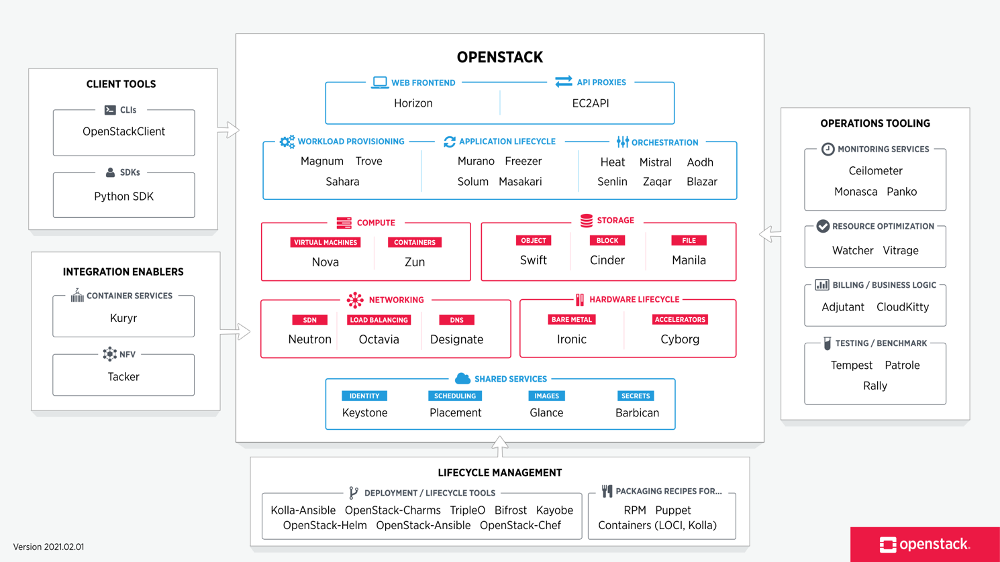
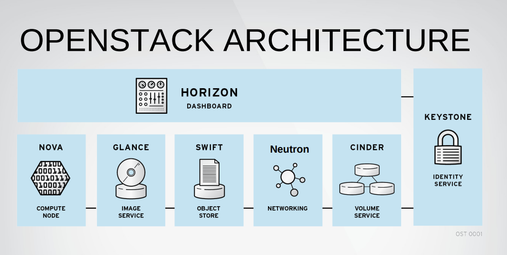
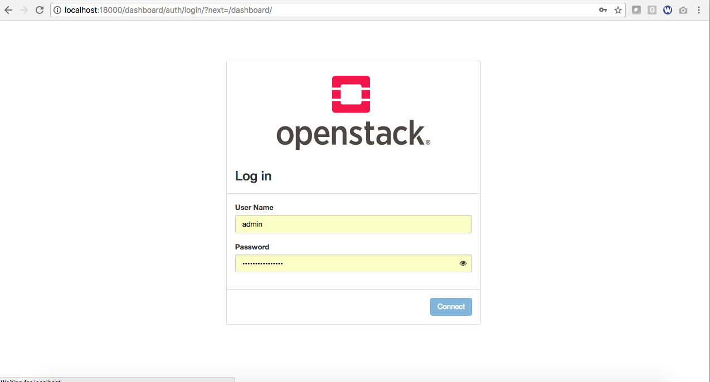
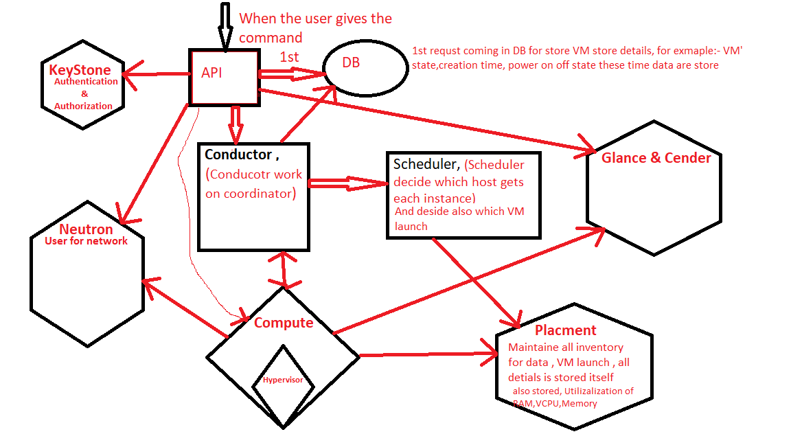
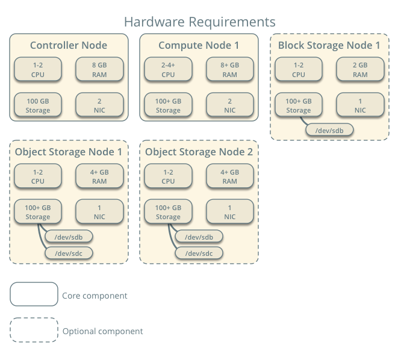
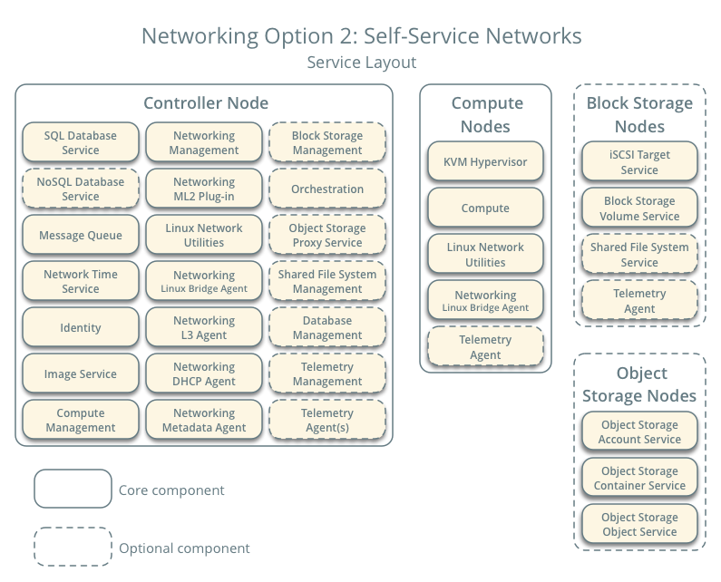
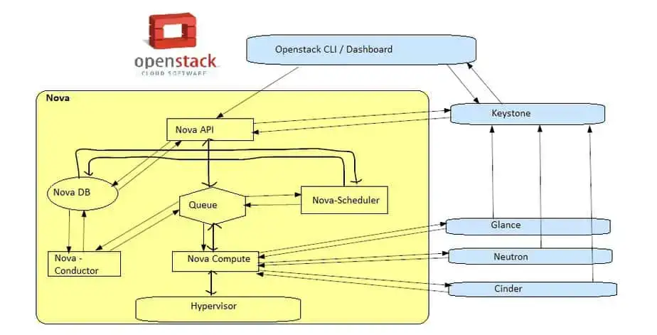



We are covering these topics.

1. About Open Stack
2. What is OpenStack
3. Bare Metal
4. Compute Service (NOVA)
5. KeyStone
6. Galnce
7. Neutron
8. Placement
9. How work NOVA*
10. Block Storage Service (CINDER)
11. Network Service (Neutron)
12. Image Storge Service (Glance)
13. Object Storage Service (Swift)
14. Indentity Service (KeyStone)
15. OpenStack Monitoring and Metering (CEILOMETER)
16. Network digram of OpenStack
17. Step By Step Instance VM (NOVA) Creation Flow of OpenStack



# About Open Stack

- Platform: Cross-platform software
- Developer: Rackspace Technology
- Initial release: 21 October 2010; 13 years ago

# What is OpenStack

OpenStack is a free, open standard cloud computing platform. It is mostly deployed as infrastructure-as-a-service in both public and private clouds, 
it is piesce of softwate when installed on cluster of phisical server offeres the users to create , run and manage virtial machine on top of it along with support to attach the connected storage atong with the networking services in a virtual formte knwo as a infrastructure as a service (IAAS).

> **OpenStack has 4 principles**

1. Open Soureces
2. Open Design
3. Open Development
4. Open Community

**Bare Metal**

In computer networking, a bare-metal server is a physical computer server that is used by one consumer, or tenant only.

**Approx 40 services is avialebl in OpenStack**

1. **Dashboard Service (HORIZON)** :-

 When we work on any application, the dashboard that we see is what we call horizon in OpenStock. Horizon it's a GUI method of OpenStack service,  

 Dashboard
- Provides simple self service UI for end-users
- Basic cloud administrator functions
- Define users, tenants and quotas
- No infrastructure managemen

2. **Compute Service (NOVA)** 

Nova is the OpenStack project that provides a way provision Compute instance (Aks Virtial Machine), nova support virtial machine, baremetal server and has limited supprt for system containers and nova run as a set of darmons on top of existing linux server to proide that service.

- Compute Nodes – hypervisors that run virtual machines
- Supports multiple hypervisors KVM, Xen, LXC, Hyper-V and ESX
- Distributed controllers that handle scheduling, API calls, etc
- Native OpenStack API and Amazon EC2 compatible API

   > -  **This services is must after nove installtion**

3. **KeyStone :-** Provide identity and authentication for all OpenStack Services
   
4. **Galnce :-** 
   
   This provide the compute iamges repository, all instance launch from glance images

- Image service
- Stores and retrieves disk images (virtual machine templates)
- Supports Raw, QCOW, VMDK, VHD, ISO, OVF & AMI/AKI
- Backend storage : Filesystem, Swift, Gluster, Amazon S3

5. **Neutron :-** This is responable for provisioing the virtual physical network that the compute instacne connecct to on boot,

6. **Placement :-**  This is tracking for inventroy available in a cloud AND assisting which provide og those will be used when creating virtual machine

**How work NOVA**

7. **Block Storage Service (CINDER)**

Block storage, object storage and file storage service is called Cinder in OpenStack.

Block Storage (Volume) Service
- Provides block storage for virtual machines (persistent disks)
- Similar to Amazon EBS service
- Plugin architecture for vendor extensions
eg. NetApp driver for Cinde

8. **Network Service (Neutron)**

Network related all service coming under the network services (neutron)

Network Service 
- Provides framework for Software Defined Network (SDN)
- Plugin architecture 
- Allows integration of hardware and software based network solutions

9. **Image Storge Service (Glance)**

Whenever we launch any instance (VM's), to launch that instance or VM we need an ISO image which we call glance in openstack.

10. **Object Storage Service (Swift)**
   
-  Object Storage service
- Modeled after Amazon's S3 service
- Provides simple service for storing and retrieving arbitrary data
- Native API and S3 compatible API

   Swift service it's a swift service

11.  **Indentity Service (KeyStone)**
   
Keystone is an OpenStack service that provides API client authentication, service discovery, and distributed multi-tenant authorization by implementing OpenStack's Identity AP,

This is a mostinportant service, from the user managment and which service where is runing all over mamanged from keystone service.

1.  **OpenStack Monitoring and Metering (CEILOMETER)**

- Goal: To provide a single infrastructure to collect measurements from an entire OpenStack infrastructure; eliminate need for multiple agents attaching to multiple OpenStack projects
- Primary targets metering and monitoring; 
provides extensibility

> **hardware Requriment for Deployment of OpenStack**

> **Network digram of OpenStack**

> # Step By Step Instance VM (NOVA) Creation Flow of OpenStack.

> We can unedersatant from this image,

# Keep Learning....

