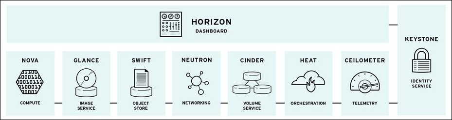
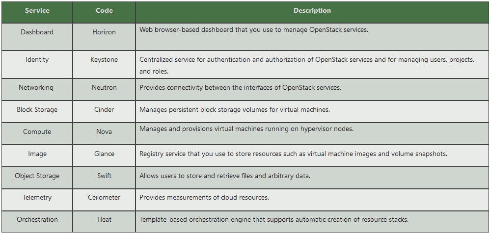
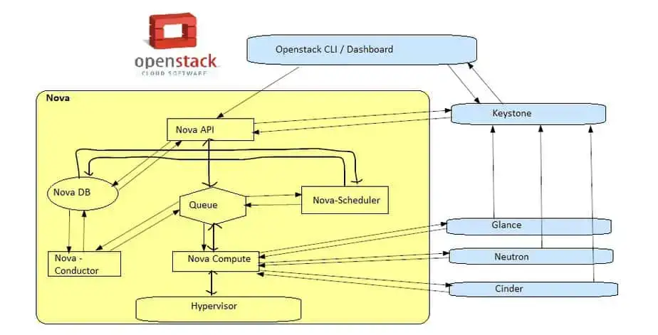

# About Open Stack

- Platform: Cross-platform software
- Developer: Rackspace Technology
- Initial release: 21 October 2010 13 years ago

# What is OpenStack

OpenStack is a free, open standard cloud computing platform. It is mostly deployed as infrastructure-as-a-service in both public and private clouds, 
it is piesce of softwate when installed on cluster of phisical server offeres the users to create , run and manage virtial machine on top of it along with support to attach the connected storage atong with the networking services in a virtual formte knwo as a infrastructure as a service (IAAS).

> ** These are same composents of OpenStack**

1. Horizaon (Dashboerd servaices)
2. NOVA  (Compute)
3. Glance (Image Service)
4. Swift (Object Storage)
5. Neutron (Network service)
6. Cinder (Volume service)
7. Hert (Orchestretor)
8. Ceilometer (Telemeter)
9. KeyStone (Identity)

> 1. **Dashboard Service (HORIZON)**

 When we work on any application, the dashboard that we see is what we call horizon in OpenStock. Horizon it's a GUI method of OpenStack service,  

- Provides simple self service UI for end-users
- Basic cloud administrator functions
- Define users, tenants and quotas
- No infrastructure managemen
  
> 2. **Compute Service (NOVA)** 

Nova is the OpenStack project that provides a way provision Compute instance (Aks Virtial Machine), nova support virtial machine, baremetal server and has limited supprt for system containers and nova run as a set of darmons on top of existing linux server to proide that service.

- Compute Nodes – hypervisors that run virtual machines
- Supports multiple hypervisors KVM, Xen, LXC, Hyper-V and ESX
- Distributed controllers that handle scheduling, API calls, etc
- Native OpenStack API and Amazon EC2 compatible API

> 3. **Galnce (Image service) :-** 

This provide the compute iamges repository, all instance launch from glance images

- Image service
- Stores and retrieves disk images (virtual machine templates)
- Supports Raw, QCOW, VMDK, VHD, ISO, OVF & AMI/AKI
- Backend storage : Filesystem, Swift, Gluster, Amazon S3

> 4. **Object Storage Service (Swift)**
 
-  Object Storage service
- Modeled after Amazon's S3 service
- Provides simple service for storing and retrieving arbitrary data
- Native API and S3 compatible API

> 5. **Neutrol Service (Network Service)**

Neutron is an OpenStack project that provides network connectivity as a service (NaaS) in virtual environments

> 6. **Block Storage Service (CINDER)** 

Block storage, object storage and file storage service is called Cinder in OpenStack.
Block Storage (Volume) Service
- Provides block storage for virtual machines (persistent disks)
- Similar to Amazon EBS service
- Plugin architecture for vendor extensions
eg. NetApp driver for Cinde

> 7. **Orchestration Tool**

Template based orchestration that support automatic creation of resources stacks

> 8. **OpenStack Monitoring and Metering (CEILOMETER)**

 Goal: To provide a single infrastructure to collect measurements from an entire OpenStack infrastructure; eliminate need for multiple agents attaching to multiple OpenStack projects
 Primary targets metering and monitoring; 
provides extensibility

> 9. **KeyStone (identity service) :-** 

Provide identity and authentication for all OpenStack Services

> **There have two types nodes planning of openstack**

 1. Single Node
 2. Multi Node
   
> **There are tree type of installtion method of OpenStack**

1. Manual Installtion
2. Packstack (POC-Prof of concept):-  (it's a software for installtion OpenStack, only for Home practice, Demo, Traning, and it's not supprt bare mattel and supprt single node)
3. Triple-O 

> **VM, Instance Creation Flow in OpenStack**

nova boot --flavor m1.small --image centos7 --nic net-id={private_network_id} --security-group norprod_sec_grp  --key-name my_key stack_testvm

Step:1):- 

The Horizon Dashboard or OpenStack CLI gets user credentials and authenticates with identity service via REST API

- The identity service (Keystone) authenticate the user with the user credentials and then generates and send back an auth-token, that auth-token which will be used for sending the request to other components through REST-Call
  
Step:2):- 

The Dashboard or OpenStack CLI converts new instance request specified in launch instance or nova boot command to a REST API request and sent it to nova-api

Step:3):-

Then nova-api service gets the request and send that request to the identity service (Keystone) for validation of auth-token and access permission,

Step:4):-

After getting the repsonse from keystone, then  nova-api checks for conflicts with nova-database and then it creates initial database entry for new instance or VM.

Step:5):-

nova-api sends the rpc.call request to nova-scheduler expecting to get updated instance entry with host id specified

Step:6):- 

Now nova-scheduler picks the request from the queue

Step:7):-

nova-scheduler talks to nova-database to locate an appropriate host using filtering and weighing mechanism,

- nova-scheduler sends the rpc.cast request to nova compute for launching an instance on the appropriate host
  
Step:8) 

nova-compute picks the request from the queue and it sends the rpc.call request to nova-conductor to get the VM or instance info such as host id and flavor (RAM,CPU and Disk)

Step:9) 

nova-conductor takes the request from queue and communicate with nova-database,

- nova-conductor gets the instance information
- now nova-compute picks the instance information from the queue
  
Step:10):-

nova-compute connects to glance-api by making a REST Call using auth-token and then nova-compute uses the image id to get the image URI from image service and loads the image from image storage

Step:11):-

glance-api validates the auth-token with keystone and after that nova-compute gets the image metadata

Step:12):-

Nova-compute make the REST-call by passing the auth-token to Network API (Neutron) to allocate and configure network so that vm gets the IP address

Step:13):-

Neutron-server validates the auth-token with keystone and after that nova-compute retrieves the network information.

Step:14):-

Nova-Compute makes the REST-call by passing the auth-token to Volume API to attach the volume to the instance or VM.

Step:15):-

cinder-api validates the auth-token with keystone and then nova-compute gets the block storage information.

Step:16):-

nova-compute generates data for the hypervisor driver and executes the request on the hypervisor using libvirt or API and then finally a VM is created on the hypervior. We can see that VM in Dashboard and also using “nova list” command.

# Installtion Process of DevStack (openStack) in Ubuntu 22.04

1. sudo useradd -s /bin/bash -d /opt/stack -m stack (create user with directory  and shell)
2. sudo chmod +x /opt/stack   (excutable permission of user)
3. echo "stack ALL=(ALL) NOPASSWD: ALL" | sudo tee /etc/sudoers.d/stack (give root permission of stack user)
4. sudo -u stack -i (Swith user in stack)
5. git clone https://opendev.org/openstack/devstack (downlod devstack file and directory)
6. cd devstack/
7. ls
8. ADMIN_PASSWORD=enter you password according to you
9. ifconfig
10. apt install net-tools (if, ifconfig command is not run then, we can install net-tools packege)
11. ls
12. ./stack.sh (run this file for installion openstack) 
13. and after run and successful this command then check apache2 sercie nginx serivce proper runing
14. should be difffrent port number of both package (apache and nginx ) and also firewall is active and add port number of apache2 and nginx
15. then create vim openrc.conf and vim , clouds.yaml and configure according to your machine and Openstack RC files
    
If Any issue then you can drop me mail (prathvisoni2001@gmial.com), please

# **These are same commands for openstack realted with explaination**

1. openstack image create "Ubuntu" --file ubuntu-20.04.6-live-server-amd64.iso --disk-format iso --container-format bare --public ( we can launch the vm in openstack)
2. openstack image list ( list the list)

# How to create project ?

1. source path
2. openstack project list
3. openstack project create --domain <domain-name> --description "Project description" <project-name>
4. 

# Keep Learning....

