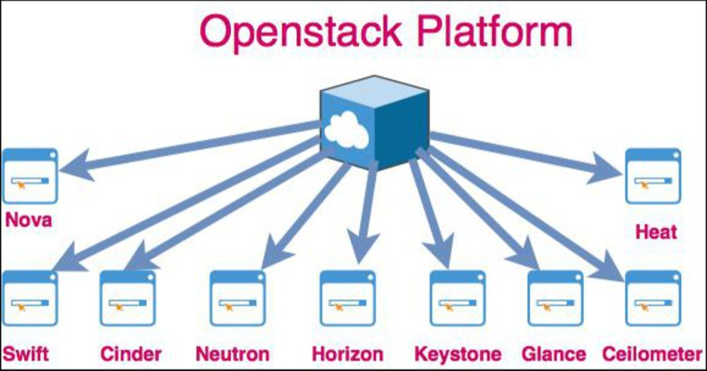

# About Open Stack

- Platform: Cross-platform software
- Developer: Rackspace Technology
- Initial release: 21 October 2010; 13 years ago

# What is OpenStack

OpenStack is a free, open standard cloud computing platform. It is mostly deployed as infrastructure-as-a-service in both public and private clouds, 
it is piesce of softwate when installed on cluster of phisical server offeres the users to create , run and manage virtial machine on top of it along with support to attach the connected storage atong with the networking services in a virtual formte knwo as a infrastructure as a service (IAAS).

> **OpenStack has 4 principles**

1. Open Soureces
2. Open Design
3. Open Development
4. Open Community

**Bare Metal**

In computer networking, a bare-metal server is a physical computer server that is used by one consumer, or tenant only.

**Approx 40 services is avialebl in OpenStack**

1. **Dashboard Service (HORIZON)** :-

 When we work on any application, the dashboard that we see is what we call horizon in OpenStock. Horizon it's a GUI method of OpenStack service,  

2. **Compute Service (NOVA)** 

Nova is the OpenStack project that provides a way provision Compute instance (Aks Virtial Machine), 
nova support virtial machine, baremetal server and has limited supprt for system containers and nova run as a set of darmons on top of existing linux server to proide that service.

   > -  **This services is must after nove installtion**

1. KeyStone :- Provide identity and authentication for all OpenStack Services
   
2. Galnce :- This provide the compute iamges repository, all instance launch from glance images

3. Neutron :- This is responable for provisioing the virtual physical network that the compute instacne connecct to on boot,

4. Placement :-  This is tracking for inventroy available in a cloud AND assisting which provide og those will be used when creating virtual machine

**How It's work NOVA**

5. **Block Storage Service (CINDER)**

Block storage, object storage and file storage service is called Cinder in OpenStack.

4. **Network Service (Neutron)**

Network related all service coming under the network services (neutron)

5. **Image Storge Service (Glance)**

Whenever we launch any instance (VM's), to launch that instance or VM we need an ISO image which we call glance in openstack.

6. **Object Storage Service (Swift)**
   
   Swift service it's a swift service

7.  **Indentity Service (KeyStone)**
   
Keystone is an OpenStack service that provides API client authentication, service discovery, and distributed multi-tenant authorization by implementing OpenStack's Identity AP,

This is a mostinportant service, from the user managment and which service where is runing all over mamanged from keystone service.

> **hardware Requriment for Deployment of OpenStack**

> **Network digram of OpenStack**

