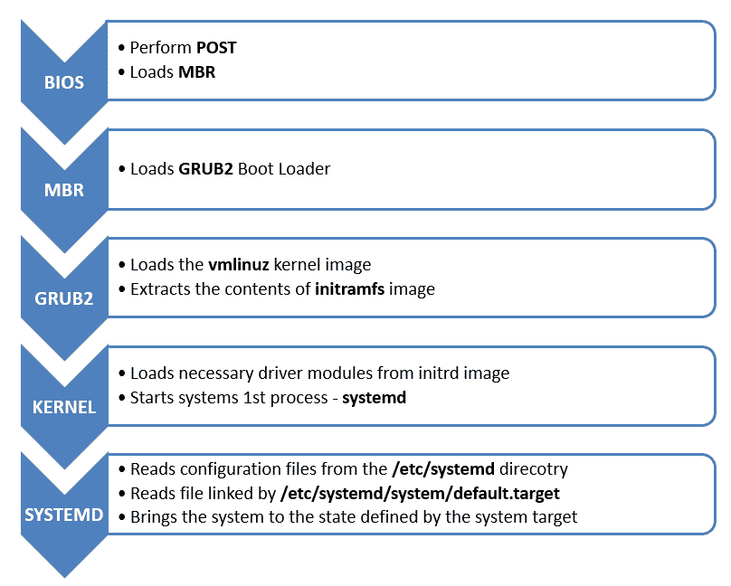
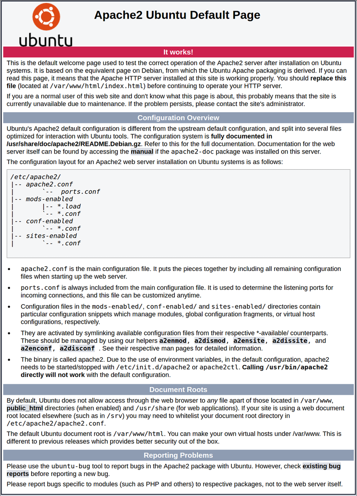
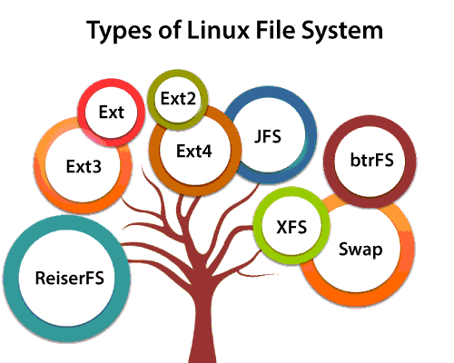
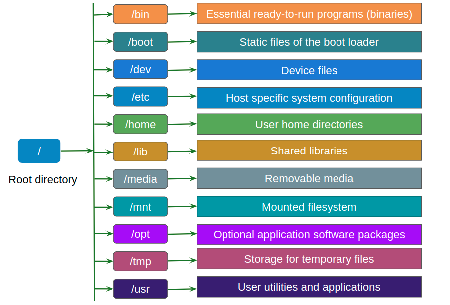

> **This is Image of Linux Logo**

 
> **About Linux**

- Developer: Linus Torvalds
- Initial release date: 17 September 1991
- Programming languages: C, Assembly language

> ***We are coverd findamental linux**

 Linux is Operating system (OS) for open surce and command line interface, Just like Windows, iOS, and Mac OS one of the most popular platforms on the planet An operating system is software that manages all of the hardware resources associated with your desktop or laptop. To put it simply, the operating system manages the communication between your software and your hardware. Without the operating system (OS), the software wouldn’t function and linux os monolithic kernal.

 > **Why use Linux?**

Linux is a totly open source Oprating system and commnad line interface, we can modify kernal and configuration file accoring to the company and me and linux is very secur operaing system which is user to SHA algoritham in linux That’s right, zero cost of entry… as in free. You can install Linux on as many computers as you like without paying a cent for software or server licensing.

> **Open source**

> Linux is also distributed under an open source license:- 

- The freedom to run the program, for any purpose.
- The freedom to study how the program works, and change it to make it do what you wish.
- The freedom to redistribute copies so you can help your neighbor.
- The freedom to distribute copies of your modified versions to others.
  
> **In the market multpule distribustion are avauilebl in the market**

- LINUX MINT
- KALI LINUX
- CENTOS
- DEBIAN
- UBUNTU
- FEDORA
- OPENSUSE

> This is most oprating system uses in company's,

- Ubuntu
- CentOS 
- Opensuse
- RHEL

> **Now we are insatlling Linux**

- 1. Decide which Linux distribution you want to use. (Later we will give a table of common choices and useful links
for downloading install media, and helpful tutorials on procedure.)

- 2. Download the install image, which will be either a local or network install image or a Live image (which can also
be used for install.)

- 3. Decide if you want to do a:

- Native Installation: To do this you will need a machine with enough useable disk space or will have to
repartition to make space available.
- Virtual Machine Installation: To do this you’ll have to first install a hypervisor program as described later.
- Live CD/DVB/USB method: To do this no install is needed, but performance will be weaker.

- 4. Do the install following distribution-supplied directions.

> **Installtion mathod**

All Linux distributions provide downloadable installation media in the form of optical media images (CD and/
or DVD) which can be easily burned to a physical disk, or USB stick images, together with instructions on how to 
produce a USB drive that can be booted from for installation. 

These images vary in type of machine (e.g., 64-bit or 32-bit; we recommend doing only 64-bit installs on modern 
hardware that supports it) or small or large (e.g., minimal or full desktop or server system).
Alternatively, one can do a much smaller download and get a network install image which has just a few files; then 
the installation procedure goes out on the Internet to get whatever else is needed. Such a network install has only 
a short initial download, but the install process itself can take a long time based on your network download speed. 
A full install image may also support going out to the Internet during installation, like a network install, but only to 
retrieve software with a newer version available than was included in the full install image. 

> **Using Live Media Instead of a Full Install **

Many popular distributions provide Live CD, DVD, or USB media which can be used to run Linux without actually 
installing it on your disk drives. As you can imagine, this is the safest method of experimenting with Linux if you 
already have a computer running another operating system. 

There are disadvantages however:

- • Slow startup: every time you boot up the hardware has to be examined and the operating system set up as if
you were doing a fresh install.
- • Performance can be poor, so more memory and CPU power may be required to make things run acceptably.
- • It can be awkward to save any work or other material either on the normal hard disk or to external media etc,
although it can be done. In particular, any changes in setup or any other software that is installed may be lost
each time one boots up.

Please note that the Live media image and the Install image is the same for many modern user-friendly distributions! 
One simply boots off the Live image and then clicks on Install once the system starts. One very nice aspect of this 
dual-use media is that before you even attempt an install, you know whether or not the Linux-based operating system 
can recognize and work with all of your hardware and peripherals, such as your network card, sound system, webcam etc

> **Installing a Hypervisor and a Virtual Machine**

Everyone has probably heard the phrase Virtual Machine. This is a full guest operating system (which may or may not be
Linux) which runs on top of a Hypervisor program on a host machine, which can be running any operating system with an 
available hypervisor, including all flavors of Windows, Linux and Mac OS. 
An advantage of using the virtual machine images is that you can’t fundamentally destroy your host system while
running them, and they run as an unprivileged application, which may be more compatible with company IT policies, if
applicable. A further advantage, especially with on-line classes, is that a system failure does not take you off-line.
The disadvantages have mostly to do with performance and requiring somewhat more memory and CPU power.
However, in many circumstances this will not be a disqualifying aspect.
You will have to install a hypervisor program if you don’t already have one. Here are two easily obtainable low- or nocost solutions:

- • Oracle Virtual Box
Can be downloaded from https://www.virtualbox.org
Exists for Windows, Linux, Mac OS and Solaris operating systems.

- • VMware
Exists in full-featured products such as VMware Workstation but also in a freely downloadable version, VMware
Player which can be reached at http://www.vmware.com/try-vmware.html. While VMware Player is free of charge
only for Windows and Linux host operating systems, VMware Fusion is a low cost program for the Mac OS.
Once you have installed the hypervisor, installing a guest operating system is pretty easy. You don’t even have to burn 
the install image to a CD or DVD; you can just point the hypervisor to the .iso image on your computer. In some cases 
(such as for Virtual Box) you can even perform an automatic installation which doesn’t even ask you questions when 
you install.

The rest of the discussion on installation for the most part applies here, except you won’t have to worry about the 
difficult things like partitioning; you can just take the default choices. However, make sure you assign enough disk space 
(say at least 20 GB to be safe, although you’ll probably need quite a bit less).

> ***Now We are learing Booting process **

- 1:- Power on machine
- 2:- After power on machine SMPS (Switch on power supply), Will supply the power to all the conctvity devices and motherboard
- 3:- Basically it provide the current from AC (Alternative current) to DC (Direct Current)
- 4:- This supply is provide to proper amount of voltage
- 5 :- **BIOS INITIALIZATION** ==> BIOS to firmware used to perform haedware inistiozation durring the booting process (POST)
- 6 :- **What is BIOS**
- **First** :- BIOS is the first think loads when you start your computer, it initilization hardware befour booting an OS from your hard dirve or another device
- **Second** :- BIOS second for , Basic input/Output System and all the types of firmware storage on a chip on your motherboard, when you start you computer, the computer boot the BIOS, Which configure your hardware befoure handling off to a boot device 

- 7:- The BIOS perform POST Operation (Power on self test), to detect and initialization system hardware component.
- 8:- If all device is OK, then Boop sound,
- 9:- Then MBR in the hard disk it refer to the location of the boot loader using DISK priority 
- 10:- BIOS load and exciutes the MBR boot laoder and give control to MBR

**This is a Imges of Booting Process you can understand**

> **What is apache web server and HTTPD Server**

- Apache web server or Apache http server is one of the most widely used on 
the Internet It is developed and maintained by Apache Software Foundation, Apache is 
an open source software available for free A web server generally hosts the web content, and responds to requests for 
this content from web browsers such as Internet explorer, Google chrome 
and Firefox And httpd is the same as apache2. It depends on the OS you use. For example in 
RHEL 6.2 it is called httpd and in Ubuntu it is called apache2. 

> **How many web Servers we have in market ?**

- 1- apache web server, 
- 2- IIS web server 
- 3- Nginx webserver and litespeed web server. 
  
- Beside Apache, IIS and Nginx also among the most common web servers in 
use today As reported (July 18, 2016) the web server statistics shows that from the 
entire internet web, there are 46% web server running in Apache, 29% in 
Microsoft IIS and 19% in Nginx,

-  The http protocol is sent over the wire in clear text, using port 80/TCP by 
default (though other ports can be used). 
 There is also a TLS/SSL encrypted version of the protocol called https that 
uses port 443/TCP by default.

> **Types of website in markets ?**

- 1:- Name based hosting 
- 2:- IP Based Hosting 

- Package name: httpd (Apache2)
- Daemon: httpd (Apache2)
- Port number: 80 { http } and 443 { https } 
- File : /etc/httpd/conf/httpd.conf OR (etc/apache2/apache2.conf)
- Log: /var/log/httpd/access.log 
- /var/log/httpd/error.log 
- Document root place: /var/www/html 

> **What is HTTPS ?**

- HTTPS stands for Hyper Text Transfer Protocol Secure, It is a protocol for securing the communication between two systems e.g. the 
browser and the web server, t is the protocol where encrypted HTTP data is transferred over a secure 
connection. By using secure connection such as Transport Layer Security or 
Secure Sockets Layer The principal motivations for HTTPS are authentication of the accessed website, 
and protection of the privacy and integrity of the exchanged data while in transit It uses the port no. 443 for Data Communication. It allows the secure transactions
by encrypting the entire communication with SSL.

> **How to install webserver in Ubuntu ?**

- sudo apt update
- sudo apt install apache2
- sudo systemctl status apache2
- sudo systemctl stop apache2
- sudo systemctl staret apach2
- Now you can hit in broser "localhost" Output open samething open,

> **Linux File System**

- We can read and write the data from file system, a Linux file system is a structured collection of files on a disk drive or a partition. A partition is a segment of memory and contains some specific data. In our machine, there can be various partitions of the memory. Generally, every partition contains a file system.

The general-purpose computer system needs to store data systematically so that we can easily access the files in less time. It stores the data on hard disks (HDD) or some equivalent storage type. There may be below reasons for maintaining the file system.

> **What is the Linux File System?**

Linux file system is generally a built-in layer of a Linux operating system used to handle the data management of the storage. It helps to arrange the file on the disk storage. It manages the file name, file size, creation date, and much more information about a file.

> **Types of Linux File System**

When we install the Linux operating system, Linux offers many file systems such as Ext, Ext2, Ext3, Ext4, JFS, ReiserFS, XFS, btrfs, and swap.

- Ext :- The file system Ext stands for Extended File System. It was primarily developed for MINIX OS. The Ext file system is an older version, and is no longer used due to some limitations.
  
- Ext2 :- Ext2 is the first Linux file system that allows managing two terabytes of data, Individual File Size 16GB-2TB
  
- Ext3 :- Ext3 is developed through Ext2; it is an upgraded version of Ext2 and contains backward compatibility Individual File Size 16GB-2TB
  
- Ext4 :- Ext4 file system is the faster file system among all the Ext file systems. It is a very compatible option for the SSD (solid-state drive) disks, and it is the default file system in Linux distribution, Individual File Size 16GB-16TB
  
- XFS :- XFS is a highly scalable, high-performance file system and size is manage up to 16 exabytes
  
- Swap :- Swap memory it a virtual memory in linux, Swap space in Linux is used when the amount of physical memory (RAM) is full. If the system needs more memory resources and the RAM is full And accepts its space from SDD or HDD, according to the need we can extand and reduse swap file system.

> **How to extant swap memory in linux**

- sudo swapon --show
- free -h
- df -h
- sudo fallocate -l 1G /swapfile
- ls -lh /swapfile
- sudo chmod 600 /swapfile
- ls -lh /swapfile
- sudo mkswap /swapfile
- sudo swapon /swapfile

> **What is partistion in linux**

- it is a method by which we can break a disk into small small parts, These partition can be use to store OS files and personal data files.

> **In windows:-**

Disk 
partition  ==>   C:\    D:\    E:\   F:\  .....so on 
C:\   ==> mandatory Disk and remainigs are optional.

C:\  ==> use to store os file and we can also use it for the data. 
D:\  E:  F:\ ==> recommened drive to store data .

> **In linux:-**

there is no concept of  C:\  D:\  E:\   F:\  Drive.
Whole OS will represent by  / 
 [ root filesystem or root partition or parent directory ]

> **Disk Name in Linux**

1- PATA OR IDE  ===> hda ==> hda1  hda2 hda3   hdb ==> hdb1 hdb2 hdb3 ..etc
2- SATA         ===> sda ==> sda1  sda2  sda3....etc 
3- Virtual Disk ===> vda ==> vda1  vda2 

fdisk -l  ==> to find out the details about your disk
   OR
lsblk  

Disk  ==> 30 GB ==> During the Installation 

1- Automatic Partition   ==> machine will automatically used this space but we can not mentioned size manually
2- Custom Partition      ==> we can plan these partition as per needs

> **Types of Partition Creation technology ?**

- Standard Method OR Standard Volume ==> fixed size partition concept 
- LVM Method [ logical volume manager]     ==> Recomended,
we can extend or reduce this volume size in future

> **How many partitions requried to install linux OS ?**

1-    /              ==> OS Files + Data files    
2-    swap partition ==> Virtual memory ==> twice of main memory

> **About linux Partistion**

- Every hard drive always manage by MBR or GPT [GUID partition Table ] technology ?
- In first sector we have already installed MBR [master boot record ] technology.
- MBR Basically Bydefault  allow maximum four partition into any disk.
- MBR basically allow two types of partition .

- Primary partition  <== can be use to store os data and personal data.
- Extended partition <== 3- Logical partition

> **Primary Limits**

1- Min ==> 1 
2- MAX ==> 4 

> **Extended Limits  [can be optional ]**

> **What is the Filesystem Hierarchy Standard**

Filesystem hierarchy standard describes directory structure and its content,

- 1:- / (Root)
- 2:- /bin 
- 3:- /boot 
- 4:- /dev 
- 5:- /etc
- 6:- /home
- 7:- /lib
- 8:- /media
- 9:- /mnt
- 10: /opt
- 11:- /sbin
- 13:- /tmp
- 14:- /usr
- 15:- /proc

1- Min  ==> 0 
2- Max  ==> 1

> **Switching Users in Ubuntu**

- sudo su (We can switch from another user)
- poweroff (power off the system with this command)
- init 0 (reboot the system), and init 1 (power off the system)

> **Recovering Deleted Files**

- Create a new text file on the desktop named coredge.txt, using the graphical file manager
- Delete the file by sending it to Trash.
- Verify the file is now in ~/.local/share/Trash, or a subdirectory thereof. NOTE: You will have to get your file browser to show      hidden files and directories, those that start with a .)
- Recover the file and make sure it is in its original location.
  
> **Networking Fundamental of Linux**

- What do you mean by networking?
- 
Networking is the process of making connections and building relationships. These connections can provide you with advice and contacts, which can help you make informed career decisions.

> **Types of  Address on every machine ?**

1- Physical Address  ==>  MAC address or Ethernet address or hardware address or LAN Card add 

2- Logical address   ==> IP-V And IP-V6 .

> **MAC address  ==> media access control**

Address  ==> Hexadecimal ( 0-9, A-F)
Total Block ==> 6 Block and each block seperated by colon symbol

> **Type Of IP**

IP - V4
IP - V6 

> **IP-V4**

- IP-V4

Address  ==> decimal ( 0-9 )
Total Block ==> 4 Block and each block seperated by dot symbol .

> **IPV6**

- IP-V6
  
Address  ==> Hexa-decimal ( 0-9, A-F )
Total Block ==> 8 Block and each block seperated by colon symbols

> **Class Range**

- A    ==>    0 - 126
- B    ==>  128 - 191
- C    ==>  192 - 223
- D    ==>  224 - 239
- E    ==>  240 - 255

> **Subnet Mask      default subnet mask**

- A   ==>  N.H.H.H    ==> 255.0.0.0
- B   ==>  N.N.H.H    ==> 255.255.0.0
- C   ==>  N.N.N.H    ==> 255.255.255.0
  
  
- 1-  /etc/hosts        ==> to connect machine with name without any dns server   
- 2-  /etc/resolv.conf  ==> to configure my machine as a DNS Client.
  
> **These are same command for network**

- ifconfig (We can IP address details)
- hostnamectl set-hostname coredge.io@example.com (To set the localhostname)
- hostname (Check hostname)
- ip a (Check IP)
  
> **Types of Login User ?**

1- Super user      ==> root               ==> #    ==> Full Power
2- Normal users    ==> amit deepak sumit  ==> $    ==> Limited Power

- Useradd coredge (we can create user in linux)
- passwd coredge (we can provide the password of linuc normal user)
  
> **How to switch useer in linux**

- su <usernmae>
- exit (Exit from current user)
  
> **How to create file and find the file from particular location**

- touch /tmp/coredge (we can create file)
- find / -name <Filename> (We can find any file from intire root)
- mkdir core
- find / -name <filename> (We can find any directory from intair machine and root)
  
- touch  ==> blank file creation  
- mkdir  ==> directory creation 
- cd     ==> change directory
- ls     ==> to check data listing 
- cd ..  ==> to go on one level back 
- cd ../..  ==> two level back
- echo  ==> use to print any mesg on the screen 
- cat   ==> use to read content of  any file on the screen 
- ;       ===> to run or execute multiple command in a sequencing order 
- |       ===> to join muiltiple commands to acheive any special types of output 

- head   ==> It display or prints by defaults 10 lines from top of any file or from any commands output
  
- head /etc/passswd (You can take any file)

- tail   ==> It display or prints by defaults 10 lines from bottom of any file or from any commands output.
  
- tail /etc/passwd (You can take any file)
  
> **This is advance concept from head and tail, sed command can be perform print opration in particilar words **

- sed:-  It also use to print any lines from any file or from any command outputs
- sed '1p' /etc/passwd ( this command print all line)
- sed -n '1p' /etc/passwd (this command print only one line)
- sed -n '1,5p' /etc/passwd (this cammnd print 1 to 5 line)
- sed -n '1p,10p' /etc/shodow (this cmmand print only 1 line and 10 line, not print 1 line number to 10 line number)
- sed -n '$p' /etc/passwd (This command print last line of the file)
- sed -n ''1p;10p /etc/passwd (This command print 1 line and 10 line)

> **We can find any particular word line**

- cat /etc/passwd | grep sbin (The line number containing sbin will print all the lines.)
  
> **Controlling Services**
>  There are 7 types of runlevel in Linux OS ?.
  
- 1:-  init	0		[ poweroff the machine ]

- 2:-  init	1 		[ Single user mode OR Troubleshooting Mode ]

- 3:-  init	2 		[ Multi user mode without Networking ]

- 4:-  init	3		[ Full Multi user mode with network OR CLI mode only OR Text Mode Only ]

- 5:-  init	4		[ un-used ] or [ Blank ]

- 6:-  init 5		[ Full Multi User mode with GUI + CLI  OR  X-windows ]

- 7:-  init	6 		[ Reboot the machine ]

> Note-   At a time we can run any machine only on any single  runlevel number.

- How to check current runlevel number in any machine  ?
  
*  who  -r
  
- How to switch or change runlevel on temporary basis ?
  
* init 3       [ to move in CLI mode ]
*  init 5       [ to again come back in GUI mode ]
  

> **How to Manage Users account in Linux  OS**

> **Who is user ?**

- 1- A user is a person which has uniq identity to enter 
   into any server machine.

- 2- With this username he/she can easily operate , configure
   and monitor any live servers.

**By default during the OS installation time ==>  root user 
will be automatically created only**

> Objective:- 

- useradd  <options>    <username> 
- usermod  <options>	<username>
- userdel  <options>	<username>
- passwd  <options>   <username>
- id   username 
- su  -  <username>
- groups  <username>
- exit
  
- useradd  sachin
- passwd   sachin

Type Password: 123
Retype Passowrd: 123

> **Users Related information files ?**

- 1- UID                   ====>  User ID  
- 2- GID                   ====>  Group ID
-3- /home/sachin/         ====>  Default Home directory place for all normal users.
-4- /etc/passwd  	 ====>  It contains all  user's related information.       
-5- /etc/group            ====>  It contains all group's related information.    
-6- /etc/shadow           ====>  It contains all  users password in encrypted format. <== x
-7- /etc/gshadow          ====>  It contains all group password in encrypted format.  <== x
-8- /var/spool/mail/sachin====>  default place for mail alerts. 

 cat  /etc/default/useradd    ==> HOME=/home
 cat  /etc/login.defs 

UID and GID Range  ==>  [ 0 - 60000 ]   ==> It devide into three parts
UID   ==>  0  -  60000
GID   ==>  0  -  60000

> **Types of Users ?**

- 1:- Super user       ===>  root 

      UID  ==>  0
      GID  ==>  0

- 2:- System defined users or service defined users  
   ==> ftp, dns, games, ldap ..etc 
  [ will generate automatically after 
  installing any application or services  ]

    UID   ==>  1 - 999
    GID   ==>  1 - 999

- 3:- Normal users or custom users   ===>  deepak , sumit  ,  rahul
 
 created by any super user or any sudo admin user ]

    UID   ==> 1000  - 60000
    GID   ==> 1000  - 60000

cat  /etc/login.defs

ls  /home

cat  /etc/default/useradd    <== HOME=/home 

Note:   we can change user home directory location if we want.

> **cat   /etc/passwd     ===>    7 Fields**

   root    :    x    :    0  :    0    :    root   :    /root   :   /bin/bash

-1- Username
-2- password Pointer  ==>  /etc/shadow 
-3- UID
-4- GID
-5- Comment OR Fullname OR GECOS OR Profilename
-6- home directory
-7- Login Shell 

> ** cat  /etc/group      ==>  4 fields**

 groupname : x :  GID Number :  Secondary Members Name

-1- groupname
-2- password pointer == /etc/gshadow
-3- GID Number
-4- Members name 

> ** groupadd  tcs**

 cat  /etc/group 
tcs:x:1001: 

> **cat  /etc/shadow      ==>    9 Fields**

 username : Encrypted-password :  next seven -- password policy 

> **File and directory based basic permissions**

Types of permissions in linux ?

1- file and directory based permissions   ==> read write execute  ==> file or directory
2- Command execution based permissions    ===> SUDO 

Types of users ?

1- Super user   ==> root               ==> home directory [rwx]  +  public place  [rwx]
2- Normal user  ==> amit deepak sumit  ==> home directory [rwx]  +  public place  [read only] or as per defined

* touch coredge (We can create file) by default permisson of file 6 4 4 
* mkdir coredge (we can create directory) bu default permission of direcotry 7   5   5 
  
> **Permissions alwats managed by these three attributes**

read           ===>    r                  ===>   4

write          ===>    w                  ===>   2

execute        ===>    x                  ===>   1

> Default permissions   ==> if you creating data with super user account ?

root    ==>   directory    ==>    7   5   5     OR       rwx   r-x   r-x 
root    ==>   file         ==>    6   4   4     OR       rw-   r--   r--

> **What is DNS And Networking of DNS Server**

DNS server basically provide naming resolution service from name to ip and ip to name.
Types of domain ?

1- Local domain   ==>  example.com   training.com    xyz.training.com    anuj.com

2- Global domain  ==> www.redhat.com   yahoo.com

- 1-  /etc/hosts         ===> without any DNS server - naming connectivity in that case we can use this file

- 2-  /etc/resolv.conf   ===> With any DNS server 
  
vim   /etc/hosts

machine-ip    machine-name   alias-name 

> **Types of DNS Server ?**

1- Primary DNS or Master DNS  ==> It is contains main records of all machines.

2- Secondary DNS or Slave DNS ==> It is replica server of Master DNS machine.

> **Types of Zone File  ?**

1- Forward Zone   ==>   convert all request from name to IP.

2- Reverse Zone   ==>   convert all querry from IP to name.

> **FQ . DN**

example.com  ==> domain name 

machine1.example.com
machine2.example.com
machine3.example.com

> **Service Profile**

Server Side

Package     :  bind 
Daemon      :  named
port number :  53
main file   :  /etc/named.conf
Zone file   :  /var/named/forward.zon
Log files  /var/named/reverse.zone

Log         :  /var/log/messages 

> **Types of DNS Records ?**

A      ( Address )          ==>  It maps all Querry from Name to IP ==> use in IP-V4

PTR    ( Pointer )          ==>  It maps all querry from IP to Name.

CNAME ( canonical name )    ==>  can be use to define alias name of any machine name or domain name.

MX    ( Mail Exchange )     ==>  use in mail server concept.

AAAA  ( address )           ==>  use in IP-V6

SOA   ( server of authority)   ==>  define your DNS server machine name.
      ( start of authority )   ==>

# NFS Server (Network file share).

> **NFS  Server & NFS Client**

inux File sharing Concept between the machines, Network File System (NFS) is a networking protocol for distributed file sharing. A file system defines the way data in the form of files is stored and retrieved from storage devices, such as hard disk drives, solid-state drives and tape drives. NFS is a network file sharing protocol that defines the way files are stored and retrieved from storage devices across networks.

> **Data access?**

- 1- Copy     ==> scp and rsync
- 2- Link     ==> ln ==> one place to another place but with in the machine
- 3- downloading  ==> FTP
- 4- uploading    ==> FTP
- 5- mounting  or data sharing  ==> NFS ==> between the machines

NFS:- Network File system OR Sharing  OR  File sharing 

- 1:- NFS Server basically use for file and directory sharing over the network.

- 2:- with the help of nfs server we can mount any shared directory on client -- machine.

- 3:- NFS  server always work with PORTMAP service to create Virtual tunnel between
   server and client machine with the help of RPC service. [ Remote Procedure Call ]

> **Types of Storage Concept  ?**

- 1:-  DAS ==> Direct Attached Storage  ==> floppy, cdroom, dvd, hardrive, USB hardrive are the examples of DAS.

- 2:-  NAS ==> Network Attached Storage ==>  File Sharing Concept ==> NFS Server and SAMBA are the example of NAS.

- 3:-  SAN ==> Storage Area network     ==>  Block Device Sharing ==>  SCSI + ISCSI
  
> **Server Side**

- 1:- service   nfs restart
- 2:- systemctl start nfs-server
- 3:- systemctl enable nfs-server 
- 4:- File:    /etc/sysconfig/nfs
- 5:- data sharing file:    /etc/exports  <=== Blank
- 6:- Log:   /var/log/messages
- 7:- port number:   2049 [NFS]
- 8:- 111  { Portmap } ==> already running 

> **Clinet Side**

Types of NFS mounting method  ?

- 1- Temporary using mount command 
- 2- permanent mounting in  /etc/fstab file

> ** SAMBA  OR SMB [ Server message block ] Server**

- 1- SAMBA  Server is mainly use for file and printer shaing between windows and linux machines.

- 2- SAMBA Server  use SMB protocol to browse any shared files on any browser.  smb://

- 3- Samba always CIFS { common internet file system } file system to mount any shared directory; 

> **Features of samba server  ?**

1- File and printer sharing between windows and linux machines.
2- printing
3- browsing  
4- mounting 
5- downloading
6- uploading  
7- network based security
8- username and password based security 
9- can be use in integration for AD and LDAP authentication.

> **Service - profile**

- package:   samba 
- daemon :   smb 
- port number:  445  (TCP) 
              139  (UDP)

- File:    /etc/samba/smb.conf   ==> data sharing  file  

- log:   /var/log/samba/log.smbd    OR   /var/log/samba/smbd.log 

> **Client Side ?**

Types of samba server accessing method  ?

- 1- browser       ===>   smb://192.168.0.10
- 2  downloading   +  uploading   ===>  smbclient  ==> package  ==>  samba-client 
- 3- mounting      ==> package ==>  cifs-utils
  
# DNS server and Client Configuration 

DNS ==> DNS server basically provide naming resolution service from name to ip and ip to name.

Types of domain ?

- 1- Local domain   ==>  example.com   training.com    xyz.training.com    anuj.com

- 2- Global domain  ==> www.redhat.com   yahoo.com

> **Networking class  ==>**

- 1-  IP to IP  ==> connect 

- 2-  Name to Name  ==> can not connected until unless we don't have two solutions ?

- 3-  /etc/hosts         ===> without any DNS server - naming connectivity in that case we can use this file

- 4-  /etc/resolv.conf   ===> With any DNS server
  
> **Types of DNS Server ?**

1- Primary DNS or Master DNS  ==> It is contains main records of all machines.

2- Secondary DNS or Slave DNS ==> It is replica server of Master DNS machine.

> **Types of Zone File  ?**

1- Forward Zone   ==>   convert all request from name to IP.

2- Reverse Zone   ==>   convert all querry from IP to name.

> **Server Side**

- Package     :  bind 
- Daemon      :  named
- port number :  53
- main file   :  /etc/named.conf
- Zone file   :  /var/named/forward.zone
               /var/named/reverse.zone

- Log         :  /var/log/messages 

> **Client Side**

- 1-  /etc/resolv.conf
        OR
- 2-  /etc/sysconfig/network-scripts/ifcfg-ens160 
  
> **Types of DNS Records ?**

- A      ( Address )          ==>  It maps all Querry from Name to IP ==> use in IP-V4

- PTR    ( Pointer )          ==>  It maps all querry from IP to Name.

- CNAME ( canonical name )    ==>  can be use to define alias name of any machine name or domain name.

- MX    ( Mail Exchange )     ==>  use in mail server concept.

- AAAA  ( address )           ==>  use in IP-V6

- SOA   ( server of authority)   ==>  define your DNS server machine name.
      ( start of authority )   ==>

# What is Rsync and SCP,

> Rsync ,

We can copy the data between two machine, Rsync is a versatile file synchronization tool designed to efficiently copy and sync files between different systems. Born out of the need for intelligent and bandwidth-efficient transfers, Rsync has become a go-to solution for users seeking to keep their files in perfect harmony. What sets Rsync apart is its ability to transfer only the parts of files that have changed, minimizing data sent over the network and significantly speeding up the process. 

- 1. rsync --version 
- 2. sudo apt install rsync
- 3. rsync -avz /path/to/local/directory username@remote_server:/path/on/remote/server 

> SCP ,

SCP, on the other hand, stands for “Secure Copy Protocol.” It operates over SSH, providing a secure method for copying files between a local machine and a remote server. SCP’s simplicity lies in its straightforward command-line interface, making it accessible to users of all levels of expertise. As a secure alternative, SCP ensures that your data remains confidential during transit, addressing the paramount concern of data security.

- 1. scp --version
- 2. sudo apt install openssh-client 
- 3. scp /path/to/local/file username@remote_server:/path/on/remote/server 

  

# Keep Learning......

