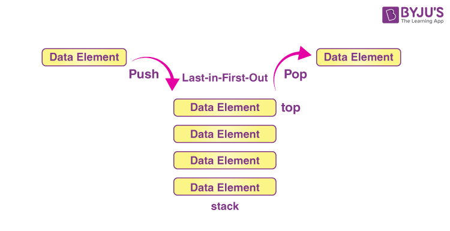

> **This is Image of Linux Logo**

 
# About Linux

- Developer: Linus Torvalds
- Initial release date: 17 September 1991
- Programming languages: C, Assembly language

# We are coverd findamental linux

 Linux is Operating system (OS) for open surce and command line interface, Just like Windows, iOS, and Mac OS one of the most popular platforms on the planet An operating system is software that manages all of the hardware resources associated with your desktop or laptop. To put it simply, the operating system manages the communication between your software and your hardware. Without the operating system (OS), the software wouldn’t function and linux os monolithic kernal.

 # Why use Linux?

Linux is a totly open source Oprating system and commnad line interface, we can modify kernal and configuration file accoring to the company and me and linux is very secur operaing system which is user to SHA algoritham in linux That’s right, zero cost of entry… as in free. You can install Linux on as many computers as you like without paying a cent for software or server licensing.

> **Open source**

> Linux is also distributed under an open source license:- 

- The freedom to run the program, for any purpose.
- The freedom to study how the program works, and change it to make it do what you wish.
- The freedom to redistribute copies so you can help your neighbor.
- The freedom to distribute copies of your modified versions to others.
  
> **In the market multpule distribustion are avauilebl in the market**

- LINUX MINT
- KALI LINUX
- CENTOS
- DEBIAN
- UBUNTU
- FEDORA
- OPENSUSE

> This is most oprating system uses in company's,

- Ubuntu
- CentOS 
- Opensuse
- RHEL

# Now we are insatlling Linux

- 1. Decide which Linux distribution you want to use. (Later we will give a table of common choices and useful links
for downloading install media, and helpful tutorials on procedure.)

- 2. Download the install image, which will be either a local or network install image or a Live image (which can also
be used for install.)

- 3. Decide if you want to do a:

- Native Installation: To do this you will need a machine with enough useable disk space or will have to
repartition to make space available.
- Virtual Machine Installation: To do this you’ll have to first install a hypervisor program as described later.
- Live CD/DVB/USB method: To do this no install is needed, but performance will be weaker.

- 4. Do the install following distribution-supplied directions.

# Installtion mathod

All Linux distributions provide downloadable installation media in the form of optical media images (CD and/
or DVD) which can be easily burned to a physical disk, or USB stick images, together with instructions on how to 
produce a USB drive that can be booted from for installation. 

These images vary in type of machine (e.g., 64-bit or 32-bit; we recommend doing only 64-bit installs on modern 
hardware that supports it) or small or large (e.g., minimal or full desktop or server system).
Alternatively, one can do a much smaller download and get a network install image which has just a few files; then 
the installation procedure goes out on the Internet to get whatever else is needed. Such a network install has only 
a short initial download, but the install process itself can take a long time based on your network download speed. 
A full install image may also support going out to the Internet during installation, like a network install, but only to 
retrieve software with a newer version available than was included in the full install image. 

> **Using Live Media Instead of a Full Install **

Many popular distributions provide Live CD, DVD, or USB media which can be used to run Linux without actually 
installing it on your disk drives. As you can imagine, this is the safest method of experimenting with Linux if you 
already have a computer running another operating system. 

There are disadvantages however:

- • Slow startup: every time you boot up the hardware has to be examined and the operating system set up as if
you were doing a fresh install.
- • Performance can be poor, so more memory and CPU power may be required to make things run acceptably.
- • It can be awkward to save any work or other material either on the normal hard disk or to external media etc,
although it can be done. In particular, any changes in setup or any other software that is installed may be lost
each time one boots up.

Please note that the Live media image and the Install image is the same for many modern user-friendly distributions! 
One simply boots off the Live image and then clicks on Install once the system starts. One very nice aspect of this 
dual-use media is that before you even attempt an install, you know whether or not the Linux-based operating system 
can recognize and work with all of your hardware and peripherals, such as your network card, sound system, webcam etc

# Installing a Hypervisor and a Virtual Machine

Everyone has probably heard the phrase Virtual Machine. This is a full guest operating system (which may or may not be
Linux) which runs on top of a Hypervisor program on a host machine, which can be running any operating system with an 
available hypervisor, including all flavors of Windows, Linux and Mac OS. 
An advantage of using the virtual machine images is that you can’t fundamentally destroy your host system while
running them, and they run as an unprivileged application, which may be more compatible with company IT policies, if
applicable. A further advantage, especially with on-line classes, is that a system failure does not take you off-line.
The disadvantages have mostly to do with performance and requiring somewhat more memory and CPU power.
However, in many circumstances this will not be a disqualifying aspect.
You will have to install a hypervisor program if you don’t already have one. Here are two easily obtainable low- or nocost solutions:

- • Oracle Virtual Box
Can be downloaded from https://www.virtualbox.org
Exists for Windows, Linux, Mac OS and Solaris operating systems.

- • VMware
Exists in full-featured products such as VMware Workstation but also in a freely downloadable version, VMware
Player which can be reached at http://www.vmware.com/try-vmware.html. While VMware Player is free of charge
only for Windows and Linux host operating systems, VMware Fusion is a low cost program for the Mac OS.
Once you have installed the hypervisor, installing a guest operating system is pretty easy. You don’t even have to burn 
the install image to a CD or DVD; you can just point the hypervisor to the .iso image on your computer. In some cases 
(such as for Virtual Box) you can even perform an automatic installation which doesn’t even ask you questions when 
you install.

The rest of the discussion on installation for the most part applies here, except you won’t have to worry about the 
difficult things like partitioning; you can just take the default choices. However, make sure you assign enough disk space 
(say at least 20 GB to be safe, although you’ll probably need quite a bit less).

# Now We are learing Booting process

- 1:- Power on machine
- 2:- After power on machine SMPS (Switch on power supply), Will supply the power to all the conctvity devices and motherboard
- 3:- Basically it provide the current from AC (Alternative current) to DC (Direct Current)
- 4:- This supply is provide to proper amount of voltage
- 5 :- **BIOS INITIALIZATION** ==> BIOS to firmware used to perform haedware inistiozation durring the booting process (POST)
- 6 :- **What is BIOS**
- **First** :- BIOS is the first think loads when you start your computer, it initilization hardware befour booting an OS from your hard dirve or another device
- **Second** :- BIOS second for , Basic input/Output System and all the types of firmware storage on a chip on your motherboard, when you start you computer, the computer boot the BIOS, Which configure your hardware befoure handling off to a boot device 

- 7:- The BIOS perform POST Operation (Power on self test), to detect and initialization system hardware component.
- 8:- If all device is OK, then Boop sound,
- 9:- Then MBR in the hard disk it refer to the location of the boot loader using DISK priority 
- 10:- BIOS load and exciutes the MBR boot laoder and give control to MBR

**This is a Imges of Booting Process you can understand**

# What is Shell ?

To write a script in any OS a language is needed, which we call shell in Linux OR When we give any input into the system and after interpreting the same input into a shell, we give the output in the machine language, which is called shell, and shell is a intface between user and kernal, that shell is called Bash.
shell and kernel are reposable in the backend of whatever Linux is running.

> **Types Of Shell ?**

  Bourn Shell (sh) /bin/sh Bourn again shell (bash) /bin/bash Kourn shell (ksh) /bin/ksh C shell (Csh) /bin/csh
  echo $SHELL (With the help this command we can check shell in current Linux machine machine) and shell is located in /bin/sh location.
  when we are ceating shell scripting, so sript is devide in 2 parts, 1 :- sebang and header 2:- commented line 3 :- program body #!/bin/bash OR #!/bin/sh and This is indicate to not commented) /bin/sh and /bin/bash ( This is indicate to shell location) you can fire this command in linux , echo $ECHO*

# What is shell scripting ?

  Shell scripting is a set of command, with the help of shell scripting we can automante any task shell scripting, when we are input - any command from the keyboad   or mounse After interpreting the input, it converts our input into 0 and 1 and gives us output.
  When we are creating shell scripting so fist going to the anyh editor, for example (vim,nano,vi) these are 3 editors for linux OS.

> **3 Parameter are available in shell scripting.**

- 1:- shebang OR header section
- 2:- comment section
- 3:- Program body secotion

> **This is a basic shell scripting,** 

- vim coredge.sh (#This is coredege file for creating shell scripting, after enter we are gose to the editor)
- #!/bin/bash (#!, we can say not commaneted and /bin/bash, It means, this is location shell location and The interpreter takes our input and converts it into the - form of 0 and 1 and gives us output.)
  
- #!/bin/bash
 mkdir coredge
 touch coredge.io
 apt install apache2
 systemctl restart apache2
 echo "Hello Everyone"
 (This is normal basic shell scripting)
  And if we are run shell scripting file. and We should always know that when we create a shell scripting file, the file must have excution permissions to - - run it. we can run with help of .coredge OR sh .coredge
 these are tools are available in the market for automate the task
 Shell/Bash Scripting and Ansible for automate task

> **What is Kernel ? **

• Kernel is an heart of Linux OS.
• The Linux kernel is the main component of a Linux operating system (OS) and 
is the core interface between a computer's hardware and its processes. 
• It is an interface between Application and computer hardware as well as shell.
• It manages resource of Linux OS. Resources means facilities available in Linux. 
• Kernel decides who will use this resource, for how long and when.
• It runs your programs (or set up to execute binary files).
• The kernel acts as an intermediary between the computer hardware and various 
programs/application/shel

> **What is Data Wrangling ?**

Data Wrangling it is kind to transforming or orgnaize you raw data into the same another formate, and wrangling data easy to undersatnd, according to the data wranging we can take a decision on data wranging, RAW data it's a critical data we can't ready and not understable data.

> **You can understand from this images of Wrangling**

> **Data Wrangling gives us some features**

- Easy to understable
- transform/orgnize
- data accessing
- Analisys and process
- Improved Communication and Decision-Making

> **About Alterys Tools ( This is data analytics and visualization tool)**

Alteryx processes values based on the data type. Alteryx supports string, numeric, date-time, and boolean data types, as well as, spatial objects and Alteryx is used to automate data processes more quickly and efficiently
- CEO of Alterys :-  Mark Anderson
- Date founded:- 1997
- Founder: Dean Stoecker.  

 > **What is Command-line Environment ?**

With the command line interface we can run any command and services, in server and systems all operation system are provide commaand line interface (CLI) Window,Mac,Linux, and CLI it's a faster interection interface.

These are CLI available inm the market for OS,
Window OS = CMD and and power shell
Linux OS = Linux itself CLI cammnd line 
Mac OS = Mac-CLI
We can oprate OS from the CLI method (Window,Mac,Linux).

#! (Interpretor calling system)
/bin/bash :- location of shell

> Types of Quotes 

- 1:- Single Quotes :- ' ' (Print As it is)
- 2:- Double Quates :- " " (We can print message and values as well)
- 3:- Back Quotes :-   ` (ti is use to print output of any commad ony)\

date :- +%A
date :- +%H:%M

date --help

# What is apache web server and HTTPD Server

- Apache web server or Apache http server is one of the most widely used on 
the Internet It is developed and maintained by Apache Software Foundation, Apache is 
an open source software available for free A web server generally hosts the web content, and responds to requests for 
this content from web browsers such as Internet explorer, Google chrome 
and Firefox And httpd is the same as apache2. It depends on the OS you use. For example in 
RHEL 6.2 it is called httpd and in Ubuntu it is called apache2. 

> **How many web Servers we have in market ?**

- 1- apache web server, 
- 2- IIS web server 
- 3- Nginx webserver and litespeed web server. 
  
- Beside Apache, IIS and Nginx also among the most common web servers in 
use today As reported (July 18, 2016) the web server statistics shows that from the 
entire internet web, there are 46% web server running in Apache, 29% in 
Microsoft IIS and 19% in Nginx,

-  The http protocol is sent over the wire in clear text, using port 80/TCP by 
default (though other ports can be used). 
 There is also a TLS/SSL encrypted version of the protocol called https that 
uses port 443/TCP by default.

> **Types of website in markets ?**

- 1:- Name based hosting 
- 2:- IP Based Hosting 

- Package name: httpd (Apache2)
- Daemon: httpd (Apache2)
- Port number: 80 { http } and 443 { https } 
- File : /etc/httpd/conf/httpd.conf OR (etc/apache2/apache2.conf)
- Log: /var/log/httpd/access.log 
- /var/log/httpd/error.log 
- Document root place: /var/www/html 

> **What is HTTPS ?**

- HTTPS stands for Hyper Text Transfer Protocol Secure, It is a protocol for securing the communication between two systems e.g. the 
browser and the web server, t is the protocol where encrypted HTTP data is transferred over a secure 
connection. By using secure connection such as Transport Layer Security or 
Secure Sockets Layer The principal motivations for HTTPS are authentication of the accessed website, 
and protection of the privacy and integrity of the exchanged data while in transit It uses the port no. 443 for Data Communication. It allows the secure transactions
by encrypting the entire communication with SSL.

> **How to install webserver in Ubuntu ?**

- sudo apt update
- sudo apt install apache2
- sudo systemctl status apache2
- sudo systemctl stop apache2
- sudo systemctl staret apach2
- Now you can hit in broser "localhost" Output open samething open,

> **Linux File System**

- We can read and write the data from file system, a Linux file system is a structured collection of files on a disk drive or a partition. A partition is a segment of memory and contains some specific data. In our machine, there can be various partitions of the memory. Generally, every partition contains a file system.

The general-purpose computer system needs to store data systematically so that we can easily access the files in less time. It stores the data on hard disks (HDD) or some equivalent storage type. There may be below reasons for maintaining the file system.

> **What is the Linux File System?**

Linux file system is generally a built-in layer of a Linux operating system used to handle the data management of the storage. It helps to arrange the file on the disk storage. It manages the file name, file size, creation date, and much more information about a file.

> **Types of Linux File System**

When we install the Linux operating system, Linux offers many file systems such as Ext, Ext2, Ext3, Ext4, JFS, ReiserFS, XFS, btrfs, and swap.

- Ext :- The file system Ext stands for Extended File System. It was primarily developed for MINIX OS. The Ext file system is an older version, and is no longer used due to some limitations.
  
- Ext2 :- Ext2 is the first Linux file system that allows managing two terabytes of data, Individual File Size 16GB-2TB
  
- Ext3 :- Ext3 is developed through Ext2; it is an upgraded version of Ext2 and contains backward compatibility Individual File Size 16GB-2TB
  
- Ext4 :- Ext4 file system is the faster file system among all the Ext file systems. It is a very compatible option for the SSD (solid-state drive) disks, and it is the default file system in Linux distribution, Individual File Size 16GB-16TB
  
- XFS :- XFS is a highly scalable, high-performance file system and size is manage up to 16 exabytes
  
- Swap :- Swap memory it a virtual memory in linux, Swap space in Linux is used when the amount of physical memory (RAM) is full. If the system needs more memory resources and the RAM is full And accepts its space from SDD or HDD, according to the need we can extand and reduse swap file system.

> **How to extant swap memory in linux**

- sudo swapon --show
- free -h
- df -h
- sudo fallocate -l 1G /swapfile
- ls -lh /swapfile
- sudo chmod 600 /swapfile
- ls -lh /swapfile
- sudo mkswap /swapfile
- sudo swapon /swapfile

> **What is partistion in linux**

- it is a method by which we can break a disk into small small parts, These partition can be use to store OS files and personal data files.

> **In windows:-**

Disk 
partition  ==>   C:\    D:\    E:\   F:\  .....so on 
C:\   ==> mandatory Disk and remainigs are optional.

C:\  ==> use to store os file and we can also use it for the data. 
D:\  E:  F:\ ==> recommened drive to store data .

> **In linux:-**

there is no concept of  C:\  D:\  E:\   F:\  Drive.
Whole OS will represent by  / 
 [ root filesystem or root partition or parent directory ]

> **Disk Name in Linux**

1- PATA OR IDE  ===> hda ==> hda1  hda2 hda3   hdb ==> hdb1 hdb2 hdb3 ..etc
2- SATA         ===> sda ==> sda1  sda2  sda3....etc 
3- Virtual Disk ===> vda ==> vda1  vda2 

fdisk -l  ==> to find out the details about your disk
   OR
lsblk  

Disk  ==> 30 GB ==> During the Installation 

1- Automatic Partition   ==> machine will automatically used this space but we can not mentioned size manually
2- Custom Partition      ==> we can plan these partition as per needs

> **Types of Partition Creation technology ?**

- Standard Method OR Standard Volume ==> fixed size partition concept 
- LVM Method [ logical volume manager]     ==> Recomended,
we can extend or reduce this volume size in future

> **How many partitions requried to install linux OS ?**

1-    /              ==> OS Files + Data files    
2-    swap partition ==> Virtual memory ==> twice of main memory

> **About linux Partistion**

- Every hard drive always manage by MBR or GPT [GUID partition Table ] technology ?
- In first sector we have already installed MBR [master boot record ] technology.
- MBR Basically Bydefault  allow maximum four partition into any disk.
- MBR basically allow two types of partition .

- Primary partition  <== can be use to store os data and personal data.
- Extended partition <== 3- Logical partition

> **Primary Limits**

1- Min ==> 1 
2- MAX ==> 4 

> **Extended Limits  [can be optional ]**

> **What is the Filesystem Hierarchy Standard**

Filesystem hierarchy standard describes directory structure and its content,

- 1:- / (Root)
- 2:- /bin 
- 3:- /boot 
- 4:- /dev 
- 5:- /etc
- 6:- /home
- 7:- /lib
- 8:- /media
- 9:- /mnt
- 10: /opt
- 11:- /sbin
- 13:- /tmp
- 14:- /usr
- 15:- /proc

1- Min  ==> 0 
2- Max  ==> 1

> **Switching Users in Ubuntu**

- sudo su (We can switch from another user)
- poweroff (power off the system with this command)
- init 0 (reboot the system), and init 1 (power off the system)

> **Recovering Deleted Files**

- Create a new text file on the desktop named coredge.txt, using the graphical file manager
- Delete the file by sending it to Trash.
- Verify the file is now in ~/.local/share/Trash, or a subdirectory thereof. NOTE: You will have to get your file browser to show      hidden files and directories, those that start with a .)
- Recover the file and make sure it is in its original location.
  
> **Networking Fundamental of Linux**

- What do you mean by networking?
- 
Networking is the process of making connections and building relationships. These connections can provide you with advice and contacts, which can help you make informed career decisions.

> **Types of  Address on every machine ?**

1- Physical Address  ==>  MAC address or Ethernet address or hardware address or LAN Card add 

2- Logical address   ==> IP-V And IP-V6 .

> **MAC address  ==> media access control**

Address  ==> Hexadecimal ( 0-9, A-F)
Total Block ==> 6 Block and each block seperated by colon symbol

> **Type Of IP**

IP - V4
IP - V6 

> **IP-V4**

- IP-V4

Address  ==> decimal ( 0-9 )
Total Block ==> 4 Block and each block seperated by dot symbol .

> **IPV6**

- IP-V6
  
Address  ==> Hexa-decimal ( 0-9, A-F )
Total Block ==> 8 Block and each block seperated by colon symbols

> **Class Range**

- A    ==>    0 - 126
- B    ==>  128 - 191
- C    ==>  192 - 223
- D    ==>  224 - 239
- E    ==>  240 - 255

> **Subnet Mask      default subnet mask**

- A   ==>  N.H.H.H    ==> 255.0.0.0
- B   ==>  N.N.H.H    ==> 255.255.0.0
- C   ==>  N.N.N.H    ==> 255.255.255.0
  
  
- 1-  /etc/hosts        ==> to connect machine with name without any dns server   
- 2-  /etc/resolv.conf  ==> to configure my machine as a DNS Client.
  
> **These are same command for network**

- ifconfig (We can IP address details)
- hostnamectl set-hostname coredge.io@example.com (To set the localhostname)
- hostname (Check hostname)
- ip a (Check IP)
  
> **Types of Login User ?**

1- Super user      ==> root               ==> #    ==> Full Power
2- Normal users    ==> amit deepak sumit  ==> $    ==> Limited Power

- Useradd coredge (we can create user in linux)
- passwd coredge (we can provide the password of linuc normal user)
  
> **How to switch useer in linux**

- su <usernmae>
- exit (Exit from current user)
  
> **How to create file and find the file from particular location**

- touch /tmp/coredge (we can create file)
- find / -name <Filename> (We can find any file from intire root)
- mkdir core
- find / -name <filename> (We can find any directory from intair machine and root)
  
- touch  ==> blank file creation  
- mkdir  ==> directory creation 
- cd     ==> change directory
- ls     ==> to check data listing 
- cd ..  ==> to go on one level back 
- cd ../..  ==> two level back
- echo  ==> use to print any mesg on the screen 
- cat   ==> use to read content of  any file on the screen 
- ;       ===> to run or execute multiple command in a sequencing order 
- |       ===> to join muiltiple commands to acheive any special types of output 

- head   ==> It display or prints by defaults 10 lines from top of any file or from any commands output
  
- head /etc/passswd (You can take any file)

- tail   ==> It display or prints by defaults 10 lines from bottom of any file or from any commands output.
  
- tail /etc/passwd (You can take any file)
  
> **This is advance concept from head and tail, sed command can be perform print opration in particilar words **

- sed:-  It also use to print any lines from any file or from any command outputs
- sed '1p' /etc/passwd ( this command print all line)
- sed -n '1p' /etc/passwd (this command print only one line)
- sed -n '1,5p' /etc/passwd (this cammnd print 1 to 5 line)
- sed -n '1p,10p' /etc/shodow (this cmmand print only 1 line and 10 line, not print 1 line number to 10 line number)
- sed -n '$p' /etc/passwd (This command print last line of the file)
- sed -n ''1p;10p /etc/passwd (This command print 1 line and 10 line)

> **We can find any particular word line**

- cat /etc/passwd | grep sbin (The line number containing sbin will print all the lines.)
  
> **Controlling Services**
>  There are 7 types of runlevel in Linux OS ?.
  
- 1:-  init	0		[ poweroff the machine ]

- 2:-  init	1 		[ Single user mode OR Troubleshooting Mode ]

- 3:-  init	2 		[ Multi user mode without Networking ]

- 4:-  init	3		[ Full Multi user mode with network OR CLI mode only OR Text Mode Only ]

- 5:-  init	4		[ un-used ] or [ Blank ]

- 6:-  init 5		[ Full Multi User mode with GUI + CLI  OR  X-windows ]

- 7:-  init	6 		[ Reboot the machine ]

> Note-   At a time we can run any machine only on any single  runlevel number.

- How to check current runlevel number in any machine  ?
  
*  who  -r
  
- How to switch or change runlevel on temporary basis ?
  
* init 3       [ to move in CLI mode ]
*  init 5       [ to again come back in GUI mode ]
  

> **How to Manage Users account in Linux  OS**

> **Who is user ?**

- 1- A user is a person which has uniq identity to enter 
   into any server machine.

- 2- With this username he/she can easily operate , configure
   and monitor any live servers.

**By default during the OS installation time ==>  root user 
will be automatically created only**

> Objective:- 

- useradd  <options>    <username> 
- usermod  <options>	<username>
- userdel  <options>	<username>
- passwd  <options>   <username>
- id   username 
- su  -  <username>
- groups  <username>
- exit
  
- useradd  sachin
- passwd   sachin

Type Password: 123
Retype Passowrd: 123

> **Users Related information files ?**

- 1- UID                   ====>  User ID  
- 2- GID                   ====>  Group ID
-3- /home/sachin/         ====>  Default Home directory place for all normal users.
-4- /etc/passwd  	 ====>  It contains all  user's related information.       
-5- /etc/group            ====>  It contains all group's related information.    
-6- /etc/shadow           ====>  It contains all  users password in encrypted format. <== x
-7- /etc/gshadow          ====>  It contains all group password in encrypted format.  <== x
-8- /var/spool/mail/sachin====>  default place for mail alerts. 

 cat  /etc/default/useradd    ==> HOME=/home
 cat  /etc/login.defs 

UID and GID Range  ==>  [ 0 - 60000 ]   ==> It devide into three parts
UID   ==>  0  -  60000
GID   ==>  0  -  60000

> **Types of Users ?**

- 1:- Super user       ===>  root 

      UID  ==>  0
      GID  ==>  0

- 2:- System defined users or service defined users  
   ==> ftp, dns, games, ldap ..etc 
  [ will generate automatically after 
  installing any application or services  ]

    UID   ==>  1 - 999
    GID   ==>  1 - 999

- 3:- Normal users or custom users   ===>  deepak , sumit  ,  rahul
 
 created by any super user or any sudo admin user ]

    UID   ==> 1000  - 60000
    GID   ==> 1000  - 60000

cat  /etc/login.defs

ls  /home

cat  /etc/default/useradd    <== HOME=/home 

Note:   we can change user home directory location if we want.

> **cat   /etc/passwd     ===>    7 Fields**

   root    :    x    :    0  :    0    :    root   :    /root   :   /bin/bash

-1- Username
-2- password Pointer  ==>  /etc/shadow 
-3- UID
-4- GID
-5- Comment OR Fullname OR GECOS OR Profilename
-6- home directory
-7- Login Shell 

> ** cat  /etc/group      ==>  4 fields**

 groupname : x :  GID Number :  Secondary Members Name

-1- groupname
-2- password pointer == /etc/gshadow
-3- GID Number
-4- Members name 

> ** groupadd  tcs**

 cat  /etc/group 
tcs:x:1001: 

> **cat  /etc/shadow      ==>    9 Fields**

 username : Encrypted-password :  next seven -- password policy 

> **File and directory based basic permissions**

Types of permissions in linux ?

1- file and directory based permissions   ==> read write execute  ==> file or directory
2- Command execution based permissions    ===> SUDO 

Types of users ?

1- Super user   ==> root               ==> home directory [rwx]  +  public place  [rwx]
2- Normal user  ==> amit deepak sumit  ==> home directory [rwx]  +  public place  [read only] or as per defined

* touch coredge (We can create file) by default permisson of file 6 4 4 
* mkdir coredge (we can create directory) bu default permission of direcotry 7   5   5 
  
> **Permissions alwats managed by these three attributes**

read           ===>    r                  ===>   4

write          ===>    w                  ===>   2

execute        ===>    x                  ===>   1

> Default permissions   ==> if you creating data with super user account ?

root    ==>   directory    ==>    7   5   5     OR       rwx   r-x   r-x 
root    ==>   file         ==>    6   4   4     OR       rw-   r--   r--

> **What is DNS And Networking of DNS Server**

DNS server basically provide naming resolution service from name to ip and ip to name.
Types of domain ?

1- Local domain   ==>  example.com   training.com    xyz.training.com    anuj.com

2- Global domain  ==> www.redhat.com   yahoo.com

- 1-  /etc/hosts         ===> without any DNS server - naming connectivity in that case we can use this file

- 2-  /etc/resolv.conf   ===> With any DNS server 
  
vim   /etc/hosts

machine-ip    machine-name   alias-name 

> **Types of DNS Server ?**

1- Primary DNS or Master DNS  ==> It is contains main records of all machines.

2- Secondary DNS or Slave DNS ==> It is replica server of Master DNS machine.

> **Types of Zone File  ?**

1- Forward Zone   ==>   convert all request from name to IP.

2- Reverse Zone   ==>   convert all querry from IP to name.

> **FQ . DN**

example.com  ==> domain name 

machine1.example.com
machine2.example.com
machine3.example.com

> **Service Profile**

Server Side

Package     :  bind 
Daemon      :  named
port number :  53
main file   :  /etc/named.conf
Zone file   :  /var/named/forward.zon
Log files  /var/named/reverse.zone

Log         :  /var/log/messages 

> **Types of DNS Records ?**

A      ( Address )          ==>  It maps all Querry from Name to IP ==> use in IP-V4

PTR    ( Pointer )          ==>  It maps all querry from IP to Name.

CNAME ( canonical name )    ==>  can be use to define alias name of any machine name or domain name.

MX    ( Mail Exchange )     ==>  use in mail server concept.

AAAA  ( address )           ==>  use in IP-V6

SOA   ( server of authority)   ==>  define your DNS server machine name.
      ( start of authority )   ==>

# NFS Server (Network file share).

> **NFS  Server & NFS Client**

inux File sharing Concept between the machines, Network File System (NFS) is a networking protocol for distributed file sharing. A file system defines the way data in the form of files is stored and retrieved from storage devices, such as hard disk drives, solid-state drives and tape drives. NFS is a network file sharing protocol that defines the way files are stored and retrieved from storage devices across networks.

> **Data access?**

- 1- Copy     ==> scp and rsync
- 2- Link     ==> ln ==> one place to another place but with in the machine
- 3- downloading  ==> FTP
- 4- uploading    ==> FTP
- 5- mounting  or data sharing  ==> NFS ==> between the machines

NFS:- Network File system OR Sharing  OR  File sharing 

- 1:- NFS Server basically use for file and directory sharing over the network.

- 2:- with the help of nfs server we can mount any shared directory on client -- machine.

- 3:- NFS  server always work with PORTMAP service to create Virtual tunnel between
   server and client machine with the help of RPC service. [ Remote Procedure Call ]

> **Types of Storage Concept  ?**

- 1:-  DAS ==> Direct Attached Storage  ==> floppy, cdroom, dvd, hardrive, USB hardrive are the examples of DAS.

- 2:-  NAS ==> Network Attached Storage ==>  File Sharing Concept ==> NFS Server and SAMBA are the example of NAS.

- 3:-  SAN ==> Storage Area network     ==>  Block Device Sharing ==>  SCSI + ISCSI
  
> **Server Side**

- 1:- service   nfs restart
- 2:- systemctl start nfs-server
- 3:- systemctl enable nfs-server 
- 4:- File:    /etc/sysconfig/nfs
- 5:- data sharing file:    /etc/exports  <=== Blank
- 6:- Log:   /var/log/messages
- 7:- port number:   2049 [NFS]
- 8:- 111  { Portmap } ==> already running 

> **Clinet Side**

Types of NFS mounting method  ?

- 1- Temporary using mount command 
- 2- permanent mounting in  /etc/fstab file

> ** SAMBA  OR SMB [ Server message block ] Server**

- 1- SAMBA  Server is mainly use for file and printer shaing between windows and linux machines.

- 2- SAMBA Server  use SMB protocol to browse any shared files on any browser.  smb://

- 3- Samba always CIFS { common internet file system } file system to mount any shared directory; 

> **Features of samba server  ?**

1- File and printer sharing between windows and linux machines.
2- printing
3- browsing  
4- mounting 
5- downloading
6- uploading  
7- network based security
8- username and password based security 
9- can be use in integration for AD and LDAP authentication.

> **Service - profile**

- package:   samba 
- daemon :   smb 
- port number:  445  (TCP) 
              139  (UDP)

- File:    /etc/samba/smb.conf   ==> data sharing  file  

- log:   /var/log/samba/log.smbd    OR   /var/log/samba/smbd.log 

> **Client Side ?**

Types of samba server accessing method  ?

- 1- browser       ===>   smb://192.168.0.10
- 2  downloading   +  uploading   ===>  smbclient  ==> package  ==>  samba-client 
- 3- mounting      ==> package ==>  cifs-utils
  
# DNS server and Client Configuration 

DNS ==> DNS server basically provide naming resolution service from name to ip and ip to name.

Types of domain ?

- 1- Local domain   ==>  example.com   training.com    xyz.training.com    anuj.com

- 2- Global domain  ==> www.redhat.com   yahoo.com

> **Networking class  ==>**

- 1-  IP to IP  ==> connect 

- 2-  Name to Name  ==> can not connected until unless we don't have two solutions ?

- 3-  /etc/hosts         ===> without any DNS server - naming connectivity in that case we can use this file

- 4-  /etc/resolv.conf   ===> With any DNS server
  
> **Types of DNS Server ?**

1- Primary DNS or Master DNS  ==> It is contains main records of all machines.

2- Secondary DNS or Slave DNS ==> It is replica server of Master DNS machine.

> **Types of Zone File  ?**

1- Forward Zone   ==>   convert all request from name to IP.

2- Reverse Zone   ==>   convert all querry from IP to name.

> **Server Side**

- Package     :  bind 
- Daemon      :  named
- port number :  53
- main file   :  /etc/named.conf
- Zone file   :  /var/named/forward.zone
               /var/named/reverse.zone

- Log         :  /var/log/messages 

> **Client Side**

- 1-  /etc/resolv.conf
        OR
- 2-  /etc/sysconfig/network-scripts/ifcfg-ens160 
  
> **Types of DNS Records ?**

- A      ( Address )          ==>  It maps all Querry from Name to IP ==> use in IP-V4

- PTR    ( Pointer )          ==>  It maps all querry from IP to Name.

- CNAME ( canonical name )    ==>  can be use to define alias name of any machine name or domain name.

- MX    ( Mail Exchange )     ==>  use in mail server concept.

- AAAA  ( address )           ==>  use in IP-V6

- SOA   ( server of authority)   ==>  define your DNS server machine name.
      ( start of authority )   ==>

# What is Rsync and SCP,

> Rsync ,

We can copy the data between two machine, Rsync is a versatile file synchronization tool designed to efficiently copy and sync files between different systems. Born out of the need for intelligent and bandwidth-efficient transfers, Rsync has become a go-to solution for users seeking to keep their files in perfect harmony. What sets Rsync apart is its ability to transfer only the parts of files that have changed, minimizing data sent over the network and significantly speeding up the process. 

- 1. rsync --version 
- 2. sudo apt install rsync
- 3. rsync -avz /path/to/local/directory username@remote_server:/path/on/remote/server 

> SCP ,

SCP, on the other hand, stands for “Secure Copy Protocol.” It operates over SSH, providing a secure method for copying files between a local machine and a remote server. SCP’s simplicity lies in its straightforward command-line interface, making it accessible to users of all levels of expertise. As a secure alternative, SCP ensures that your data remains confidential during transit, addressing the paramount concern of data security.

- 1. scp --version
- 2. sudo apt install openssh-client 
- 3. scp /path/to/local/file username@remote_server:/path/on/remote/server 

# This is About VIM text editor in linux

> **What is VIM Editor?**

  VIM Editor it's test editor file, we can edit and modify any existing file and we can create new file accoring to the need.
  For Example :- If we want to create a new file, vim coredge, vim core, we can take any name

> **Types of Editor in Linux OS,**

> **This is a basics command of VIM Editor**

- VIM,VI,NANO
  In VIM Editor, we can use these commands for save,quit,set number etc,
- Esc+wq! = Enter (file save and quit from the file)
- Esc+q!
- I ( press i for eiditing in file)
- / (we can search any work in file)
- :set number ( With this coommand can set numnber of test lines), and these are same command we can use it.
- 7j : move 7 lines down.
- w : move a word forward
- ctrl + f : move down a page
- ctrl + b : move up a page
- gg : move to the top of the document
- dw : delete a word
- 4dd : delete 4 lines
- cc : change a line ( change is delete and go in insert mode ). 

# What is Stack ?

Stack is a linear data structure. The elements are inserted or removed from the same end. Queue is also a linear data structure. The elements are inserted or removed from two different ends, that is called (FIFO,First in first out And LIFO, Last in first out). In one stack we can uplaod and remove data from the stack.

 Push :- We can upload the data in stack
 pop :- We can remove the data from stack 

 

 # Private Cloud

Private cloud is not availale to each persion and private cloud are desined only instities or only orgnizations, private closud provide to security and costly, best example of open stack for private cloud, private cloud mostly use IAAS Service (Insfrasture As A Service). and more then costmized.

Private Cloud :- OpenStack 

# About of openstack ?

Written in:- Python
Initial release:- 21 October 2010, 14 years ago
Type of OpneStack :- Cloud
Developer: Rackspace Technology

# Monolithic Kernal ?

All OS related component stuffed as a single module of a kernal, all services are runing in a single kernal, If any service failed or crashes in Karnal then it becomes difficult to find the field service, these kernal are diffecult to debug.

Monolithic Kernal :- Linux,Unix,Dos

# What is SSID :-

SSID (Service set identifier), When we install Wi-Fi at home, and after installing Wi-Fi, we receive a name which is called SSID when we login to the wifi by entering the password.

# Crontab OR Job Scheduling

Crontab is use to schedule any task on any time with the help of cronta we can run any command and scripts on any time as per demand.

- Package:   crontabs 
- Daemon name or  service name:   crond 
- File:    /etc/crontab  
- Log:   /var/log/cron  
  


Minutes        ===> [ 0 - 59 ]
Hours          ===> [ 0 - 23 ]
Day of month   ===> [ 1 - 31 ]
Month          ===> [ 1 - 12 ]
Days of week   ===> [ 0 - 6 OR 1 - 7 ]  where 0 and 7 ==> Sunday



- crontab   -l    { list ==> to check all crontab details in my account }

- crontab    -e   { edit ==> to apply crontab }

- crontab   -r    { Remove ==> to remove all cron jobs from my account }
  
- Minutes    Hours    Day-of-Month   Month    days-of-week

- (0 - 59)   (0-23)     (1-31)      (1-12)    (0 - 6 OR 1 - 7 ) [Where 0 and 7 => sunday]
  
  

# Firewall  Concept And What is firewalls in linux ?

Firewall basically use to allow or deny any request on server machine,
With the help of firewall we can set allow and deny rules to access any services.

**Types of firewall  ?**

1. hardware based firewall
2. Software based firewall

In linux we have os defined firewalls inbuilt in OS....

1. TCP - Wrappers
2. IP-Tables ===> Till rhel-6 
3. 3- IPtables replaced with firewalld ( new firewall concept in rhel-7 + rhel- 8 )

**TCP - Wrappers**

1. IT is an example of software firewalls .

2. with the help of tcp wrappers we can apply only incomming based rules on server machine 
   to allow or deny any traffic coming to the server side.

- Types of Rules :-   1-  Incoming    2- Outgoing   3- forwarding 

Note:   with the help iptables and firewalld we can apply any types of rules in linux OS.

3.  TCP-wrappers always works only on these two files:-   note:   syntax are same in both files. 

      1-    /etc/hosts.deny     ==> to apply deny rules

      2-   /etc/hosts.allow     ==> to apply Allow rules

**IP-Tables**

1. IP-Tables is also an example of Software firewalls.
2. With the help of IP-Tables we can apply incomming , outgoing and port forwarding based rules.

     Package :    iptables  
     Daemon  :    iptables  
     File    :    /etc/sysconfig/iptables    <=== Rules are store here
     Command :    iptables  <options> 

       ACCEPT    ==> Traffic is allowed.

       REJECT    ==> Traffic is block and error mesg send to END user.

       DROP      ==> Traffic is block but no error mesg send to END user.

       REDIRECT  ==> It always use in Port Forwarding Based Examples.

**This is same command for knowladge**

  2  cat  /etc/passwd 
    3  cat  -n   /etc/passwd 
    4  head -n 5  /etc/passwd
    5  tail  -n 5  /etc/passwd
    6  cat  /etc/passw
    8  sed -n  '1p'  /etc/passwd
    9  sed -n  '5p'  /etc/passwd
   10  head  -n 5 /etc/passwd
   11  sed -n  '1,5p'  /etc/passwd
   12  sed -n  '1p;5p'  /etc/passwd
   13  sed -n  '1p'  /etc/passwd
   14  sed -n  '$p'  /etc/passwd
   15  useradd soniya  
   16  sed  -n  '1p'  /etc/passwd
   17  sed  -n  '$p'  /etc/passwd
   18  sed  -n  '1p;$p'  /etc/passwd
   19  sed  -n  '1p;$p'  /etc/passwd  >  /info    
   20  cat  /info 
   21  cat  -n  /etc/passwd | sed -n  '1p'
   22  cat  -n  /etc/passwd | sed -n  '5p'
   23  cat  -n  /etc/passwd | sed -n  '$p'
   24  cat  -n  /etc/passwd | sed -n  '1p;$p'
   25  cat  -n  /etc/passwd | sed -n  '1,5p'
   26  cat  -n  /etc/passwd | sed -n  '1p;11p;21,25p;41,$p'
   27  grep  -i -n  workgroup   /etc/samba/smb.conf
   28  sed  -n '7p'   /etc/samba/smb.conf
   29  lsblk  
   30  lsblk   | cat  -n 
   31  lsblk   | cat  -n  | head  -n  5
   32  lsblk   | cat  -n  | head  -n  5 | tail -n 4  
   33  lsblk   | cat  -n  | sed -n '2,5p' 
   34  lsblk 
   35  lsblk | sed -n  '3,5p' 
   36  lsblk | sed -n  '1p;3,5p' 
   37  df  -h 
   38  df  -h | cat  -n  
   39  df  -h | cat  -n   | sed  -n  '6,7p'
   40  df  -h | cat  -n   | sed  -n  '1p;6,7p'
   41  df  -h | sed  -n  '1p;6,7p'
   42  lscpu 
   43  lscpu | cat -n  
   44  lscpu | cat -n   | sed -n  '13p'
   45  grep root  /etc/passwd
   46  sed   '/root/p'  /etc/passwd
   47  sed  -n    '/root/p'  /etc/passwd
   48  sed  -n    '/root/p'  /etc/passwd  | sed  -n  '1p'
   49  ifconfig 
   50  ifconfig  | sed  -n  '2p'
   51  head  /etc/passwd
   52  head  /etc/passwd  >  /report  
   53  cat  /report  
   54  sed  -n  '1p'  /report  
   55  sed  -n  '$p'  /report  
   56  cat -n  /report 
   57  sed   '6d'    /report 
   58* sed   'd'    /report 
   59  sed  -n   '6p'    /report 
   60  cat  /report 
   61  sed   -i   '6d'    /report 
   62  cat  -n  /report 
   63  sed  '1,5d'   /report 
   64  sed  '1,5!d'   /report 
   65  sed  -i  '1,5d'   /report 
   66  cat -n  /report 
   67  lsblk  
   68  lsblk   | grep -E  'sda1|sda2'
   69  lsblk   | grep -E  'sda1|sda2' | sed  '1d'
   70  lsblk   | grep -E  'sda1|sda2' | sed  -i '1d'
   71  lsblk   | grep -E  'sda1|sda2' 
   72  lsblk   | grep -E  'sda1|sda2'  |  sed  '/boot/p'
   73  lsblk   | grep -E  'sda1|sda2'  |  sed -n  '/boot/p'
   74  ifconfig 
   75  ifconfig | grep inet  
   76  ifconfig | grep -w  inet  
   77  ifconfig | grep -w  inet   | sed  -n  '1p'
   78  ifconfig | grep -w  inet   | sed  -n  '1p' | sed 's/inet/ipaddress/'
   79  ifconfig | grep -w  inet   | sed  -n  '1p' | sed 's/inet/ipaddress/;s/netmask/subnetmask/'
   80  ifc
   81  ifconfig 
   82  ifconfig  |  grep ether  
   83  ifconfig  |  grep ether   |  head  -n 1  
   84  ifconfig  |  grep ether   |  head  -n 1   | sed  's/ether/macaddress/'
   85  grep root  /etc/passwd
   86  grep root  /etc/passwd | sed  's/root/network/'
   87  grep root  /etc/passwd | sed  's/root/network/g'
   88  cat  /report 
   89  cat  -n    /report 
   90  sed  '2a  KR network Cloud'  /report 
   91  cat  /report 
   92  sed  '2i  KR network Cloud'  /report 
   93  sed  '2a  KR network Cloud'  /report 
   94  sed  -i  '2a  KR network Cloud'  /report 
   95  cat  /report 
   96  sed  -i  '4i  KR network Cloud'  /report 
   97  cat /report 
   98  head  /etc/passwd
   99  head  /etc/passwd  > /sample  
  100  cat  /sample 
  101  grep  root  /sample 
  102  grep sync    /sample 
  103  sed   's/root/network/'    /sample 
  104  sed   's/root/network/g'    /sample 
  105  sed   's/Root/network/g'    /sample 
  106  sed   's/ROOT/network/g'    /sample 
  107  sed   's/ROOT/network/gi'    /sample 
  108  sed   's/sync/network/gi'    /sample 
  109  sed   's/sync/network/gi'    /sample   |  grep network  
  110  grep sync /sample 
  111  grep sync /sample  ;  sed   's/sync/network/gi'    /sample   |  grep network
  112  sed    's/root/network/g'  /sample 
  113  sed    's/root/network/'  /sample 
  114  grep root   /sample 
  115  grep root   /sample  | sed  's/root/network/'
  116  grep root   /sample  | sed  's/root/network/2'
  117  grep root   /sample  | sed  's/root/network/1'
  118  grep root   /sample  | sed  's/root/network/'
  119  grep root   /sample  | sed  's/root/network/2'
  120  grep root   /sample  | sed  's/root/network/2g'
  121  sed 's/root/network/2g'   /sample 
  122  sed '1s/root/network/2g'   /sample 
  123  sed '1s/root/network/g'   /sample 
  124  sed '5s/root/network/g'   /sample 
  125  sed '1,10s/root/network/g'   /sample 
  126  history 
  127  ifconfig |  grep -E  'inet|ether'
  128  ifconfig |  grep -E -w    'inet|ether'
  129  ifconfig |  grep -E -w    'inet|ether' | sed  -n  '2p'
  130  ifconfig |  grep -E -w    'inet|ether' | sed  -n  '1,2p'
  131  ifconfig |  grep -E -w    'inet|ether' | sed  -n  '1,2p' | sed   's/inet/ipaddress/g'
  132  ifconfig |  grep -E -w    'inet|ether' | sed  -n  '1,2p' | sed   's/ether/macaddress/g'
  133  ifconfig |  grep -E -w    'inet|ether' | sed  -n  '1,2p' | sed   -e   's/ether/macaddress/g'    -e  s/inet/ipaddress/g'
  134  ifconfig |  grep -E -w    'inet|ether' | sed  -n  '1,2p' | sed   -e   's/ether/macaddress/g'    -e  's/inet/ipaddress/g'
  135  ifconfig |  grep -E -w    'inet|ether' | sed  -n  '1,2p' | sed   's/ether/macaddress/g;s/inet/ipaddress/g'
  136  cat  /report 
  137  cat  /sample 
  138  cat  /sample  | grep  -E   'root|sync'
  139  cat  /sample  | grep  -E   'root|sync' | sed 's/root/network/g;s/sync/cloud/g'
  140  cat  /sample  | grep  -E   'root|sync' | sed 's/root/network/g;s/sync/cloud/g' | grep  -E  'network|cloud'
  141  sed 's/root/network/g;s/sync/cloud/g'  /sample 
  142  sed 's/root/network/g'  /sample 
  143  history 
  144  sed    -i   's/root/network/gi'  /sample 
  145  cat  /sample 
  146  sed    -i   's/network/root/gi'  /sample 
  147  cat  /sample 
  148  sed  's/:/ >>>>  /g'  /sample 
  149  cat  /sample 
  150  sed -i   's/:/ >>>>  /g'  /sample 
  151  cat  /sample 
  152  sed  's/ >>>>  /:/g'  /sample 
  153  sed -i   's/ >>>>  /:/g'  /sample 
  154  cat  /sample 
  155  grep '^root'  /etc/passwd
  156  grep '^root'  /etc/passwd | sed  's/root/network/g'
  157  cat /etc/passwd
  158  cat  -n  /etc/sudoers 
  159  sed   -n  '100p'  /etc/sudoers 
  160  sed   '100s/^/#/'  /etc/sudoers 
  161  sed  -i    '100s/^/#/'  /etc/sudoers 
  162  sed   -n  '100p'  /etc/sudoers 
  163  sed  -i    '100s/^#//'  /etc/sudoers 
  164  sed   -n  '100p'  /etc/sudoers 
  165  sed   '1s/root/network/' /sample 
  166  sed   '1s/root//' /sample 
  167  sed   '1s/root/     /' /sample 
  168  sed   '1s/root//' /sample 
  169  grep -n -i  workgroup  /etc/samba/smb.conf
  170  sed  '7s/SAMBA/DON/'  /etc/samba/smb.conf
  171  sed  '7s/SAMBA/DON/'  /etc/samba/smb.conf  |  sed  -n  '7p'
  172  sed  -i   '7s/SAMBA/DON/'  /etc/samba/smb.conf 
  173  grep -n -i  workgroup  /etc/samba/smb.conf
  174  sed  -i   '7s/DON/SAMBA/'  /etc/samba/smb.conf 
  175  grep -n -i  workgroup  /etc/samba/smb.conf
  176  lsblk 
  177  lsblk |  grep sda
  178  lsblk |  grep -w   sda
  179  lsblk |  grep -w   sda | sed  's/disk/myfirstdisk/g'

  
======================================
1- Redhat installation 
2- Types of login mode 
3- Types of machine access method 
4- Types of user's 
5- Super user and Normal users
6-  #  and $ command prompt
7-  Data store ==>   /    ===> default directort + custom directory or files
8-  login ==> data writting ==> place ==> home directory + public place
9-  pwd
10- ls
11- touch 
12- mkdir
13- mkdir -p 
14- ls -R
15- tree
16- cd directoryname
17- cd ..
18- cd ../..
19- cd -
20- cd .
21- cd ~
22- cd  /
23- cat 
24- tac
25- wc
26- echo 
27- symbols ==>  ;   and  pipe symbols  |
======================================
Symbols:-

1- ;  
2- |
3- >       ==> use to store output of any commands into any file
4- >>      ==> use to append output of any command into any existing file.

>   OR   tee
>>  OR   tee -a 
======================================
head
tail
grep
egrep
fgrep
sed 
======================================

    2  date  
    3  cal  
    4  date ;  cal 
    5  cat  /etc/passwd
    6  cat  -n /etc/passwd
    7  cat  -n /etc/passwd  | head  -n 5  
    8  cat  -n /etc/passwd  | head  -n 5  | grep root  
    9  cat  /etc/passwd  | head  -n 5  | grep root  
   10  lsblk | cat  -n 
   11  lsblk | cat  -n  |  head -n 2  
   12  cat  /etc/passwd  | head  -n 5  | grep root ; lsblk | cat  -n  |  head -n 2
   13  cat  /etc/passwd  | head  -n 5  | grep root ; lsblk | head -n 2
   14  lsblk  
   15  lscpu 
   16  df  -h
   17  ls  /
   18  lsblk  >  /report 
   19  ls  /
   20  cat  /report 
   21  date  
   22  date   >>   /report 
   23  cat  /report 
   24  echo "this is my final report"  >>  /report 
   25  cat  /report 
   26  ls  /
   27  cat  /report 
   28  cat  /report  >  /new-report 
   29  ls  /
   30  cat  /new-report 
   31  cat  /report 
   32  echo  >  /report 
   33  cat  /report   
   34  >  /report 
   35  cat  /report   
   36  rm -f  /report 
   37  ls  /
   38  lsblk | head  -n 2  
   39  lsblk | head  -n 2   >  /report 
   40  cat  /report  
   41  cat /etc/passwd |  head -n 5  >>  /report  
   42  cat  /report 
   43  echo  "final report"  >>  /report 
   44  cat  /report 
   45  date  
   46  cal  
   47  date   ; cal  > /info 
   48  cat  /info 
   49  date   > /info ; cal  >> /info 
   50  cat  /info 
   51  lsblk | head  -n 2   >  /report  ; cat  /etc/passwd |  head  -n 5 >>  /report  
   52  cat   /report 
   53  echo  "testing"  >  /training
   54  cat  /training 
   55  echo  "hello team1"  >  /test-1
   56  echo  "hello team2"  >  /test-2
   57  ls  /
   58  cat  /test-1
   59  cat  /test-2
   60  cat  /test-1  /test-2 
   61  cat  /test-1  /test-2   >  /backup-file 
   62  cat  /backup-file 
   63  echo  "hello  team3"  >  /test-3
   64  cat  /test-3
   65  cat  /test-3  >>  /backup-file 
   66  cat  /backup-file 
   67  >  /test-1
   68  >  /test-2
   69  >  /test-3
   70  cat  /test-1
   71  cat  /test-2
   72  cat  /test-3
   73  rm -f   /test-1   /test-2    /test-3 
   74  ls  /
   75  cat  /backup-file 
   76  cat  /etc/passwd   >  /red-info 
   77  cat  /red-info 
   78  cat  /etc/group >>  /red-info 
   79  cat  /red-info 
   80  cat /etc/shadow  >>  /red-info 
   81  cat  /red-info 
   82  history 
   83  echo  "hello"  >>  /fedora 
   84  cat  /fedora 
   85  >  /fedora 
   86  cat  /fedora 
   87  lsblk 
   88  lsblk | head -n 2 
   89  echo "######### output of lsblk command  #####"  >  /info  
   90  cat  /info 
   91  lsblk >>  /info 
   92  cat  /info 
   93  echo "######### Finish #####"  >>  /info  
   94  cat  /info 
   95  echo >>  /info 
   96  cat /info 
   97  echo  "############ output of lscpu command #######"  >>  /info 
   98  cat /info 
   99  lscpu |  head -n 3 >>  /info 
  100  cat  /info 
  101  echo  "############ Finish #######"  >>  /info 
  102  cat  /info 
  103  lsblk  | tee    /network  
  104  cat  /network 
  105  lscpu | head  -n 3 
  106  lscpu | head  -n 3  | tee  -a /network 
  107  cat  /network 
  108  echo  "hello finish"  |  tee  -a  /network 
  109  cat  /network 
  110  cat /etc/passwd
  111  cat < /etc/passwd
  112  cat  /etc/passwd
  113  cat < /etc/passwd >  /save
  114  cat  /save 
  115  < /etc/passwd 
  116  cat < /etc/passwd 
  117  cat  /etc/passwd  >  /amandeep  
  118  ls  /
  119  cat  /amandeep 
  120  ls  /
  121  mkdir  /data  
  122  cat  /etc/passwd  >  /data/abc  
  123  cat /data/abc 
  124  ls /
  125  cat  /etc/passwd  >   /krishna/abc  
  126  mkdir  /krishna 
  127  cat  /etc/passwd  >   /krishna/abc  
  128  ls  /
  129  ls  /tmp  
  130  ls /
  131  ls -ld  /bin  
  132  mkdir  -p   /kr/network/cloud
  133  tree  /kr
  134  mkdir  /kr1
  135  cd /kr1
  136  mkdir  network
  137  cd  network
  138  mkdir cloud
  139  cd
  140  history 
  141  ls  /
  142  touch abc  
  143  file abc  
  144  echo  hello > abc  
  145  cat abc 
  146  file abc  
  147  file /etc  
  148  file /home  
  149  file /etc/passwd
  150  ls  /
  151  file  /bin 
  152  ls /bin 
  153  ls /bin | wc -l  
  154  ls  /usr/bin  | wc -l  
  155  ls  /sbin | wc -l 
  156  ls /usr/sbin  | wc -l 
  157  ls /
  158  touch   cloud.tar.gz  
  159  ls 
  160  file cloud.tar.gz 
  161  ls  
  162  ls   | wc -l  
  163  ls /etc  | wc -l 
  164  ls /etc 
  165  ls /
  166  cat  /etc/redhat-release 
  167  cat  /etc/system-release
  168  ls  -l  /etc/system-release
  169  ls l  /etc/redhat-release 
  170  ls -l  /etc/redhat-release 
  171  ls -l  -d  /bin  
  172  ls -l  -d  /usr/bin  
  173  file  /etc/system-release
  174  file  /etc/redhat-release 
  175  ls -l  /etc/system-release
  176  ls -ld  /bin  

     1  cat  /etc/passwd 
    2  cat -n   /etc/passwd 
    3  tac   /etc/passwd 
    4  cat  /etc/passwd
    5  head  /etc/passwd 
    6  tail  /etc/passwd
    7  head  -n 5  /etc/passwd
    8  tail -n 1  /etc/passwd
    9  useradd  user1
   10  useradd  user2
   11  useradd  user
   12  useradd  user4
   13  useradd  user5
   14  tail  -n 5  /etc/passwd
   15  head -n   1 /etc/passwd
   16  tail -n 1  /etc/passwd
   17  head -n   1 /etc/passwd ;  tail -n 1  /etc/passwd
   18  head  -n 5  /etc/passwd
   19  head  -n 5  /etc/passwd  >  /tmp/report  
   20  cat /tmp/report 
   21  head  /etc/passwd
   22  head  /etc/passwd | wc -l
   23  tail  /etc/passwd | wc -l
   24  cat  /etc/passwd |  head -n  5
   25  cat -n  /etc/passwd |  head -n  5
   26  lsblk 
   27  lsblk  |  head  -n 1  
   28  lsblk  |  head  -n 3
   29  lsblk  | tail -n 1  
   30  lsblk 
   31  lsblk  | cat -n  
   32  lsblk  | cat -n   | head  -n 3  
   33  lscpu | cat  -n  
   34  lscpu | cat  -n   | head -n 3  
   35  cat  -n   /etc/passwd
   36  head -n  25  /etc/passwd
   37  head -n  25  /etc/passwd | tail -n 5  
   38  cat -n  /etc/passwd | head -n 25 | tail -n 5
   39  cat -n  /etc/passwd | head -n 25 | tail -n 5  >  /tmp/new-file
   40  cat  /tmp/new-file 
   41  lsblk
   42  lsblk | cat -n  
   43  lsblk | cat -n   | head  -n  5 
   44  lsblk | cat -n   | head  -n  5  | tail -n  3
   45  lscpu 
   46  lscpu | cat -n  
   47  lscpu | cat -n   | head  -n 13 
   48  lscpu | cat -n   | head  -n 13  | tail -n 4 
   49  lscpu 
   50  lscpu | cat  -n 
   51  lscpu | cat  -n  | head  -n 13
   52  lscpu | cat  -n  | head  -n 13 | tail -n 1
   53  head  -n 5  /etc/passwd
   54  head  -5  /etc/passwd
   55  tail -n 3  /etc/passwd
   56  tail -3  /etc/passwd
   57  ls /
   58  ls  /var/log 
   59  useradd soniya  
   60  date  
   61  cat  /var/log/secure 
   62  userdel  -rf soniya 
   63  cat  /var/log/secure 
   64  tail   /var/log/secure 
   65  tail -f   /var/log/secure 
   66  tail -f  /var/log/secure   /var/log/messages 
   67* 
   68  lsblk 
   69  lsblk  | cat -n 
   70  lsblk  | cat -n | head  -n 5
   71  lsblk  | cat -n | head  -n 5 | tail -n 3  
   72  lsblk 
   73  cat  -n  /etc/passwd
   74  head  -n 5  /etc/passwd
   75  head  -n 5  /etc/passwd | tail -n 1
   76  sed  '1p'  /etc/passwd
   77  sed  -n   '1p'  /etc/passwd
   78  sed  -n   '5p'  /etc/passwd
   79  sed  -n   '1,5p'  /etc/passwd
   80  sed  -n   '1p;5p'  /etc/passwd
   81  sed  -n   '1p'  /etc/passwd
   82  sed  -n   '$p'  /etc/passwd
   83  sed  -n   '1p;$p'  /etc/passwd
   84  cat  -n  /etc/passwd
   85  cat  -n  /etc/passwd | sed -n  '1p'
   86  cat  -n  /etc/passwd | sed -n  '5p'
   87  cat  -n  /etc/passwd | sed -n  '1,5p'
   88  cat  -n  /etc/passwd | sed -n  '1p;5p'
   89  cat  -n  /etc/passwd | sed -n  '1p'
   90  cat  -n  /etc/passwd | sed -n  '$p'
   91  cat  -n  /etc/passwd | sed -n  '21,25p'
   92  cat  -n  /etc/passwd | sed -n  '1p;5p;21,25p;41,$p'
   93  lsblk  
   94  lsblk  | sed  -n  '1p,3,5p'
   95  lsblk  | sed  -n  '1p;3,5p'
   96  lscpu 
   97  lscpu  | cat  -n  | sed -n  '13p'
   98  lscpu  | sed -n  '13p'
   99  df  -h 
  100  df  -h | cat -n 
  101  df  -h | sed  -n  '1p;6,7p'
  102  df  -h | head -n 7 | tail -n  2
  103  df  -h | sed  -n  '1p'
  104  df  -h | sed  -n  '1p'  ; df  -h | head -n 7 | tail -n  2
  105  ifconfig 
  106  ifconfig  | cat -n 
  107  ifconfig  | cat -n | sed  -n  '2p;11p;20p'
  108  ifconfig | sed  -n  '2p;11p;20p'
  109  ifconfig 
  110  ifconfig  | head -n 2  
  111  ifconfig  | head -n 2   | tail -n 1  
  112  ifconfig  | sed  -n  '2p'
  113  ifconfig 
  114  ifconfig  |  grep ether  
  115  ifconfig  |  grep ether   | head -n 1 
  116  ifconfig  |  grep ether   | tail -n 1 
  117  ifconfig |  head  -n  5
  118  ifconfig |  head  -n  5 |  grep ether  
  119  ifconfig | grep ether 
  120  ifconfig | grep ether  | head  -n  1
  121* cat  -n  /etc/passwd  | head -n 25  | tail -n 5 
  122  head -n 25 /etc/passwd | tail -n 5
  123  head -n 25 /etc/passwd | tail -n 5  | cat -n  
  124  history 

================================================================

Grep  ==> it is use to print any lines as per defined string Required.

# grep  <options>    < pattern or string or word >     <file location>

                    OR

# <any-command-name>  | grep  <options>  <pattern or string> 

================================================================

  136  cat  /etc/passwd
  137  grep  root   /etc/passwd
  138  grep  ftp    /etc/passwd
  139  grep  games    /etc/passwd
  140  grep  --color  root   /etc/passwd
  141  grep  root   /etc/passwd
  142  grep  ROOT   /etc/passwd
  143  grep  -i    ROOT   /etc/passwd
  144  grep  -i    Root  /etc/passwd
  145  grep  dns  /etc/passwd
  146  grep  -i   dns  /etc/passwd
  147  grep -n root  /etc/passwd
  148  grep -n games   /etc/passwd
  149  grep -n root  /etc/passwd
  150  grep -c  root  /etc/passwd
  151  grep -n root  /etc/passwd
  152  grep -o  root  /etc/passwd
  153  grep -o  root  /etc/passwd  >  /string.txt  
  154  cat  /string.txt 
  155  grep -n -i root  /etc/passwd
  156  grep -n -i -o  root  /etc/passwd
  157  grep root  /etc/passwd
  158  wc -l   /etc/passwd
  159  grep  -v  root  /etc/passwd 
  160  grep root  /etc/passwd  | wc -l  
  161  grep -v   root  /etc/passwd  | wc -l  
  162  grep -c  root  /etc/passwd  
  163  grep -c -v    root  /etc/passwd  
  164  grep root /etc/passwd
  165  grep root /etc/passwd  >  /tmp/matched 
  166  grep  -v  root /etc/passwd  >  /tmp/un-matched 
  167  cat  /tmp/matched 
  168  cat  /tmp/un-matched 
  169  useradd manish 
  170  useradd manisha 
  171  grep manish  /etc/passwd 
  172  grep -w  manish  /etc/passwd 
  173  cat  /etc/passwd  |  grep  root  
  174  grep root  /etc/passwd
  175  cat  /etc/services 
  176  cat  /etc/services  |  grep rsync
  177  cat  /etc/services  |  grep 873
  178  cat  /etc/services  |  grep -w  873
  179  cat  /etc/services  |  grep -w  rsync
  180  ps -aux 
  181  ps -aux  | grep systemd  
  182  ps -aux  | grep crond  
  183  ps -aux  | grep -n  crond  
  184  grep   ftp  /etc/passwd
  185  grep  -n    ftp  /etc/passwd
  186  grep  -n  -A2    ftp  /etc/passwd
  187  grep  -n  -A3    ftp  /etc/passwd
  188  grep  -n  -B2    ftp  /etc/passwd
  189  grep  -n  -C2    ftp  /etc/passwd
  190  grep root  /etc/passwd
  191  grep -n -A2  root  /etc/passwd
  192  grep  root  /etc/passwd
  193  grep  "root"  /etc/passwd
  194  grep  'root'  /etc/passwd
  195  cat  /etc/passwd
  196  grep  Red Hat  /etc/passwd
  197  grep  "Red Hat"  /etc/passwd
  198  grep  "red hat"  /etc/passwd
  199  grep  -i  "red hat"  /etc/passwd
  200  cat  /etc/passwd
  201  grep  "DHCP and DNS"   /etc/passwd
  202  grep -i    "DHCP and DNS"   /etc/passwd
  203  grep root  /etc/passwd
  204  grep root  /etc/passwd | sed  's/root/network/'
  205  grep root  /etc/passwd | sed  's/root/network/g'
  206  grep root  /etc/passwd 
  207  grep  ftp  /etc/passwd
  208  grep  'root'   /etc/passwd
  209  grep  '^root'   /etc/passwd
  210  grep  '^ftp'   /etc/passwd
  211  grep  'bash$'   /etc/passwd
  212  grep  'nologin$'   /etc/passwd
  213  lsblk  
  214  lsblk   |  grep sda
  215  lsblk   |  grep -w  sda
  216  lsblk   |  grep mountpoint
  217  lsblk   |  grep -i  mountpoint
  218  lscpu  |  grep -i  "model name"
  219  lscpu  |  grep  "Model name"
  220  cat -n /etc/passwd | sed  -n  '21,25p'
  221  cat -n /etc/passwd | sed  -n  '21,25p' | grep qemu
  222  lsblk  
  223  lsblk   | sed  -n  '1,2p'
  224  lsblk   | sed  -n  '1,2p'  |  grep sda
  225  ifconfig 
  226  history 
  227  ifconfig 
  228  ifconfig  |  grep inet  
  229  ifconfig  |  grep -w  inet  
  230  ifconfig  |  grep -w  inet   |  head  -n 1  
  231  ls  
  232  ls   |  grep ana  
  233  ls  
  234  ls  /etc 
  235  ls  /etc  |  grep  passwd 
  236  ls  /etc  |  grep  'yum.conf'
  237  ls  /etc 
  238  ls  /etc  |  grep  yum.conf
  239  df  -h  
  240  df  -h  | grep sda1
  241  df  -h  | grep sda2
  242  grep  root  ftp   games  /etc/passwd 
  243  egrep   'root|ftp|games'    /etc/passwd 
  244  egrep -n  -i     'root|ftp|games'    /etc/passwd 
  245  grep  -E   -n  -i     'root|ftp|games'    /etc/passwd 
  246  df  -h  |  grep -E  'sda1|sda2'
  247  grep  -E  'root|user1|user5'  /etc/passwd
  248  fgrep  root  /etc/passwd  /etc/group 
  249  fgrep -n  -i    root  /etc/passwd  /etc/group 
  250  grep -F   -n  -i    root  /etc/passwd  /etc/group 
  251  grep -n  -i    root  /etc/passwd  /etc/group 
  252  grep  -F  -n  -i    'root|games|ftp'   /etc/passwd  /etc/group 
  253  grep  -E  -n  -i    'root|games|ftp'   /etc/passwd  /etc/group 
  254  egrep   -n  -i    'root|games|ftp'   /etc/passwd  /etc/group 
  255  dmidecode 
  256  dmidecode | grep  bios  
  257  dmidecode | grep -i   bios  
  258  dmidecode | grep -i   smbios 

  ========================================================

    2  useradd user1
    3  useradd user2
    4  useradd user3
    5  useradd user4
    6  useradd user5
    7  ls /home  
    8  cat  /etc/passwd
    9  tail -n 5  /etc/passwd
   10  cut  -c1    /etc/passwd 
   11  cut  -c1,3    /etc/passwd 
   12  cut  -c1-5    /etc/passwd 
   13  head  -n 1  /etc/passwd
   14  head  -n 1  /etc/passwd | cut  -c1 
   15  head  -n 1  /etc/passwd | cut  -c1,4 
   16  head  -n 1  /etc/passwd | cut  -c1-4 
   17  tail - 5  /etc/passwd
   18  tail -n  5  /etc/passwd
   19  tail -n  5  /etc/passwd |  cut  -c1
   20  tail -n  5  /etc/passwd |  cut  -c1-5
   21  cat -n  /etc/passwd
   22  sed  -n  '25p'  /etc/passwd
   23  sed  -n  '25p'  /etc/passwd | cut  -c1-3
   24  lsblk 
   25  lsblk  |  sed  -n  '2p'
   26  lsblk  |  sed  -n  '2p' |  cut -c1-3
   27  cat  /etc/passwd
   28  cut  -f1   /etc/passwd  
   29  cut  -d:  -f1   /etc/passwd  
   30  cut  -d':'  -f1   /etc/passwd  
   31  tail -n 5  /etc/passwd
   32  tail -n 5  /etc/passwd | cut  -d:   -f1
   33  tail -n 5  /etc/passwd | cut  -d:   -f1,7
   34  tail -n 5  /etc/passwd | cut  -d:   -f1,7   >  /tmp/info
   35  cat  /tmp/info 
   36  tail -n 5  /etc/passwd
   37  tail -n 5  /etc/passwd | cut  -d:   -f1,7
   38  tail -n 5  /etc/passwd | cut  -d:   -f1,3,4
   39  tail -n 5  /etc/passwd | cut  -d:   -f1-4
   40  tail -n 5  /etc/passwd | cut  -d:   -f1-4 | sed  's/:/>>>/g'
   41  tail -n 5  /etc/passwd
   42  tail -n 5  /etc/passwd | cut  -d:   -f7
   43  vim  example 
   44  cat  example 
   45  cut   -f1   example 
   46  cut  -d' '   -f1   example 
   47  cut  -d' '   -f1,4   example 
   48  cut  -c1-4  example 
   49  sed  -n  '1p,$p' example 
   50  sed  -n  '1p;$p' example 
   51  sed  -n  '1p;$p' example  | cut  -d' '  -f1  
   52  vim example 
   53  cat   example 
   54  cat   example | cut -d:  -f1
   55  cat   example | cut -d:  -f4
   56  vim example 
   57  cat   example | cut -d:  -f4
   58  cat   example | cut -d[;:]  -f4
   59  cat   example | cut -d[:;]  -f4
   60  tail -n 5  /etc/passwd
   61  tail -n 5  /etc/passwd | awk  -F':'   '{print $1}'
   62  tail -n 5  /etc/passwd | awk  -F':'   '{print $1,$7}'
   63  tail -n 5  /etc/passwd | cut  -d:   -f1,7
   64  tail -n 5  /etc/passwd | awk  -F':'   '{print $1,$7}'
   65  tail -n 5  /etc/passwd | awk  -F':'   '{print $1,$7}'  OFS=':'
   66  tail -n 5  /etc/passwd | awk  -F':'   '{print $1,$7}'  OFS=' >>> '
   67  tail -n 5  /etc/passwd | awk  -F':'   '{print $1,$7}'  OFS=' ram '
   68  tail -n 5  /etc/passwd | awk  -F':'   '{print $1,$7}'
   69  tail -n 5  /etc/passwd | awk   '{print $1,$7}'  FS=':'
   70  tail -n 5  /etc/passwd | awk   '{print $1,$7}'  FS=':'  OFS=':'
   71  head  -n 1  /etc/passwd
   72  head  -n 1  /etc/passwd | 
   73  head  -n 1  /etc/passwd | awk  -F:   '{print $1}'
   74  df  -h
   75  df  -h | cut -d' '  -f1  
   76  df  -h | cut -d' '  -f2  
   77  df  -h 
   78  df  -h  | awk    '{print $1}'
   79  df  -h  | awk    '{print $1,$2}'
   80  df  -h  | awk    '{print $1,$2}'  | column  -t  
   81  df  -h  | awk    '{print $1,$2}'   
   82  df  -h  | awk    '{print $1,$2}'   |  column -t 
   83  df  -h  | awk    '{print $1,$2}'  
   84  df  -h  | awk    '{print $1,$2}'    OFS='        '
   85  df  -h  | awk    '{print $1,$2}'   |  column -t 
   86  df -h
   87  df -h | cat -n 
   88  df -h | cat -n  |  sed  -n  '1p;6,7p'
   89  df -h  |  sed  -n  '1p;6,7p'
   90  df -h  |  sed  -n  '1p;6,7p'  | awk  '{print $1,$5}'
   91  df -h  |  sed  -n  '1p;6,7p'  | awk  '{print $1,$5}' | column -t  
   92  ifconfig 
   93  ifconfig  | grep inet  
   94  ifconfig  | grep -w  inet  
   95  ifconfig  | grep -w  inet   |  head  -n 1  
   96  ifconfig  | grep -w  inet   |  head  -n 1   | awk  '{print $2,$4}'
   97  ifconfig  | grep -w  inet   |  head  -n 1   | awk  '{print $2}'
   98  ifconfig 
   99  ifconfig  |  grep ether  
  100  ifconfig  |  grep ether   | head  -n 1  
  101  ifconfig  |  grep ether   | head  -n 1   | awk  '{print $2}'
  102  ifconfig  | grep -w  inet   |  head  -n 1   | awk  '{print $2}'
  103  a=$(ifconfig  | grep -w  inet   |  head  -n 1   | awk  '{print $2}')
  104  b=$(ifconfig  |  grep ether   | head  -n 1   | awk  '{print $2}')
  105  echo $a
  106  echo $b
  107  echo "our machine IP address is = $a and MAC address is = $b"
  108  xyz=krishna 
  109  echo $xyz  
  110  date  
  111  xyz=date 
  112  echo $xyz  
  113  xyz=$(date) 
  114  echo $xyz  
  115  history 
  116  cat  /var/log/secure 
  117  tail -n 5   /var/log/secure 
  118  tail -n 5   /var/log/secure   | awk  '{print  $1,$2,$3,$4}'
  119  tail -n 5   /var/log/secure   | cut  -d' '   -f1-4
  120  cat example 
  121  awk  -F'[;:]'  '{print $1}'
  122  awk  -F[;:]  '{print $1}'
  123  awk  -F[;:]  '{print $1}' example 
  124  awk  -F'[;:]'  '{print $1}' example 
  125  awk  -F'[;:]'  '{print $4}' example 
  126  awk  -F'[;:]'  '{print $1,$4}' example 
  127  cat  /etc/shadow
  128  tail -n 5  /etc/shadow
  129  tail -n 5  /etc/shadow | cut -d:  -f1,6
  130  lsblk  
  131  lsblk   | sed  -n  '1p;3,5p'
  132  lsblk   | sed  -n  '1p;3,5p' | awk  '{print $1}'
  133  lsblk   | sed  -n  '1p;3,5p' | awk  '{print $1,$4}'
  134  lsblk   | sed  -n  '1p;3,5p' | awk  '{print $1,$4,$7}'
  135  lsblk   | sed  -n  '1p;3,5p' | awk  '{print $1,$4,$7}'  | column -t  
  136  history 
  137  grep  root  /etc/passwd
  138  grep -o   root  /etc/passwd
  139  grep -o   root  /etc/passwd |  uniq
  140  grep -o   root  /etc/passwd |  uniq  -d  
  141  grep -o   root  /etc/passwd |  uniq  -c  
  142  grep  -E   'root|games|ftp'   /etc/passwd
  143  grep  -E -o    'root|games|ftp'   /etc/passwd
  144  grep  -E -o    'root|games|ftp'   /etc/passwd |  uniq  
  145  history 

  ===========================================================

    2  find  /   -name  passwd  
    3  find  /etc    -name  passwd  
    4  find  /usr     -name  passwd  
    5  find  /etc    -name     useradd 
    6  ls  /
    7  find  /etc    -name     useradd 
    8  which locate 
    9  which find  
   10  rpm -q   -f  /usr/bin/locate
   11  rpm -q   -f  /usr/bin/find  
   12  locate useradd
   13  find /   -name  useradd  
   14  updatedb 
   15  locate useradd
   16  find  /  -name useradd
   17  locate useradd
   18  locate useradd | head  -n 5
   19  locate -n 2 useradd 
   20  locate  yum.conf  
   21  locate YUM.conf
   22  locate -i YUM.conf
   23  locate USERADD
   24  locate -i  USERADD
   25  touch tajmahal 
   26  ls  /
   27  locate  tajmahal
   28  find  /   -name tajmahal
   29  locate yum.conf 
   30  locate useradd
   31  locate  tajmahal
   32  locate -S
   33  updatedb 
   34  locate -S
   35  locate  tajmahal
   36  touch   raju  
   37  locate -S
   38  locate raju  
   39  find /  -name raju 
   40  locate raju  
   41  updatedb 
   42  locate raju  
   43  locate -S
   44  ls /etc
   45  ls /etc/skel
   46  locate  skel  
   47  locate -S
   41  updatedb 
   42  locate raju  
   43  locate -S
   44  ls /etc
   45  ls /etc/skel
   46  locate  skel  
   47  locate -S
   48  history 
   49  touch  punit  
   50  locate -S
   51  locate  punit 
   52  reboot   
   53  locate  punit 
   54  locate -S
   55  updatedb 
   56  locate -S
   57  locate  punit 
   58  touch rakesh  
   59  find  /   -name rakesh  
   60  find  /etc     -name rakesh  
   61  find  /  -name  useradd
   62  find  /  -name  *useradd*
   63  locate  useradd
   64  find  /  -name  *useradd*
   65  find  /  -name  *useradd
   66  find  /  -name  useradd*
   67  find  /  -name  *useradd*
   68  find  /  -name  useradd*  | wc -l  
   69  find  /  -name  *useradd*  | wc -l  
   70  find /  -name luseradd  
   71  find /  -name luseradd*  
   72  locate  useradd
   73  locate USERADD
   74  locate -i   USERADD
   75  find  /   -name   useradd  
   76  find  /   -name   USERADD  
   77  find  /   -iname   USERADD  
   78  find  -name  punit  
   79  ls
   80  find  -name  useradd  
   81  find  /etc   -name  useradd  
   82  ls  /
   83  find  /   -empty
   84  find  /   -empty | wc -l
   85  mkdir  /data  
   86  cd /data
   87  touch abc1 abc2 abc3
   88  ls
   89  echo  hello  > abc1
   90  cat abc1
   91  cat abc2
   92  cat abc3
   93  cd
   94  find  /data  -empty
   95  find  /data  ! -empty

   =============================================

   1  which tar
    2  which gzip
    3  which bzip2
    4  which xz
    5  rpm -qa  tar
    6  rpm -qa  gzip
    7  rpm -qa  bzip2
    8  rpm -qa  xz
    9  history
   10  ls
   11  touch abc1 abc2 abc3
   12  ls
   13  tar  -cvf  network.tar    abc*
   14  ls
   15  tar  -tvf  network.tar
   16  touch abc4
   17  ls
   18  tar  -rvf  network.tar  abc4
   19  ls
   20  tar  -tvf  network.tar
   21  touch abc5
   22  ls
   23  ls
   24  tar  -rvf  network.tar   abc5
   25  tar  -tvf  network.tar
   26  ls
   27  gzip    network.tar
   28  ls
   29  tar  -tvf network.tar.gz
   30  touch abc6
   31  tar  -rvf  network.tar.gz   abc6
   32  gzip  -d   network.tar.gz
   33  ls
   34  gzip   network.tar
   35  ls
   36  gunzip    network.tar.gz
   37  ls
   38  tar  -rvf   network.tar  abc6
   39  ls
   40  tar  -tvf   network.tar
   41  gzip   network.tar
   42  ls
   43  rm -rf abc*
   44  ls
   45  gunzip   network.tar.gz
   46  ls
   47  tar -xvf  network.tar
   48  ls
   49  tar -xvf  network.tar   -C   /tmp
   50  ls  /tmp
   51  mkdir  /linux
   52  ls
   53  tar -xvf  network.tar   -C   /linux
   54  ls  /linux
   55  mkdir  /redhat
   56  cd  /redhat
   57  tar -xvf   /root/network.tar
   58  ls
   59  cd
   60  tar  -xvf  network.tar    -C  /redhat
   61  ls /redhat
   62  ls
   63  gzip   network.tar
   64  ls
   65  rm -rf abc*
   66  ls
   67  tar  -xvf  network.tar.gz
   68  ls
   69  rm -rf abc*
   70  tar  -xzvf  network.tar.gz
   71  ls
   72  rm -rf abc*
   73  ls
   74  ls /redhat
   75  gzip   /redhat
   76  tar  -cvf   cloud.tar  /redhat/
   77  ls
   78  tar  -tvf  cloud.tar
   79  ls
   80  gzip  cloud.tar
   81  ls
   82  rm -rf cloud.tar.gz
   83  ls  /redhat
   84  tar  -czvf  cloud.tar.gz    /redhat/
   85  ls
   86  gunzip  cloud.tar.gz
   87  ls
   88  tar -xvf  cloud.tar
   89  ls
   90  ls redhat
   91  rm -rf  /redhat
   92  ls
   93  ls redhat
   94  rm -rf cloud.tar   network.tar.gz
   95  ls
   96  ls  /
   97  ls /etc
   98  du -sh  /etc
   99  tar  -czvf   redhat.tar.gz    /etc
  100  ls
  101  tar  -cjvf fedora.tar.bz2   /etc
  102  ls
  103  tar  -cJvf  linux.tar.xz   /etc
  104  ls
  105  du -sh  /etc
  106  du -sh redhat.tar.gz
  107  du -sh  fedora.tar.bz2
  108  du -sh  linux.tar.xz
  109  tar  -tvf  redhat.tar.gz
  110  tar  -tvf  redhat.tar.gz | grep shadow
  111  tar  -tvf  redhat.tar.gz | grep useradd
  112  ls
  113  tar  -xzvf  redhat.tar.gz
  114  ls
  115  du -sh etc
  116  tar  -xjvf  fedora.tar.bz2
  117  ls
  118  tar  -xJvf  linux.tar.xz
  119  ls
  120  history
  121  echo  "testing"  >   tcs
  122  cat tcs
  123  ls
  124  gzip  tcs
  125  ls
  126  zcat  tcs.gz
  127  gunzip  tcs.gz
  128  ls
  129  tar  -cvf  krishna.tar  tcs
  130  ls
  131  tar -tvf krishna.tar
  132  gzip   krishna.tar
  133  ls
  134  rm -rf  tcs
  135  ls
  136  tar -tvf krishna.tar.gz
  137  tar  -xvf krishna.tar.gz
  138  ls
  139  rm -rf  krishna.tar.gz
  140  ls
  141  bzip2  tcs
  142  ls
  143  bzcat    tcs.bz2
  144  bunzip2  tcs.bz2
  145  ls
  146  xz  tcs
  147  ls
  148  xzcat   tcs.xz
  149  unxz   tcs.xz
  150  ls
  151  touch abc1 abc2 abc3
  152  ls
  153  tar  -cvf    krnetwork.tar  abc*
  154  ls
  155  rm -rf abc*
  156  ls
  157  tar -tvf  krnetwork.tar
  158  touch abc4
  159  tar -rvf  krnetwork.tar  abc4
  160  ls
  161  rm -rf abc4
  162  tar  -tvf  krnetwork.tar
  163  ls
  164  tar  -xvf  krnetwork.tar  abc4
  165  ls
  166  tar  -tvf  krnetwork.tar
  174  tar  -f  krnetwork.tar  --delete   abc4
  175  tar  -tvf  krnetwork.tar
  176  ls
  177  history
  178  mkdir  /kr-network
  179  touch  /kr-network/abc{1..3}
  180  ls /kr-network
  181  tar  -cvf  ibm.tar   /kr-network
  182  tar  -tvf  ibm.tar
  183  ls
  184  rm -rf abc*
  185  ls
  186  tar  -tvf  ibm.tar
  187  tar  -xvf  ibm.tar  kr-network/abc3
  188  ls
  189  cd kr-network
  190  ls
  191  cd
  192  tar  -tvf ibm.tar
  193  tar  -f ibm.tar --delete  abc1
  194  tar  -f ibm.tar --delete  kr-network/abc1
  195  tar  -tvf ibm.tar
  196  ls
  
   

# Keep Learning......

