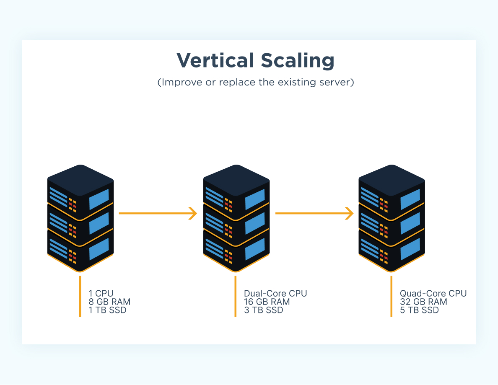
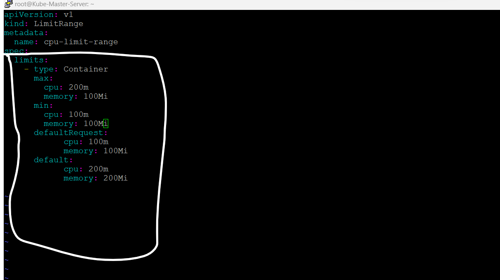

> # What is kubernetes (9 September 2014)

Kubernetes it's a orchestration tool, With the help of Kubernetes we can manage multiple containers at a time If one of our containers failed for same reaion, then we can automatically create another container with the same configuration, Kubernetes provide me same featuer like and Kubernetes is a system for application deployment that enables efficient use of the containerized infrastructure that powers modern applications, You can also run Kubernetes on-premises or within the public cloud. AWS, Azure and Google Cloud Platform (GCP) offer managed Kubernetes solutions to help you start quickly and efficiently operating K8s apps. Kubernetes also makes apps much more portable, so IT can move them more easily between different clouds and internal environments Kubernetes is the most popular open-source project from the Cloud Native Computing Foundation (CNCF), with active engagement and contribution from many enterprises, large and small we can login multuile node from a one place.

> # Introduction of Kubernetes

1. **Centralized Managment for cluster Host**
  
  Now we are able to managed to all docker mahine/container host from single Host

2. **Cluster Arch/Failover**
  
  Now container can migrate one machine to another machine

3. **Scalability**

Now we can add container more existing runing application .

> # These are most popular feature of kubernetes

1. Centralized managment for conatiner host :- We are able to all conatainer mahcine Container host from the single host
2. Cluster Failer :- Kubernetes also provide cluster failer feature container can migrate one machine to another machine
> - 3. Scalability :- We can add contianer for exisring runing applications

- A:- Vertical Scalling
- B :- Horizontal Scalling

> A:- Vertical Scalling:- 

We can describes adding additional resources to a system increase or decrease the power of a system to handle increased or reduced workload Add or reduce the CPU or memory capacity of the existing VM

> This is a vertical iamge, You can undersatnd from this iamge.

> B:- Horizontal Scalling :- 

Horizontal scaling is the ability for an application to automatically scale by adding/reducing computing nodes as the workload increases/decreases. This is in contrast to vertical scaling, which means that you scale by adding more power (CPU, RAM) to an existing machine.

> This is Horizontal Image, you can undersatand from this image.

4. Multi-cloud flexibility
5. Effective migration to the cloud
  
4. ROllout and Rollback :- We can rollout and rollback of conatiner application with out downtime, kubernetes it'saying that we can distroy and deploy new containter in zero downtime, we can upgrade you application in new conatiner, and there is same issue in new conatainer then rollback to previous version conatiner.

> # How does work kubernetes

This is a Images,

> **There are 4 services is always runing in kubernetes master node**

- 1:- Kube-API (Application programming interface)
- 2:- Kube-Etcs
- 3:- Kube-Sheduler
- 4:- Kuber-Controller

> What is Kuber-API :- Any command (Delete/create/scale) which extand by administrator it goes  to API Fist and it does validation (Authentiction and authorization) for any instructor.

> What is Kube-Etcd :- It contain complete kubernetes cluster information and store API related information and alos store the data key and valume formate.

> Kube-Sheduller :- it help to find the worker nodes for your application pod(container)

> Kube-controller (Port of Kubelet , 10250) :- it maintain comminicate with worker node and provide instructor to worker nodes.

# Latest installtion of kubernetes,

> Crio link :- (  https://cri-o.io/ ) Copy and You can install the kubernetes,

> Kubernetes Link :- ( https://kubernetes.io/docs/setup/production-environment/tools/kubeadm/install-kubeadm/ )   

# How install kubernetes in ubuntu- 20.04 version , (Install kubernete-Master Server)

> Note **3 Server required for kubernetes server and master, 1st for kubernetes master and 2ad and 3ad kubernetes-node server **

> # This is for kubernetes server

 1.  hostname
 2.  sudo apt-get update
 3.  sudo apt-get install -y apt-transport-https ca-certificates curl gpg
 4.  curl -fsSL https://pkgs.k8s.io/core:/stable:/v1.30/deb/Release.key | sudo gpg --dearmor -o /etc/apt/keyrings/kubernetes-apt-keyring.gpg
 5.  echo 'deb [signed-by=/etc/apt/keyrings/kubernetes-apt-keyring.gpg] https://pkgs.k8s.io/core:/stable:/v1.30/deb/ /' | sudo tee /etc/apt/sources.list.d/kubernetes.list
 6.  sudo apt-get update
 7.  apt install containerd
 8.  sudo apt-get install -y kubelet kubeadm kubectl
 9.  kubeadm init
 10.  kubeadm init --ignore-preflight-errors=all
 11.  kubectl get nodes
 12.  mkdir .kube
 13.  cd .kube/
 14.  touch config
 15.  ls
 16.  cd
 17.  cp /etc/kubernetes/admin.conf .kube/config
 18.  kubectl get nodes
 19. curl https://raw.githubusercontent.com/projectcalico/calico/v3.28.0/manifests/calico.yaml -O
 20.  kubectl create -f calico.yaml
 21.  curl https://raw.githubusercontent.com/projectcalico/calico/v3.28.0/manifests/calico.yaml -O (Download the Calico networking manifest for the Kubernetes API datastore)
 22. kubectl create -f calico.yaml
 23.  kubeadm token create --print-join-command (to create token for join kubernetes nod)

# This is fro kubernetes-node server
>

 sudo apt-get update
    1  sudo apt-get install -y apt-transport-https ca-certificates curl gpg
    2  curl -fsSL https://pkgs.k8s.io/core:/stable:/v1.30/deb/Release.key | sudo gpg --dearmor -o /etc/apt/keyrings/kubernetes-apt-keyring.gpg
    3  echo 'deb [signed-by=/etc/apt/keyrings/kubernetes-apt-keyring.gpg] https://pkgs.k8s.io/core:/stable:/v1.30/deb/ /' | sudo tee /etc/apt/sources.list.d/kubernetes.list
    4  sudo apt-get update
    5  apt install containerd
    6 sudo apt-get update
    7 sudo apt-get install -y kubelet kubeadm kubectl
    8 sudo apt-mark hold kubelet kubeadm kubectl
    9 kubeadm join 172.31.40.85:6443 --token 6jxmip.jcbwjv50beo7a4v4 --discovery-token-ca-cert-hash sha256:eae5c3eccedd332263cc7a8c76a9960b3d9a02108fcefdf44c37b72c57bdfa9a --ignore-preflight-errors=all (For join worker node)



> **These are same service is runing in Node side**

- CRI/containerd/dockerd :- 

it's a sercvices for runing worker node/conatainer We need a socket to run a container and CRI socket do not understand directly kubernetes language
  
- kubelet :- 
  
If we have to manage any container or node through kubernetes then we have to install kubectl agent with Cri socket on the front node side of kubernetes, it is kubernetes agent which take command from kube-controller

> **What Runing from worker node side**

1. Container run time :- 

1. Dockerd
2. Contianerd
3. Cri-o (Redhat/Ibm)

> This is a images of working process to kubernetes maste node to worker node

First you can go to docker website, (Install ubuntu-20.04)

---
# How to install kubernetes in ubuntu machine
---

> **for setup kubernetes atleast required 3 machine,**

- 1:- Master node (ubuntu)
- 2:- Worker node (ubuntu)
- 3:- Workder node (ubuntu)

> Master Ubuntu (ubuntu)

- sudo apt-get update
- sudo apt-get install ca-certificates curl
- sudo install -m 0755 -d /etc/apt/keyringspackages.cloud.google.com/apt/doc/apt-key.gpg
- sudo curl -fsSL https://download.docker.com/linux/ubuntu/gpg -o /etc/apt/keyrings/docker.asc
- sudo chmod a+r /etc/apt/keyrings/docker.asc
- echo \
  "deb [arch=$(dpkg --print-architecture) signed-by=/etc/apt/keyrings/docker.asc] https://download.docker.com/linux/ubuntu \
  $(. /etc/os-release && echo "$VERSION_CODENAME") stable" | \
  sudo tee /etc/apt/sources.list.d/docker.list > /dev/null
- sudo apt-get update
- sudo apt-get install docker-ce docker-ce-cli containerd.io docker-buildx-plugin docker-compose-plugin
- sudo apt-get update
- sudo apt-get install -y apt-transport-https ca-certificates curl gpg
- curl -fsSL https://pkgs.k8s.io/core:/stable:/v1.30/deb/Release.key | sudo gpg --dearmor -o /etc/apt/keyrings/kubernetes-apt-keyring.gpg
- echo 'deb [signed-by=/etc/apt/keyrings/kubernetes-apt-keyring.gpg] https://pkgs.k8s.io/core:/stable:/v1.30/deb/ /' | sudo tee /etc/apt/sources.list.d/kubernetes.list
- sudo apt-get update
- sudo apt-get install -y kubelet kubeadm kubectl

> Worker Node

- apt-get update
- apt-get install -y apt-transport-https ca-certificates curl
-  curl -fsSLo /usr/share/keyrings/kubernetes-archive-keyring.gpg https://packages.cloud.google.com/apt/doc/apt-key.gpg
-  echo "deb [signed-by=/usr/share/keyrings/kubernetes-archive-keyring.gpg] https://apt.kubernetes.io/ kubernetes-xenial main" | sudo tee /etc/apt/sources.list.d/kubernetes.list
-   apt install containerd
-   apt-get install -y kubelet kubeadm kubectl
-    apt-mark hold kubelet kubeadm kubectl
-    kubeadm join 172.31.32.151:6443 --token twvupt.c9h12ojc6lywt7km --discovery-token-ca-cert-hash sha256:c63ff01bbf7fcf968d31e85d51a91a9e89724d7766504cc8b45a8ba383ca68b0
-    kubeadm join 172.31.32.151:6443 --token twvupt.c9h12ojc6lywt7km --discovery-token-ca-cert-hash sha256:c63ff01bbf7fcf968d31e85d51a91a9e89724d7766504cc8b45a8ba383ca68b0 --ignore-preflight-errors=all
    
 - Kubelet :- Agent
 - kubeadm :- Installtion Utility
 - kubectl :- API command interface
  

> **Note**
- /etc/container (we can deleteing one file)
- mkdir .kube
- cp /etc/kubernetes/admin.conf .kube/config

> # What is kubernetes namespace(Project)

Kubernetes namespace means that according to which user is working in which namespace, every user has a particular area which the user can do only by logging in with his user, multipule team can work easily and also we can seprate workload team wise based on the project we can provide priviliges for users and we can provide CPU/Memory/storage use for team ,

To easiy explain, namespace and project in simple language, if we open any account of our AWS or cloud, not everyone can see our dashboard, all user has their own account which one user can see his dashboard. Other users cannot see

> - kubectl get ns (show all namespaces in kuberneres)

> # How to create Pod in kubernetes

> **There are 2 types of pod**
 
- 1:- Pod Creation (Simple/Orphan pod)
- 2:- Controlller pod
  
> # How to create simple/orphan pod by command line in kubernetes.



> - kubectl get ns 
> - kubectl run test --image=docker.io/nginx 
> - kubectl get pod
> - kubectl get pod -o wide 
> - kubectl exec -it test bash 
> - exit 
> - kubectl get event
> - kubectl delete pod podname 
> - kubectl get pod
> - kubectl create ns nitin
> - kubectl run demo1 --image=docekr.io/nginx -n nitin 
> - kubectl run dem2 --image=docker.io nginx


> **How to create pod by using file method (yaml) kubernetes.**



> - kubectl run core1 --image=nginx --dry-run -o yaml (show with yaml file)
> - kubectl run core1 --image=nginx --dry-run -o yaml > pod.yaml (save file in pod.yaml)
> - kubectl create -f pod.yaml (create pod from pod.yaml file)



> **In yaml file most important the resources and how to create pod by using file method**



**all parametter already defined for yaml file,
and we can see all formates from these commands**
  
> - kubectl api-resources (Show all resources)
> - kubectl explain pod  (telling that How we can careate yml file for creating yml file.)
> - kubectl explain pod.metadata (telling that How we can careate yml file for creating yml file.)
> - vim rc.yml (yml file)
> - kubctl create -f rc.yml (create RC pod)
> - kubectl get rc  (see RC in kubernetes)
> - kubectl get pod (we can see pod)
> - kubectl get pod -o wide (show all detail for pod)
> - kubectl describe pod nitin-c65ws | grep -i controller (who is controller of this pod or not)
> - kubectl delete pod coredge-hzgq5 (if you are delete RC pod then by automatic one RC pod will create, maintain desiered state of pod)



# How to create pod using API Controller.

> Purpose of API Controller pod.

   -  Maintain pod stat   (Hight availability)
   -  scalability.
              1. Manual (Horizontal)

1. **RC (Replication Controller) :-**

it's privide high availability and scalability for pod, if pod is crased and failed to automatic pod is create in horizonatal form.

We can't create RC method by command line, onyl we can create file method.
that the reasion we are going to kubernetes offial page, and in search option we can search , **Replication Controller**, after you can see RC based yaml file.



> **RC Yaml file, we can edit according to the need and company**

> - kubectl delete pod --all (delete all pod)
> - vim rc.yml (all parametter is available in this file)
**For Example**
 
> - kubectl create -f rc.yml (Create RC file from this command)
> - kubectl get rc (Display RC)
> - kubectl scale --replicas=7 rc coredge (we can extand and reduse rc pod by using this command)
> - kubectl delete rc core (delete rc pod)
**Note**

> after create rc pod, and now you want to extand rc pod from insdie the rc file, we can extand rc pod number and run billow command for apply,

> - vim rc.yml
> - kubectl apply -f rc-yml (after update in rc file, we requried this command, and from this command rc pod is extand, without this command pod is not extand)
> - kubectl get rc
> - kubectl describe rc coredge | grep -i image (we can check, which from image pod is created)
> - kubectl describe rc coredge | grep -i image (show version of rc pod, if are we wnat to change veriosn of application from yml file but because of same resion veriosn is not reflact)
> - kubectl describe rc coredge | grep -i image (hare is showing version,)
> - kubectl delete pod --all (delete pod for reflect verion of applciation)
> - kuebctl get pod (how we can check appliction version)
> - kubectl describe pod coredge-9pwcz | grep -i image (how version will show)



> # What is Label and Selector in kubernetes Resources.

> **In case pod only**

for example you have to a multipule pod with labels, and you you find pod from label level, the we need to label



> - vim nitin.yml
> - kubectl create -f nitin.yml
> - kubectl get pod
> - kubectl get pod --show-labels (show label of pod)
> - kubectl get pod -l env-qa (show pod from envirement level)
> - kubectl delete -l tier=nitin (delete pod, which name of this teri)
> - kubectl get pod --show-labels (show all labels of pod)
> - kubectl label pod coredge-9pwcz type=B (we can define label in rungin pod)



 **Now, we are set lable in RC pod file**

In RC work on equality base, and if value is machted during the creating 2 container then you one pod will not ceate during the valume match from label and selector.  

 **Note**

Label and sector are at 2 places in the RC pod file, 1st **top of spac** section and 2ad **billow of the spec**


> - vim rc.yml
> - kubectl get rc --show-labels (show label with rc file)
> - kubectl get rc (show all rc file) 
> - kubectl delete rc -l tier=web (delete rc with define label)



**This is a example of top label in file**

> # Replica Set.

In replica set, work on set bases, 

**thi is image of relica set**

# Application And Rollback

> **Deplyment Provided feature**

  1. Desired State maintain
  2. Scalalibilty
  3. Rollout And Rollback 
   
> **3 types methood available for Application Deployment stretagy**

1. Blue And Gree Stretagy (by default), Save yor downtime
2. Recreate Stretagy
3. Canary Deployment.
   
> Deployment pod by command line.

**Blue And Gree Stretagy**



1. kubectl create deploy nitin --image=nginx --replicas=2 (create two pod)
2. kubectl get deploy (show pod)
3. kubectl delete pod nitin-75f6b7bf46-k6dz7 (if same reasion you one pod is delted, then by default one pod will create)
4. kubectl get pod
5.kubectl scale --replicas=4 deploy nitin (exatant pod with this command)
1. kubectl get pod
2. kubectl delete deploy nitin (delete deplo, witj app pods)
3. kubectl get pod

**Fiel Method**

vim deploy.yml

apiVersion: apps/v1
kind: Deployment
metadata:
  name: nginx-deployment
  labels:
    app: nginx
spec:
  replicas: 3
  selector:
    matchLabels:
      app: nginx
  template:
    metadata:
      labels:
        app: nginx
    spec:
      containers:
      - name: nginx
        image: nginx:1.14.2
        ports:
        - containerPort: 80

9. kubectl create -f deployment.yml
10. kubectl get pod --show-labels
   


> **Now Will cover Rolllout First**

In Deployment stretagy follow to blue green stretagy,  when we are upgarde appllication version to old version to new version with downtime.

> Old version :- Blue Deployment Stretagyy
> New Version :- Green Deployment stretagy

> **Nte**

Deployment Stretgy follow to Blue,Green formolla rule, first available 25% and unable 25%, but it's default rule, we can chenge this rule for deployment stretagy.

. Unavailable (delete)
. available (creation)

**You can understand from this image for deployment stretagy**



1. kubectl create deploy nitin --image=nginx:1.14 --replicas=10 (create deployment pod by command line)
2. watch kubectl get pod (we can watch process of upgradtion stretagy)
3. kubectl describe deploy nitin | grep -i max (we can see stretagy)
4. kubectl edit deploy nitin (going to yml file of deployment,and we can modify this file according to the need)
5. kubectl describe pod nitin-86d775cc94-kckbh | grep -i image (we can applicaiton version from this command)
6. kubectl rollout history deploy nitin (we can check rollout histoy)
7. kubectl rollout history deploy nitin --revision=2 (check details of application)
8. kubectl rollout undo deploy nitin --to-revision=2 (we can move back in previous verison application from this commnad)
9. kubectl describe deploy nitin | grep -i image (we can applcaition versio)



**Recreate stretagy**

In This stretagy old veriso directoly is deleted and then new version is created,

1. vim deploy.yml
2. kubectl create -f deploy.yml

**Canary Deployment**

It's a teknic for both application is runing, When both the applications were run, we could see a difference in both version application.

> # Pod Schedulling.

1. Node Name based shedulling 
2. Node label and selector based schedulling
3. tait and toleration based schedulling
4. Affinity And Anti-Affinity based schedulling.

> **Node Name based shedulling**

We tell the node that this deployment should run on that node. (worker-node1 , worker-node-2) ,

.But there is also a dropback, once we give the name of the node, the deployment will run on that node, and if no resources in node then pod will crashed and not create pod in kubernetes,



1. kubectl create deploy nitin --image=nginx --dry-run -o yaml > deploy.yml (create one deployment)
2. kubectl get node (show node in kubernetes)
3. vim deploy.yml (open deploy file)



We will change in **spac section** for node base shedulling and menstion node name, for exmaple, bollow this image.

 We can understand this image,
   ![This 

4. kubectl create -f deploy.yml (create pod)
5. kubectl get pod
6. kubectl get pod -o wide

> **Node label and selector based schedulling**

We can decide which role to run in which node, according to the need, if one node is down due to some reasion, then going itself to another node. 

**We can understand this imgages** 

**How we can in command line**



1. kubectl label node kube-clien-1 nitin=nitinsoni gagan=gaggi buti=lallu (we can define label in node)
2. kubectl label node kube-client-2 roll=rool1 abc=web --overwrite (If we accidentally assign a roll to the wrong node then we can overwrite it. )
3. kubectl get node --show-labels (show label in node)
4. kubectl get node -l roll=rool1 (we can check role of node)



**This is image of, how to create label bases schedulling**

5. kubectl get node -l role=web (check role)
6. kubectl create -f deploy.yml
7. kubectl get pod -o wide

> Selector:-
     1. Deployment (deploment file only)
     2. Namespaces (Deplyment on namesapce levelfrom node)
   
**cd /etc/kubernetes/manifests/ (control 4 servics)**



1. etcd.yaml  
2. kube-apiserver.yaml  
3. kube-controller-manager.yaml  
4. kube-scheduler.yaml
5. kubectl get ns
6. kubectl create ns nitin
7. kubectl edit ns nitin

(going to this file and edit this varialble **we need the add same value**) 

Billow of metadata:-

 -     annotations:
 -        scheduler.alpha.kubernetes.io/node-selector: env=nitin

8. kubectl label node kube-clien-1 env=nitin (given lable of node)
9.  kubectl create deploy home --image=nginx -n nitin (deployment with niitn name namesapce)
10. kubectl create ns nitin
11. kubectl create deploy web --image=nginx -n nitin (create deploy from web name in nitin namespace)
12. kubectl get pod -o wide -n nitin (check details of nitin node)
13. kubectl get pod -o wide -n nitin (who pods in nitin namespace)



**this image refrensh of namespace edit**

> # Tait and toleration Based Schedulling

Test and Tolerance is used only for deidcated hardware requirement for pode, So that no pod can come to that node.

> - Taint :- Node Side
> - Toleration :- Deployment Side



1. kubectl taint node kube-clien-1 monitoringpurpoise:NoSchedule (node is taint from this command)
2. kubectl create deploy nitinsoniji --image=nginx --replicas=10 (create 10 pod, after taint any node then when we have create any pode, so pod is not going to taint node. )
3. kubectl describe node kube-clien-1 | grep -i taint (we can find tiant node)
4. kubectl run dge --image=nginx --dry-run -o yaml > pod.yml
5. vim pod.yml
6. kubectl taint node kube-clien-1 monitoringpurpoise- (untant node)

6. kubectl create -f pod.yml 
7. kubectl get pod -o wide

- We can pass vule for toleration,



> **Type of taint Effect**

1. NoSchedule :- it does not delete (evict), existing pod even the don't have toleration (if any pod is created already, and after pod creation, we have assign tolaretion so dones not effect exiting pod, and upcoming pod does not creaete tolaretion node)

   

    - kubectl create deploy tent --image=nginx --replicas=2
    - kubectl get pod
    - kubectl get pod -o wide
    - kubectl get node
    - kubectl taint node kube-clien-1 tes:NoSchedule
    - kubectl get pod -o wide
    - kubectl delete pod tent-5644c9c7bc-l6z8s
    - kubectl get pod
   


2. NoExcute :- it evict (delete) all pod they don't have toleration
   

    - kubectl taint node kube-client-2 DB:NoExecute
    - kubectl get pod -o wide  

> **Type of toleration Effect**

**Operator**
 1. Exist :- It only match single string
    
    - kubectl taint node kube-clien-1 role=DB:NoExecute ( we can define role of pod)
   - vim pod.yml
    **how to add parametter in Exist**
    

 2. Qual :- Key and value both matched.
   
  - kubectl taint node kube-clien-1 role=DB:NoExecute (we can pass valume during the taint node)
  - kubectl create -f pod.yml
  - kuebctl get pod

> # Afinity And Anti-Afinity

> **Node lavel (lablel and selector) affinity and Anti-Affnity**

- 2 Types of Afinity And Anti-Afinity available,
  
  1. Node Level
          - Afinity
          - Anti-Afinity
  2. Pod lavel
          -  Afinity
          - Anti-Afinity
  
> **How to apply node lavel Afinity And Anti-Afinity**

1. Node Lavel, 
2. Afinity And Anti-Afinity,
  
**Example of Affinity** = disk=sd

1:-Node Lavel Affinity,

> **hard Affinity rules**

- RequriedDuringschedulling+IgnoreDuringExtention :- (first time check lablel and selector of node and afer check, if any user change lable and selector don't matter)
  
- RequriedDuringschedulling+RequiredDuringExtention :- (Both condistion match label and selector,)

> **Soft affinity rules** 

- prefferedDuringschedulling+IgnoreDuringExtentio ()
  
> **Oprator**

> **For Affnity**
 - IN (Agar ek nhi mile to dusre vaule par chale jana)
 - Exists ()

> **Anti-Affinity**
  - NotIn
  - DoesNotExists

> **This Oprator both work affinity and Anti-affinity**

  - LT And GT (Less Then and Grator then)

> **Pod Lavel Anffinity and Anti-Affinity**

1. Pod to Pod Affinity. (When we are runing two microservice in same node, that time we can use pod to pod affinity)
  
  
---
> **Compute And Resource Quota**
---

We can manage how many pods will be created on which node or how many resources it will have, You can limit the total sum of compute resources that can be requested in a given namespace. Across all pods in a non-terminal state, the sum of CPU limits cannot exceed this value. Across all pods in a non-terminal state, the sum of memory limits cannot exceed this value

2 Types Quota are availebl,

1. Compute Quota (CPU,MEMORY)
2. Resource Quota (Objective, In kubernets language, pod,rs,rs,deployment, contollers etc.)
  
**Compute Quota**

    - Deployment Level,
              - Soft Quota (Requrest Quota)
              - Hard Quota (Limit Quota)
    - Project Level (NameSpace),
              - For limitrand for pod, if any pod is comming in namepsce.
  
**How to create Deployment Node Quota**



  1. vim deploy.yml
  2. kubectl create -f deploy.yml
  3. kubectl get pod -o wide
  4. kubectl describe node kube-clien-1 | grep -iA5 allocated (check allocated space of node)



**we can add valumes in deploy file**

> (Agar ham kise deployment me ja kar CPU ya memory ko chagne karte hai ya fir cpu memory badhate hai and ek hi pod ke duplicate replica banate hai ise ko ham Horizontal scalling bolate hai,)

   

> **How to create Project Level (NameSpace)**

If we fix any limit in the namespace, then we can create as many pods in that namespace as we have given the limit in the namespace.



1. kubectl create ns qa
2. kubectl create quota cka --hard=cpu=400m,memory=400mi -n qa (we have allocated fix space for namespace)
3. kubectl get quota -n qa
4. kubectl describe quota -n qa (show name space limits)



> **Limit Rang**

1. We can define default value for CPU/Memory, 
2. Max/Min value for cpu/memory. 
   
**This is available only yml file not command line**

When we define the limitrange at the namespace level, the pod created after that by default gets the CPU and memory that we have given at the namespace level.



Going to kubernete site and copy the sentax for limite rang,

1. vim limit.yml (we can take any name)
2. kubectl create ns nit (create one namespace)
3. kubectl create -f limit.yml -n nit (this is creted limitrang, I have attched image for your referensh)
4. kubectl run test --image=nginx -n nit (create orphan pod)
5. kubectl describe quota test -n example 
6. kubectl describe pod test -n nit | less
7. kubectl get limitrange -n nit (we can check limitrang of namespace)
8. kubectl delete limitrang xyz -n nit (remove limitrang)



**This is exmaple of limitrang of namepsace level**

#  Voulme for kubernetes 

> 2 Types valume are availanle,
1. Static Volume
2. Dynamic Volume

> **Static Volume Deployment**

1. Local Volume
2. Network Based Volume
             > - NAS Based
             > - SAN Based

> **Static Volume provisoing using NAS (NAF)Server**

          - PV [Persitent Volume] (Object, Commnd line is not availabnle only we can create yml file method)
  
          - PVC (Object, Commnd line is not availabnle only we can create yml file method)
  
**For PV and PVS creation we requrid yml file from kubernetes officel site**
  
>  For this prectical perform, we will setup nfs server first,

1. sudo apt update
2. sudo apt install nfs-kernel-server
3. sudo mkdir -p /var/nfs/general
4. sudo chown nobody:nogroup /var/nfs/general
5. vim /etc/exports
6. /var/nfs/general    client_ip(rw,sync,no_subtree_check) 
7. sudo exportfs -a
8. sudo systemctl start nfs-kernel-server
9. sudo systemctl enable nfs-kernel-server

> Now we will configure PV yml file

1. vim pv.yml

**This is exmapl of PV** 



apiVersion: v1
kind: PersistentVolume
metadata:
  name: pv0003 ==> This is PV name we can take any name, PV should be uniqe
spec:
  capacity:
    storage: 5Gi
  volumeMode: Filesystem
  accessModes: =====>> 3 Types of access moe billow I have mensioned
    - ReadWriteOnce
  persistentVolumeReclaimPolicy: Recycle ==> 3 Type of volme recycle
  storageClassName: slow
  mountOptions:
    - hard
    - nfsvers=4.1
  nfs:
    path: /tmp ==>  (Shared Derectory)
    server: 172.17.0.2 == > (Server IP)


  

 ==> 3 Type AccessModes available, PV mode means how many worker nodes a node can access at a time.

                               -  **ReadyWritemany** ==> (A PV whose mode is ReadWriteMany can be accessed at a time on multiple worker nodes.)
                               -  **ReadOnlyMany** 
                               -  **ReadWriteOnce** 
                               -  **ReadWriteOncePod** (Only one pod read and write,)
                              - ReadWriteOnce                
 **This is Work only static provisiong**

                                **3 Type Policy available of persistentVolumeReclaimPolicy,**
                               - 1. Recycle, (if PVC deleted, Application changes lost but PV will available in cluster so it can be use for another namespca and other deployment)
                               - 2. Retain, (If PV + Data both available)
---
**This is Work only dynaic provisning**
                               - 3. Deleted, (PV+Data Lost )
  
> **Status of PV**
- Available:- (free PV any can use)
- BOUND:- (PV has claimed, with any namespace)
- Released
- Failed.

1. kubectl get pv
2. kubectl create -f pv.yml
3. kubectl get pv
4. kubectl create ns nitin (create namespace, and claim namespce to PV )
5. vim pvc.yml
   
**Now we are claim request (claim request yml file available, we can't calim from command line, goto kubernete.io site)**

**Thi is sentax of PVC**


apiVersion: v1
kind: PersistentVolumeClaim
metadata:
  name: myclaim ==> PVC name (uniqe name in namespace)
spec:
  accessModes:
    - ReadWriteOnce
  volumeMode: Filesystem
  resources:
    requests:
      storage: 8Gi



6. kubectl create -f pvc.yml -n nitin (pvc is claimed in nitin namespace)
7. kubectl get pvc -n nitin
8. kubectl get pv
9. kubectl create deploy mysql --image=myqsl:5.6 --dry-run -o yaml > deploy.yml
10. vim deploy.yml
  
> **Edit in yml file**

11. kubectl create -f deploy.yml -n nitin
12. kubectl get pod -n nitin 
13. kubectl get pod -o wide
14. chmod -R 777 /var/nfs
  

> **Dynamic Volume Deployment**

- **StorageClass**
- **StorageProvisinor Agent :- Pof NFS Client**
  
https://github.com/kubernetes-sigs/nfs-subdir-external-provisioner/tree/master

(This is github site of kubernetes, which is available manifect of dynamic provisoing yml file)

#  Pod Networking for kubernetes

1. Each pod should have seprate IPaddress (True)
2. Two pod should be commucnicate to each on same host (True)
3. Two pod should be communicate to each other every they on diffrence host (True)
4. calico basically create route table as well on each worker
5. all node's calico switch's are connected to the tun10 ports

NOTE:- Pod netwoek on SDN techonology OR CNI concept 

**Flavor of SDN/CNI**

1. Weave
2. flannel
3. calico
  
**Calico**

It's a software define network which provide L3 layer networking for kubernetes pod, and act as L3 layter switch on each kubernetes nodes and calico basically designed by BGP (Border getway Protocal )protocol,
calico also configured routuing for pod , that is why remote pod they are able to reach.

- During the installtion calico has configured one default subnet, 192.168.0.0/16
  

> Kubernetes API basically breack your network inbto small small network, then it pul on each worker node API baically does subnet  based on /26 CIDR according it place small network on each worker node

**What is packet flov, when same node will communicate the same pod**
        Pod ===> Calico (Beidge Network) ===> Pod

****What is packet flov, when 2 node will communicate the difrent pod****
        pod-A ==> Calico ==> Tun10 ==> (Packet Encapsulate) ==> Network ==> Tun10 ==> Calico ==> Pod-B

                                     (Packet Encapsulate)
                                        Spod      Dpod
                                        Snod      Dnode 
                                              IP

**How does work netwoek between pod and node**

This is image,



1. kubectl get ds -n kube-system (deaom set, they don't need ceate replica valume of node by defautl according to the node network replica IP is created)
2. kubectl get ippool
3. kubectl get ippool default-ipv4-ippool -o yaml (Show network details)
4. route -n
5. ip  route
6. route -n | grep tun10 (who's node which pod from connected)
7. 



# Proxy Server.

- Pod IP is not static, and proxy/Service IP is provided static ip for pod proxy discover pod endpoint/IP dyanmic through API, Expose for and micro services and proxt it provided reserved IP for each deployment so now forntend microservice can reach backend through static IP address service IP can distribute load accross the pod, if multiupule pod accossiate with service IP, kube proxy also act as a internal level network lead balencer.
  

**How work ServiceIP/ProxyIP in kubernetes**



1. kubectl create deploy app --image=nginx
2. kubectl create deploy db --image=nginx
3. kubectl get pod -o wide
4. kubectl expose deploy db --port=8080 --target-port=80 --name=my-service (expose ip in DB pod and port with name)
5.  kubectl get service
6.  echo I am nitin soni and this is my DB > /usr/share/nginx/html/index.html
7.  exit
8.  curl 10.103.210.143:8080
9.  kubectl describe service my-service
10. kubectl delete pod db-6b7cdcbfc6-v92pn
11. kubectl get pod
12. kubectl get pod -o wide 



> **How to expose pod from external word**

1. Port forwording
2. Ingress Controller 

> **Port forwording**

    1. Pod Level (Not Recomded)
    2. Servie IP level

> **Network Policy**

- **Types of policy**
  
   1. Ingress Rules
   2. Egress Rules
   
Policy ==> Set of Rules
Rules ==> they are basically 3 criteria

   1. Network based
   2. namespace based
   3. pod label

> **And / OR**
   1. AND :- all criteria should be satisfied
   2. OR :- one of them
   
> **Only allow policy**

based on criteria match traffic is allowed expext deny

> **Network Policy**

Types of policy

  1. Ingress (Incoming)
  2. Egress (Outging)
   
> Policy => Set of Rules
> Rule => there are basically 3 criteria
  1. Network based rule
  2. Namespace base rule
  3. Pod label base rule
   
>  And / OR 

1. And => Both condistion math
2. OR => One of them

# Helm ( Kubernetes Manifect manger)

It,s a kubernetes manifect packege manger

1. **Helm Repo** (there are folder(storage) which contenc helm chart)
   
      1. Internet Based
      2. Local Based
   
2. **Helm Chart** (it's packaged of kubernetes manifect resources)
  
     1. Community Based
     2. Custom Based
   


==> We Are Installing helm pakage <===

1. curl https://baltocdn.com/helm/signing.asc | gpg --dearmor | sudo tee /usr/share/keyrings/helm.gpg > /dev/null
2. sudo apt-get install apt-transport-https --yes
3. echo "deb [arch=$(dpkg --print-architecture) signed-by=/usr/share/keyrings/helm.gpg] https://baltocdn.com/helm/stable/  debian/ all main" | sudo tee /etc/apt/sources.list.d/helm-stable-debian.list
4. sudo apt-get update
5. sudo apt-get install helm

==> Now we are hire helm command<==

6. helm repo list
7. helm repo add wp https://charts.bitnami.com/bitnami (add repo)
8. helm search repo wp (find total packges in helm repo)

**We are setup wordpress with helm**

9. helm search repo wp | grep wordpress
10. kubectl create ns example
11. helm install nitin wp/wordpress -n example
12. kubectl get all -n example
13. helm list -n example (how many deploymnent is runing)
14. helm uninstall nitin -n example (unistall all appliction form exmaple namespace)
15. unintall pvc
16. cd .cache/helm/repository/
17. cp wordpress-22.4.12.tgz /tmp/
18. cd /tml
19. tar -xzf  wordpress-22.4.12.tgz
20. rm -rf Chart.lock values.schema.json README.md
  

**Craating Custom Bundol**

1. helm create nginx
2. ls nginx/
3. cd /tml/wordpress
- These are 4 files and directory of wordpress :- Chart.yaml  charts  templates  values.yaml
4. 



**Helm Directory Structure**

1. Chart.Yaml => it contains chart details, Like :- Version details , dependencies 
   
2. charts :- it contencs depends chart.
   
3. Templates :- it contains all manifast which run this projects.
   
4. values.yaml :- it contains user define values
   

# Resource Monitoring in Kubernetes,
 
2 Types of monitoring is available in kubernetes,

1. Resoures Monitoring :- 
   
            - Prometheus (Metrics Server, But not provide grafical interface)
            - Grafana (Provide GUI Interface)
  
2. Logs Monitoring :- 
   
            - Elastic Search (Log Server, And It's not GUI interface)
            - Kibana  (GUI)
            - Fluentd/Logstash (Agent)
            - EFK (Elastic fluentd kibana)
            - ELK (Elastic search login test kibana)

- EFK (Elastic fluentd kibana)
- ELK (Elastic Search logstash kibana)
  
# RBAC (Role Based Access Controller).

1. Authentication
2. Authorozation

Command ==> Authenticatio ==> Authorization ==> Admimission Control

**Authentication** :- It's check identity .
**Authorization** :- It's check role access .

> User
> Group
> Role 

         (resources+verb=roles => which allow to permission of user for managing kubernetes resources, [pod,deplymenet,rc.rs,afinity,anti-afinity, limit, quota etc,pv,pvc])

         Verbs:- list/update/pathc/delete

         Role are  2 Types :-

        - Default role :- during the installtion it has created alredy
        - custom role :- we can create own role as well
  
        - Spoce :- 
        - 1. cluster scope
        - 2. namespace scope
  
         Resources :-
         - 1. clusterwide :- PV
         - 2. namespace wide :- Pod
  
         Rolebinding :- when we map role to user it become binding.

         - 1. Cluster level
         - 2. namespace level

  
> Rolebinding
> Service Account

> **Authentication**

There are many types of authonticatin for login API in kubernetes,

Kubernetes.admin (by default user of super user)

- SSL Based authentication (by default kubernetes super user, he is login based on the certificate)
- Service account based authentication
- static token file based  
- webhook based authenticati
- OpenID bassed authentication

**Installtion of Bation Node (New server machine ubuntu)**

**Note**

If we are copy then file of admin.conf kubernetes file to another server so second server act as a kubernetes master node server,

# Custom Role in kubernetes,

1. Resources :- API object like , RC,RS,PV,PVC etc
2. Verbs :- Verbs mean that, List,describe,delete etc
  
We can create 2 Types of costom role,
- Cammond line
- Manifact (yml files)

# Keep Learning.....