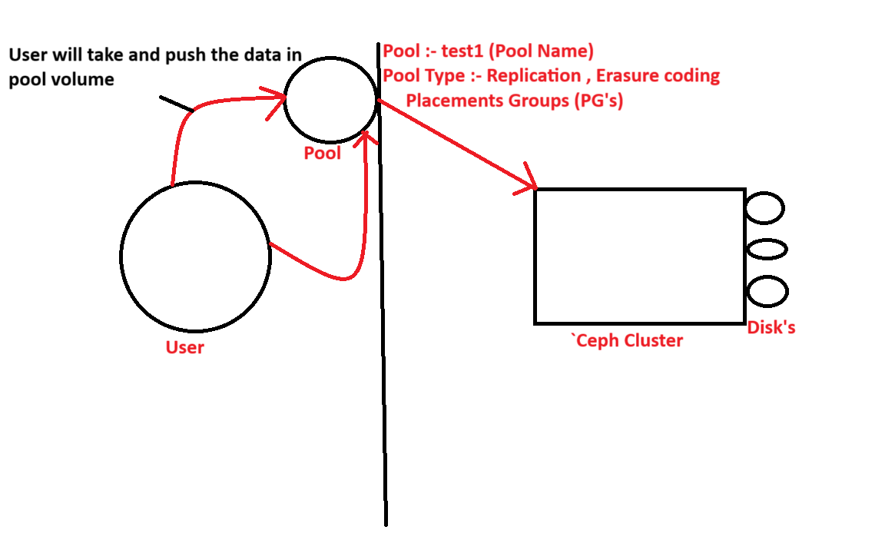

> **What is Ceph ?**

 Caph is a software, it will run the oer the OS and support multipule node, this is cluster server storeat to their clients in the from block , file or object level storage.

> **Why We Need Ceph Storage**

1. Scalability
Ceph can scale from a few terabytes to petabytes of data easily.

You can add more disks or nodes without downtime.

2. Fault Tolerance & High Availability
Ceph replicates data across multiple nodes.

Even if a disk or server fails, your data remains safe and accessible.

3. Unified Storage (All-in-One)
Ceph supports:

  => Block storage (like for VMs, OpenStack Cinder)

  => Object storage (like S3, for cloud-native apps)

  => File storage (like NFS or POSIX, for traditional use)

So you don’t need separate systems.

4. Open Source & Cost-Effective
No license cost, unlike NetApp, EMC, etc.

Built for commodity hardware — no vendor lock-in.

5. Self-Healing & Self-Managing
Ceph automatically detects failed disks and re-balances data.

Less manual work for admins.

6. Used in Cloud Environments
Popular in OpenStack as backend storage for Cinder, Glance, and Nova.

> **This is the basic daigram of caph storage**

> **Caph storage how ,it work and how to store the data, we can understand from this daigram**

> **caph storage key points**

=> open source
=> software define storage
=> distributed
=> it provide storage in the from of block , file and object storage client.

> **What is OSD's ?**

The disks or partitions in our system or server — which we represent in Linux as `/dev/sda` or `/dev/vda` — are where our data is stored. This data can be referred to as files. In Ceph terminology, the data stored on `/dev/sda` is referred to as an OSD (Object Storage Daemon).

> **This is the architecture of ceph storage**

> **OSD Type name**

- Primary OSD
- Secondry OSD
- Backup OSD

it is using method => replicas => copy or replicate data from one location to another location,

- Production ENV => 3 way replicate => your one day should be present in 3 location

> **What is primary OSD**

- The disk where the data is first written is called the primary OSD, all read and write operation will be handed by primary OSD

> **What is Secondry OSD**

it will equire role of primary OSD when primary OSD will down,

> **What is Backup OSD**

when secondry OSD dwon, then data will be move in backup OSD and waiting for uping OSD of primary and secondry OSD.

> **We are understanding to this image**

This is the flow to save your data

User will create data => object => object will club in PG's => PG's will be write our suitable OSD by the help rados,

- Ceph Cluster => logical type parts physical layer application layer
- Application layer => pool => user will save your data inside the pool
- physical layer => cluster map, CRUSH msp, OSD map

        Cluster MAP:- storad info about network topology 

        CRUSH MAP :-  failure domain information

        OSD MAP :- OSD information stored
        
        PG Map :- Maintain yor number PG number , primary number , OSD number , backup OSD's

- Reweight Value :- reweight value zero main ceph cluster will never selet that osd for vaing the data

- Weight value :- weight value is indicate TB value

- Pool Vloume :- A pool in Ceph is a collection of Placement Groups (PGs) that store your data across multiple OSDs (Object Storage Daemons). Pools define:

           Replication level (how many copies of data to keep),

           CRUSH rule (how data is distributed),

           PG count (data distribution granularity),

           Type (replicated or erasure-coded).

- What is RADOS :- Reliable Autonomic Distributed Object Store

It is the core component of Ceph — the foundation layer that handles all data storage, replication, recovery, and distribution, and The data grouped by the PG (Placement Group) is taken to the RADOS nodes or servers for storage, and it is RADOS that decides which data should be stored on which node or server.

- What is cluster MAP :- Save your information of topology, we got the detaisl of OSD information

- What is CRUSH MAP :- failure doamin, CRUSH map will save your data privamry , secondary and backup osd.

- PG Map :- Maintain your serial number of data.

- OSD Map :- stored OSD information

> **What is Bluestore in ceph storage**

BlueStore is the default storage backend for Ceph OSDs (Object Storage Daemons).
It directly stores objects on raw block devices (like HDDs or SSDs) without using a file system like XFS or ext4.

> **What is Pools in ceph cluster**

In a Ceph cluster, a pool is a logical collection of storage space used to store objects. Pools are how Ceph organizes and manages data placement, replication, and access policies.

> **What is Placments Group's**

