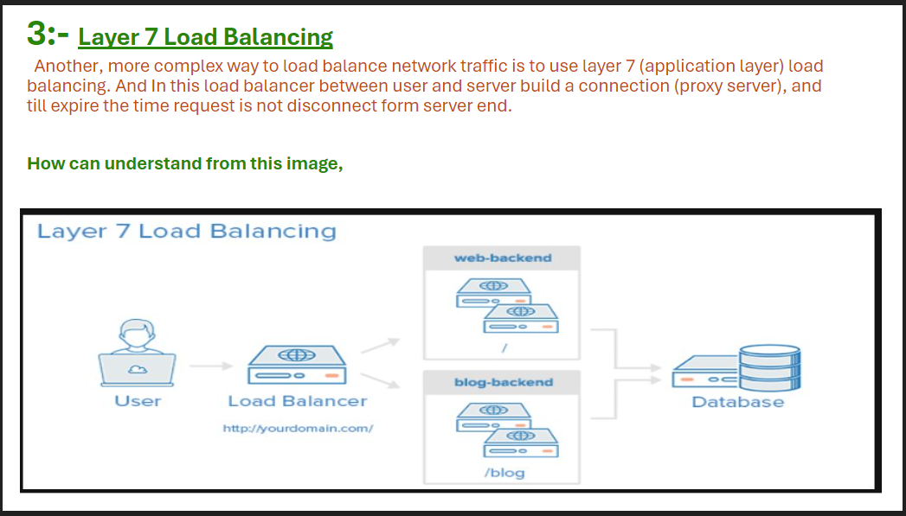

> **What is Ceph ?**

 Ceph is an open source project that provides software-defined storage with unified (object, block, and file) storage. You can scale out this storage, and it is self-healing with the ability to anticipate failures.
 
 Ceph is a free, open-source storage platform that operates in a distributed manner, without a single point of failure, scalable to the exabyte level, and freely available. Ceph replicates data and makes it fault-tolerant using commodity hardware, thus delivering highly cost-effective storage capabilities

  Ceph is often deployed with OpenStack as a back-end storage method. These two open source projects work together to make a well-integrated and robust solution for infrastructure.

> **How Ceph and OpenStack work together**

 Ceph Storage Clusters, which are based on Reliable Autonomic Distributed Object Store (RADOS), can provide back-end storage for OpenStack. This image shows how they work together.

 .png)

 OpenStack's Keystone and Swift take advantage of Ceph by using the Ceph Object Gateway (a RADOS Rest Gateway, or RGW). This integration with Keystone allows the gateway to accept Keystone tokens for validation. This same gateway enables Swift to store its objects within Ceph

> **Feature of Ceph**

 1. Self-Managment features
 2. No Vendor lock-in
 3. Power shifted to software layer
 4. No single points of failure
 5. Ceph is Open Source Software
 6. Run as a Commodity hardware
   => Commodity Servers
   => IP Networks
   => HDDs,SDDs,NVME, etc
 7. A single cluster can serve, object block and file workload

 > **Ceph is Scallable**

 1. Ceph is elastic storage infrasture service
   => Storage Cluster may grow and shrink
   => add or remove hardware while system is online and under laod
 2. Scale up with bigger, faster hardware
 3. Scale out within a single cluster for capacity and perfomance

 > **RADOS**

  - Reliable Autonomic Distributed Object Storage
    => Common storege layer underpinning object, bloct, block, and file services
  - Provide low-lavel data object storage service 
    => Reliable and high availeble
    => Scallable 
    => Manage all replicas

  > **RADOS Softwate Component**

   1. Cepf Monitor , (Port number 6789 and 330)​
   2. Cepf Manager , (Port number 8443 or 8080)​
   3. Cepf OSD (Object Storage Deamon) , (Port number 6800-7300)

> **1. Cepf Monitor , (Port number 6789 and 330)​**
 
- Central authority for authonication, data placment policy
- Coordination for all cluster components 
- Protect critical cluster state 
- 3 - 7 per cluster

> **2. Cepf Manager , (Port number 8443 or 8080)​**

- Agregate real time metrics (through, disk , cpu uses etc)
- Host all plugable function
- 1 active + 1 standby per cluster

> **3. Cepf OSD (Object Storage Deamon) , (Port number 6800-7300)**

- Store data on HDD and SDD
- Service client IO Request
- 10s to 1000s per cluster 
   
> **What is DHClient ?**

 The Internet Software Consortium DHCP client, dhclient, provides a means for configuring one or more network interfaces using the Dynamic Host Configuration Protocol, BOOTP protocol, or, if these protocols fail, by statically assigning an address.

  File name :- /image/sys_bank/dhclient.cf

> **How to Start and Stop the DHCP Service (Command Line)**

 - To start the DHCP service, # /etc/init.d/dhcp start.
 - To stop the DHCP service,  # /etc/init.d/dhcp stop.

-  **The DHCP daemon stops until it is manually started again, or the system reboots.**

>>> **I Have learned during the Real time traning with Adani Company And Airtel Company**

1:- 
2:- 
3:- 
4:- 
5:- 
6:- 
7:- 
8:- 
9:- 
10:- 
11:- 
12:- 
13:- 
14:- 
15:- 
16:- 
17:- 
18:- 
19:- 
20:- 
21:- 
22:- 

>> **Add the VIP(virtual IP) over Load Balancer**

- In this openstack blog, we have discussed adding a virtual IP across a load balancer for a RabbitMQ cluster.

**HAProxy, or High Availability Proxy is used by RightScale for load balancing in the cloud.HAProxy is installed with RightScale load balancer ServerTemplates. Load-balancer servers are also known as front-end servers. Generally, their purpose is to direct users to available application servers.

Keepalived provides frameworks for both load balancing and high availability. The load balancing framework  relies on the well-known and widely used Linux Virtual Server (IPVS) kernel module, which provides Layer 4 load balancing.

**Task:**

Install HaProxy (HAProxy version 2.4.24-0ubuntu0.22.04.1)
Install Keepalived (Keepalived v2.2.4 (08/21,2021))
Prerequisite:

1. Two ubuntu server for load balancer (Ubuntu 22.04 )
2. Need one free IP in same subnet as ubuntu server network.
3. Internet connnectivity should be enabled.(For install packages)
4. Port security should be disabled on VMs.
5. Port 5763, 5762 will be open in VMs.(when security group is added)

Procedure:
Create VIP port

Create the Port in network same as ubuntu server network.
Steps :
1. Login to Horizon > Network.
2. Click on Network Name> Ports > Create Port.
3. Enter Port-name Name ,Specify IP address or subnet(chose Fixed ip address) , enter the fixed IP in Fixed IP Address and click on
create.

**Install the HaProxy:**

1. ssh to ubuntu VM using username/password or private key.
2. Switch to sudo user.
3. Install the Haproxy.
4. Start the haproxy service.

 **Install the keepalived**

1. Switch to sudo user.
2. Install the keepalived.
1 sudo su
2 // enter the password
3 apt update
4 apt install haproxy
1 systemctl start haproxy
1 apt update

**Repeat the above process for both server Configure the keepalived config file.**

1. Navigate to /etc/keepalived.
2. Create the file keepalived.conf.
Paste the below configuration in keepalived config file.
Example of above config file:
2 apt install keepalived
1 vi /etc/keepalived/keepalived.conf


vrrp_script chk_haproxy {
script "killall -0 haproxy" # health check script, will force master election when error code is yielded
interval 2
weight 5
}
vrrp_instance VI_1 {
interface eth0
state MASTER # or BACKUP for backup instances
virtual_router_id 202 # must be synchronized across instances
priority 101 # must vary across instances, highest priority instance is master
must ensure that (priority + health check weight) of lowest priority instance
be high enough to outweight highest priority amongst instances
advert_int 1
unicast_src_ip <node1> # ip of the instance
unicast_peer {
<node2> # ip of other instances, add more ip as necessary
}
// must be the same for all instances
authentication {
auth_type PASS
auth_pass password
}
virtual ip to bind to master instance
virtual_ipaddress {
<virtual ip>
}
call check script defined above
track_script {
chk_haproxy
}
}


Example of above config file: 


vrrp_script chk_haproxy {
script "killall -0 haproxy" # health check script, will force master election when error code is yielded
interval 2
weight 5
}
vrrp_instance VI_1 {
interface ens3
state MASTER # or BACKUP for backup instances
virtual_router_id 202 # must be synchronized across instances
priority 101 # must vary across instances, highest priority instance is master
must ensure that (priority + health check weight) of lowest priority instance
be high enough to outweight highest priority amongst instances
advert_int 1
save the file and restart the service.
Once the VIP is assigned to MASTER node check via run the command.
Example:

Description of keepalived.conf file

- state: choose as MASTER/ BACKUP which server will be master.
- interface : Give the inference name on vip will be added example: ens3
- priority: Decide which server of load balancer server should be master.If value will be higher server behave as master.
- unicast_src_ip: Give the server current VM ip.
- unicast_peer: Give the other(ubuntu server IP) VM ip.
- auth_pass: Give the authorisation password same for both MASTER and BACKUP server.
- virtual_ipaddress: Give the virtual IP.Repeat the above process for backup server and restart the service.
NOTE: VIP is assigned to only MASTER server, in absence of master server it assigned to BACKUP server.
Configure the Haproxy config file.
unicast_src_ip 10.10.65.42 # ip of the instance
unicast_peer {
10.10.65.81 # ip of other instances, add more ip as necessary
}
// must be the same for all instances
authentication {
auth_type PASS
auth_pass password170
}
# virtual ip to bind to master instance
virtual_ipaddress {
10.10.65.100
}
call check script defined above
track_script {
chk_haproxy
}
}

ave the file and restart the service.

1 systemctl restart keepalived
2
3 //check the status of keepalived 
4 systemctl status keepalived

Once the VIP is assigned to MASTER node check via run the command.
1 ip a

Navigate to /etc/haproxy directory.
Open the haproxy.cfg file.
Update the cfg file with below config file(below config file is only valid for rabbitmq cluster).
Example of above config file.
Save the file and restart the haproxy service.
Repeat the above process for both VMs.
Give the rabbitmq server name and its IP.
Note: port 5673 is not mandatory port u have use any according to your requirement.
Testing:
Ping the virtual ip with another VM of same subnet rather than loadbalancer VM.
Telnet virtual ip with haproxy port 5763, will be connected.

1 vi /etc/haproxy/haproxy.cfg

Update the cfg file with below config file(below config file is only valid for rabbitmq cluster).

1 global
2 log 127.0.0.1 local0 notice
3 maxconn 10000
4 user haproxy
5 group haproxy
6 defaults
7 timeout connect 5s
8 timeout client 100s
9 timeout server 100s
10 listen rabbitmq
11 bind :5673
12 mode tcp
13 balance roundrobin
14 server rabbitmq-01 <node1>:5672 check inter 5s rise 2 fall 3
15 server rabbitmq-02 <node2>:5672 check inter 5s rise 2 fall 3

Example of above config file.

1 global
2 log 127.0.0.1 local0 notice
3 maxconn 10000
4 user haproxy
5 group haproxy
6 defaults
7 timeout connect 5s
8 timeout client 100s
9 timeout server 100s
10 listen rabbitmq
11 bind *:5673
12 mode tcp
13 balance roundrobin
14 server msgbrokerdcvm1 10.10.65.24:5672 check inter 5s rise 2 fall 3
15 server msgbrokerdcvm2 10.10.65.184:5672 check inter 5s rise 2 fall 3

Save the file and restart the haproxy service.

1 systemctl restart haproxy
2 // check the status of service
3 systemctl status haproxy 
1 telnet <IP> 5763 
Reference:
RabbitMQ cluster with HAProxy & Keepalived for high availability

# Keep Learning......
