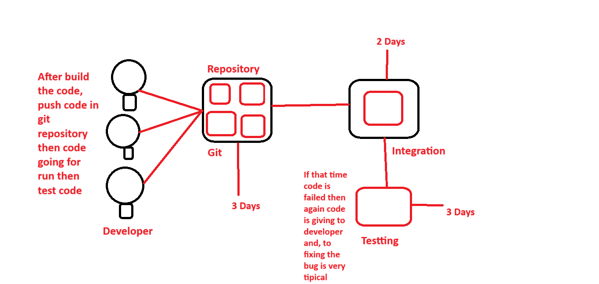
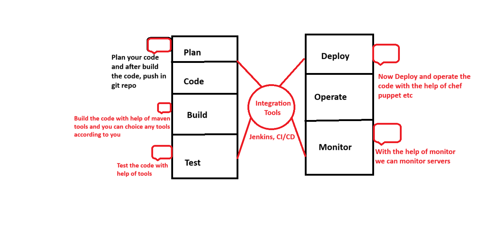

> **What is Jenkins, CI/CD PipeLine**

Jenkins it's a automated tools for deplyment software (SDLC, Software Define Life Cycle management),

> **Before CI (Continios Integration)**

- before continuous integration (CI), when a developer writes code, that means after writing the complete code, we push it to git and then after pushing the code, the code goes into our integration and then the code is tested, After going through this process, it takes a lot of time and when testing, if there is any bug then problem arises to fix it.

> **After CI (continious Integration)**

- After continuous integration, the developer pushes the code to Git on a daily basis or as the code is completed, the data is pushed to Git at the usage time, and as soon as the code is pushed, the code goes to Git. By default the API goes to the CI server and the code build, test and deployment takes place in the CI server. If I face any problem or bug, at the time of use a mail notification is sent to the developer that the API is not working. There is a bug in the code and at the same time the code is changed.

> **CI/CD PipeLine**
- In this case, when the developer writes the code and sends it to the CI/CD pipeline, our code is checked line by line and step by step and if there is any bug or issue in the code, the developer gets a notification at the same time.
- Jenkins automate the entir software developer ment life cycle

- And this is life cycle of DevOps,

> **What is Jenkins**

- We can attach git maven selenium and antrigate plugins to jenkins and one develope the code in github jenkins pull that code and send to maven for build 
and one build the code and code pull and send to selenium then once testing is done then jenkins will pull that code and send to artifacoty as per requrement and so on,............

> **How to Install jenkins in Window (17/08/2024)**

- Git Download Link:-
1. https://github.com/git-for-windows/git/releases/download/v2.46.0.windows.1/Git-2.46.0-64-bit.exe
- Java Kit Donwlaod:- 
2. https://download.oracle.com/java/21/latest/jdk-21_windows-x64_bin.exe
- Maven Download :- 
3. https://dlcdn.apache.org/maven/maven-3/3.9.8/binaries/apache-maven-3.9.8-bin.zip

**NOTE:-** And Set Invirement path, and check version from cmd.

> **how to install Jenkins in Ubuntu-22.04 (17/08/2024)**

**NOTE** Also you can follow the link, offical Jenkins site :- https://pkg.jenkins.io/debian-stable/

  - sudo wget -O /usr/share/keyrings/jenkins-keyring.asc   https://pkg.jenkins.io/debian-stable/jenkins.io-2023.key
  - echo "deb [signed-by=/usr/share/keyrings/jenkins-keyring.asc]"   https://pkg.jenkins.io/debian-stable binary/ | sudo tee   /etc/apt/sources.list.d/jenkins.list > /dev/null
  - sudo apt-get update
  - sudo apt-get install jenkins
  - sudo apt update
  - sudo apt install fontconfig openjdk-17-jre
  - java -version
  - openjdk version "17.0.8" 2023-07-18
  - OpenJDK Runtime Environment (build 17.0.8+7-Debian-1deb12u1)
  - OpenJDK 64-Bit Server VM (build 17.0.8+7-Debian-1deb12u1, mixed mode, sharing)
  - sudo systemctl enable jenkins
  - sudo systemctl start jenkins
  - sudo systemctl status jenkins
  and Now open the browser and IP:8080, Like:- 192.168.3.2:8080, after open jenkins page and setup.

> **What is persnal Access Token**, When we are communicate the diffrent tool, (like GitHub and Jenkins) so we are ceating token (persnal token)

> **How to integrate Jenkins and GitHub** 1st we need the token and also remeber git should be installed in jenkins side,

> **How to Integrate jenkins with GitHu ?**

Goto GitHub account => profile => setting => click on persnol access token => click on Token (classic) => Genrate new token => genrate new token(Classic) => Type in Note section => and choice permission => And last genrate toekn => now pull code any another user => cd and chage dir => git clone (url) => git remote -v (check what is id of ifle) => git remote set-url origin (and past self reposotory url) => git remote -v (check again id) => git status => git add . => git commit -m "s" => git push origin master => enter username and passwork (copy and past access token) => and refresh the code

> ***How to Inigrate GitHub with jenkins**

open jenkins => login => create job => and check plugin git client => manage jenkins => configure system => sroll down and go to the GitHub server section and fill requreint => save 

