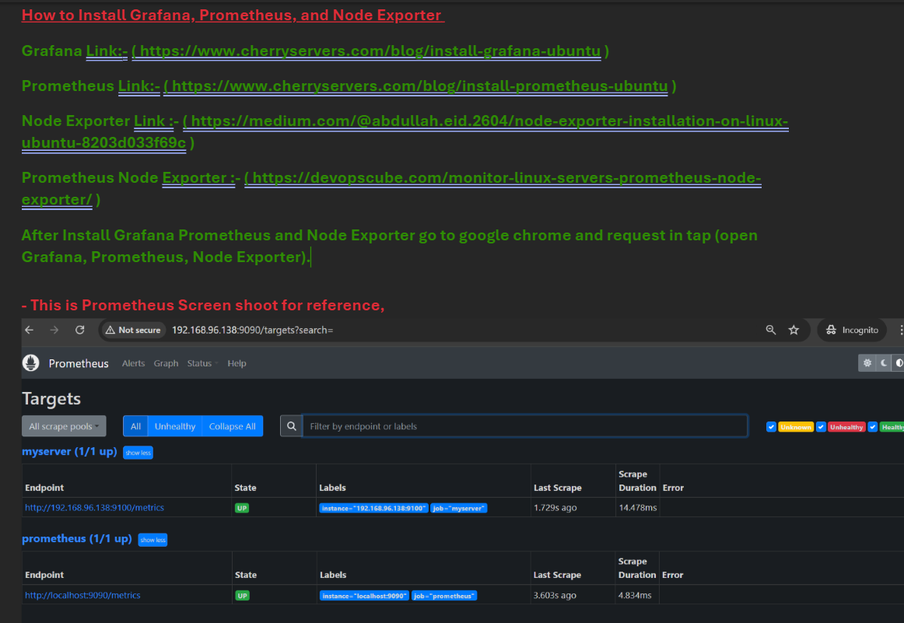
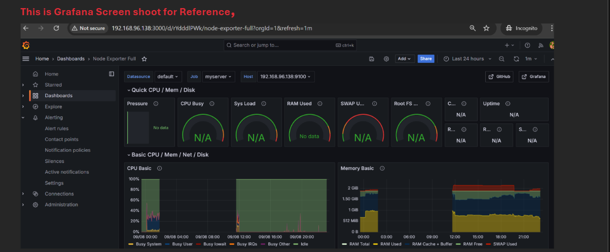
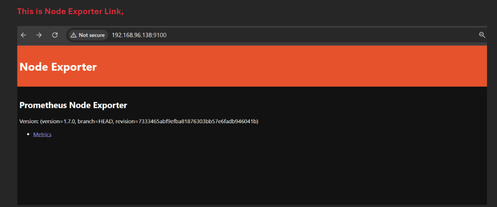
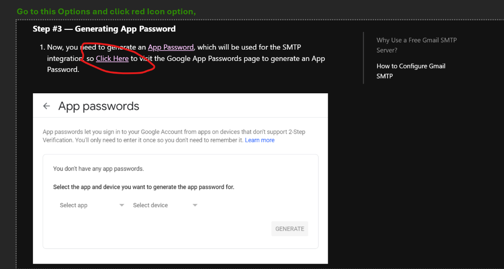
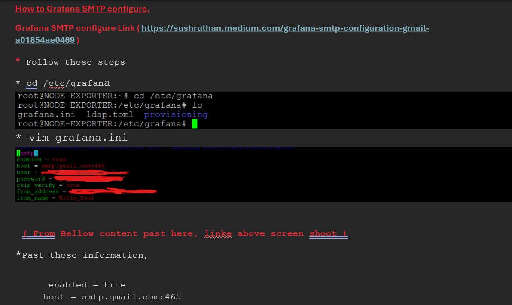
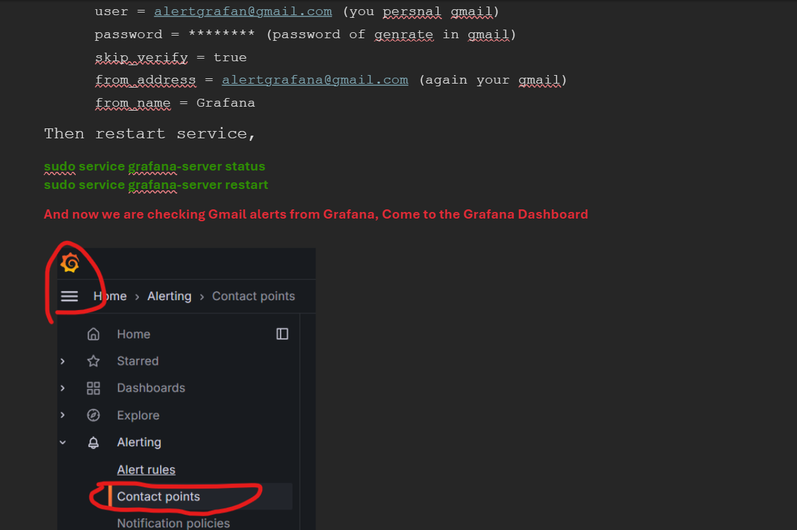
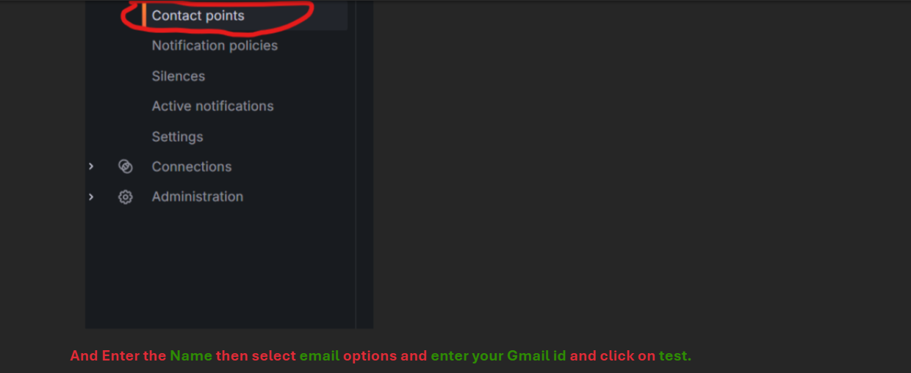
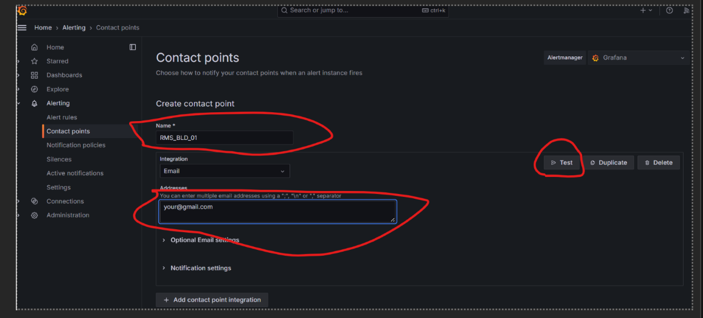
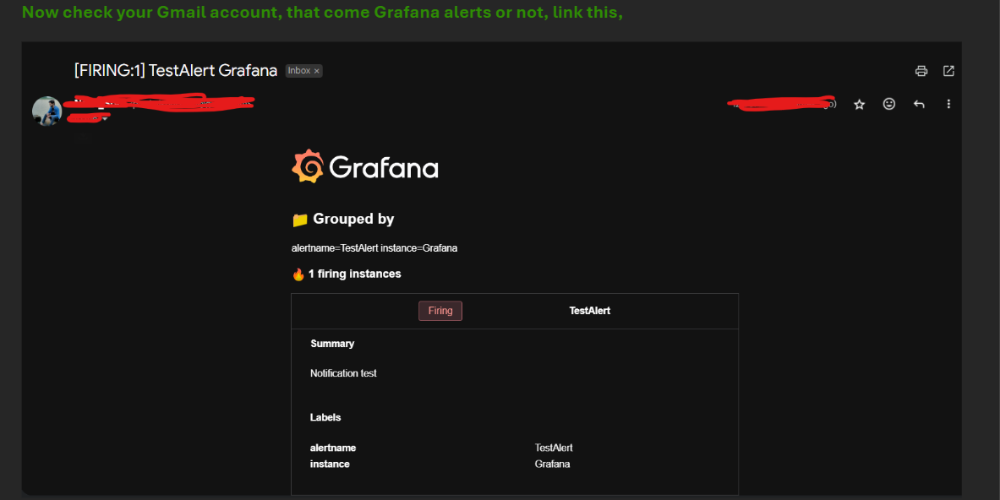

# What is Grafana ?

Grafana is a multi-platform open source analytics and interactive visualization web application. It can produce charts, graphs, and alerts for the web when connected to supported data sources

# Introduction to Alerting,

Whether you’re just starting out or you’re a more experienced user of Grafana Alerting, learn more about the fundamentals and available features that help you create, manage, and respond to alerts; and improve your team’s ability to resolve issues quickly. For a hands-on introduction, refer to our tutorial to get started with Grafana Alerting.

The following diagram gives you an overview of Grafana Alerting and introduces you to some of the fundamental features that are the principles of how Grafana Alerting works.

# How it works at a glance,

- Grafana Alerting periodically queries data sources and evaluates the condition defined in the alert rule
- If the condition is breached, an alert instance fires
- Firing (and resolved) alert instances are sent for notifications, either directly to a contact point or through notification policies for more flexibility

# Installtion of Grafana Prametheus and Node Exporter for Ubuntu-22.04

- pramatheus Link :- (https://www.cherryservers.com/blog/install-grafana-ubuntu)

- Grafan Installtion Link :- (https://www.cherryservers.com/blog/install-grafana-ubuntu)

- Node Exporter (https://medium.com/@abdullah.eid.2604/node-exporter-installation-on-linux-ubuntu-8203d033f69c)

<<<<<< HEAD

# How to Install Grafana, Prometheus, and Node Exporter  

Grafana Link:- ( https://www.cherryservers.com/blog/install-grafana-ubuntu ) 

Prometheus Link:- ( https://www.cherryservers.com/blog/install-prometheus-ubuntu ) 

Node Exporter Link :- ( https://medium.com/@abdullah.eid.2604/node-exporter-installation-on-linux-ubuntu-8203d033f69c ) 

Prometheus Node Exporter :- ( https://devopscube.com/monitor-linux-servers-prometheus-node-exporter/ )  

After Install Grafana Prometheus and Node Exporter go to google chrome and request in tap (open Grafana, Prometheus, Node Exporter).

=======
# What is Prometheus ?

- Prometheus is an open-source systems monitoring and alerting toolkit originally built at SoundCloud. Since its inception in 2012, many companies and organizations have adopted Prometheus, and the project has a very active developer and user community. It is now a standalone open source project and maintained independently of any company. To emphasize this, and to clarify the project's governance structure, Prometheus joined the Cloud Native Computing Foundation in 2016 as the second hosted project, after Kubernetes.

Prometheus collects and stores its metrics as time series data, i.e. metrics information is stored with the timestamp at which it was recorded, alongside optional key-value pairs called labels.

# Features
Prometheus's main features are:

a multi-dimensional data model with time series data identified by metric name and key/value pairs
PromQL, a flexible query language to leverage this dimensionality
no reliance on distributed storage; single server nodes are autonomous
time series collection happens via a pull model over HTTP
pushing time series is supported via an intermediary gateway
targets are discovered via service discovery or static configuration
multiple modes of graphing and dashboarding support

# What are metrics?

Metrics are numerical measurements in layperson terms. The term time series refers to the recording of changes over time. What users want to measure differs from application to application. For a web server, it could be request times; for a database, it could be the number of active connections or active queries, and so on.

Metrics play an important role in understanding why your application is working in a certain way. Let's assume you are running a web application and discover that it is slow. To learn what is happening with your application, you will need some information. For example, when the number of requests is high, the application may become slow. If you have the request count metric, you can determine the cause and increase the number of servers to handle the load.

# What is Node Exporter ?

The Node Exporter is an agent that gathers system metrics and exposes them in a format which can be ingested by Prometheus. The Node Exporter is a project that is maintained through the Prometheus project. This is a completely optional step and can be skipped if you do not wish to gather system metrics,

# Port Number's 

- Grafana (3000)
- Prometheus (9090)
- Node Exporter (9100)

# Download Link,

- Grafana Link:-  (https://www.cherryservers.com/blog/install-grafana-ubuntu)

- Prometheus Link:- (https://www.cherryservers.com/blog/install-prometheus-ubuntu)

- Node Exporter:- (https://ourcodeworld.com/articles/read/1686/how-to-install-prometheus-node-exporter-on-ubuntu-2004)

# Keep Learning 
