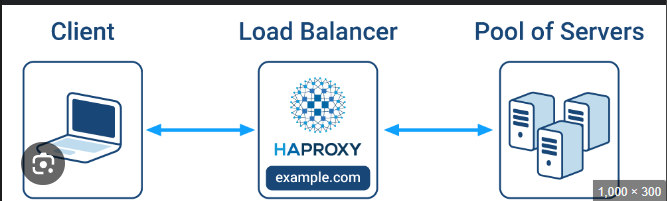

> **What is HA-Proxy**

 AProxy, which stands for High Availability Proxy, is a popular open source software TCP/HTTP Load Balancer and proxying solution which can be run on Linux, macOS, and FreeBSD. Its most common use is to improve the performance and reliability of a server environment by distributing the workload across multiple servers (e.g. web, application, database). It is used in many high-profile environments, including: GitHub, Imgur, Instagram, and Twitter.

> **How Does work HA-Proxy**
From this image we can understand,

> **Types of Load Balancing**

1. No Load Balancing

 In this example, the user connects directly to your web server, at yourdomain.com and there is no load balancing. If your single web server goes down, the user will no longer be able to access your web server. Additionally, if many users are trying to access your server simultaneously and it is unable to handle the load, they may have a slow experience or they may not be able to connect at all.​

> 2. **Layer 4 Load Balancing**

 The simplest way to load balance network traffic to multiple servers is to use layer 4 (transport layer) load balancing. Load balancing this way will forward user traffic based on IP range and port (i.e. if a request comes in for http://yourdomain.com/anything, the traffic will be forwarded to the backend that handles all the requests for yourdomain.com on port 80). For more details on layer 4, check out the TCP subsection of our Introduction to Networking .

3. **Layer 7 Load Balancing**

  Another, more complex way to load balance network traffic is to use layer 7 (application layer) load balancing. Using layer 7 allows the load balancer to forward requests to different backend servers based on the content of the user’s request. This mode of load balancing allows you to run multiple web application servers under the same domain and port. For more details on layer 7,

